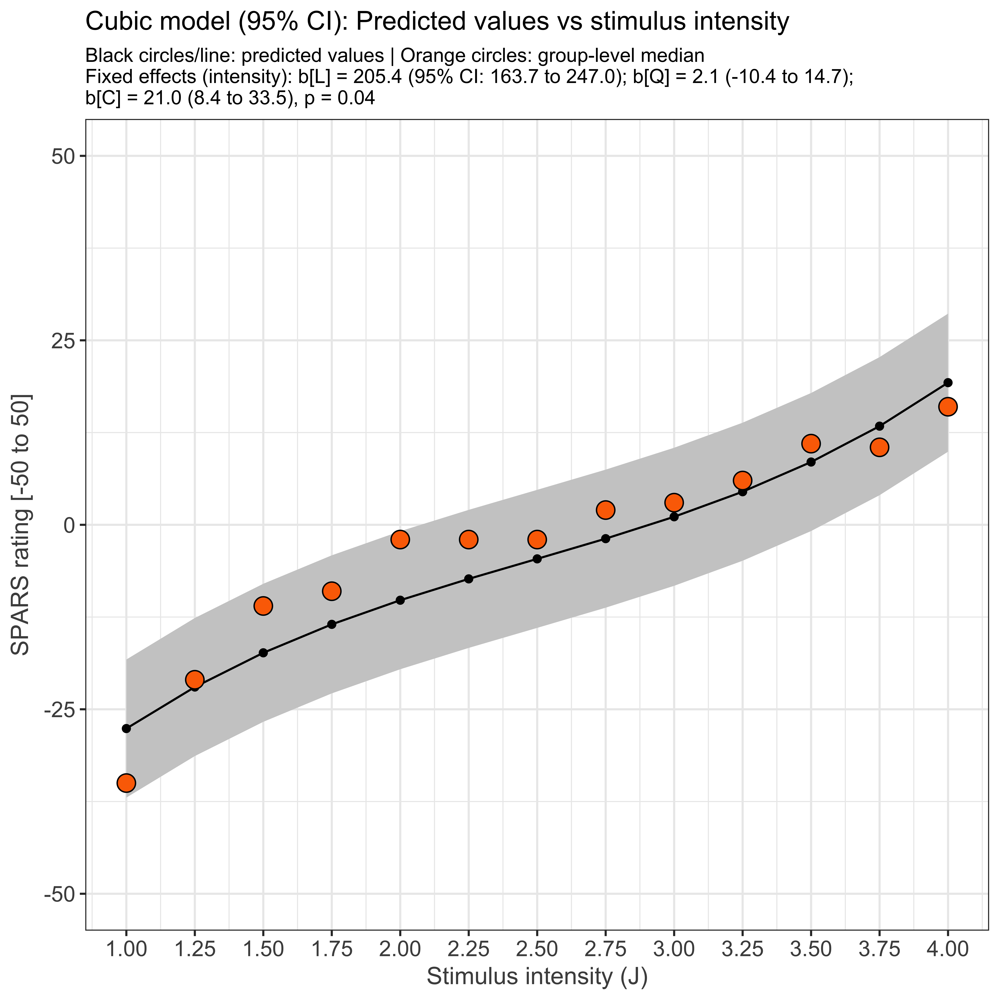
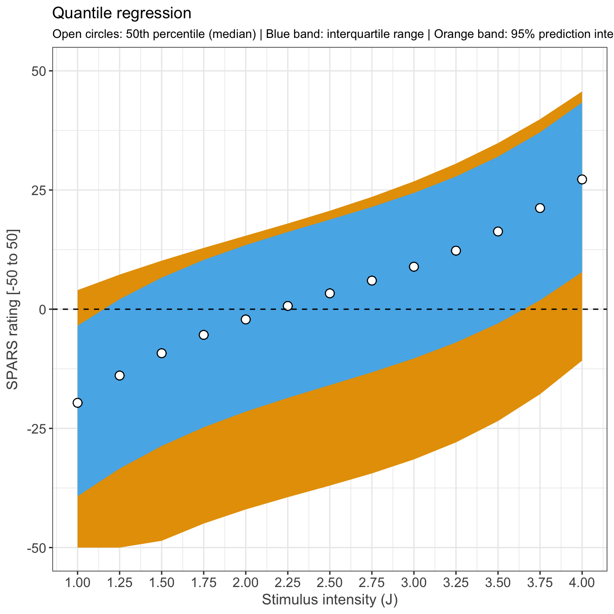
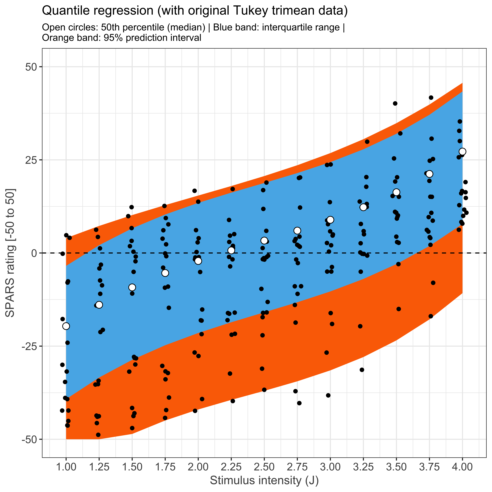

----

This script is part 2 of our analysis of the stimulus-response characteristics of the SPARS. This script models the relationship between stimulus intensity and SPARS rating using linear mixed models and quantile mixed model regression.

Descriptive plots of the data are provided in _"outputs/4A-stimulus-response-1.html"_, the diagnostics on the final linear mixed model are described in _"outputs/4A-stimulus-response-3.html"_, the stability of the model is described in _"outputs/4A-stimulus-response-4.html"_, the sensitivity of the scale to changes in stimulus intensity are described in _"outputs/4A-stimulus-reponse-5.html"_, and the variance in ratings at each stimulus intensity is described in _"outputs/4A-stimulus-reponse-6.html"_.

----

# Import and clean/transform data


```r
############################################################
#                                                          #
#                          Import                          #
#                                                          #
############################################################
data <- read_rds('./data-cleaned/SPARS_A.rds')

############################################################
#                                                          #
#                          Clean                           #
#                                                          #
############################################################
data %<>%
  # Select required columns
  select(PID, block, block_order, trial_number, intensity, intensity_char, rating) 

############################################################
#                                                          #
#                Calculate 'Tukey trimean'                 #
#                                                          #
############################################################
# Define tri.mean function
tri.mean <- function(x) {
  # Calculate quantiles
  q1 <- quantile(x, probs = 0.25, na.rm = TRUE)[[1]]
  q2 <- median(x, na.rm = TRUE)
  q3 <- quantile(x, probs = 0.75, na.rm = TRUE)[[1]]
  # Calculate trimean
  tm <- (q2 + ((q1 + q3) / 2)) / 2
  # Convert to integer
  tm <- as.integer(round(tm))
  return(tm)
}

############################################################
#                                                          #
#                    Generate core data                    #
#                                                          #
############################################################
# Calculate the participant average 
data_tm <- data %>% 
  group_by(PID, intensity) %>%
  summarise(tri_mean = tri.mean(rating)) %>%
  ungroup()

# Calculate the group average
data_group <- data_tm %>%
  group_by(intensity) %>%
  summarise(median = median(tri_mean)) %>%
  ungroup()
```

----

# Linear mixed model regression

To allow for a curvilinear relationship between stimulus intensity and rating, we modelled the data using polynomial regression, with 1^st^ (linear), 2^nd^ (quadratic), and 3^rd^ (cubic) order orthogonal polynomials. For each polynomial expression, we modelled the random effects as random intercept only, and as random intercept and slope. 

The random intercept only and random intercept and slope models were compared using the likelihood test, and the better model taken forward.

### 1st-order (linear) polynomial


```r
# Intercept only
lmm1 <- lmer(tri_mean ~ intensity + (1 | PID),
             data = data_tm,
             REML = TRUE)

# Intercept and slope
lmm1b <- lmer(tri_mean ~ intensity + (intensity | PID),
              data = data_tm,
              REML = TRUE)

# Better model?
anova(lmm1, lmm1b)
```

```
## Data: data_tm
## Models:
## lmm1: tri_mean ~ intensity + (1 | PID)
## lmm1b: tri_mean ~ intensity + (intensity | PID)
##       Df    AIC    BIC  logLik deviance  Chisq Chi Df Pr(>Chisq)    
## lmm1   4 1814.7 1828.7 -903.37   1806.7                             
## lmm1b  6 1733.6 1754.6 -860.79   1721.6 85.146      2  < 2.2e-16 ***
## ---
## Signif. codes:  0 '***' 0.001 '**' 0.01 '*' 0.05 '.' 0.1 ' ' 1
```

```r
# Anova of better model
Anova(lmm1b,
      type = 2,
      test.statistic = 'F')
```

```
## Analysis of Deviance Table (Type II Wald F tests with Kenward-Roger df)
## 
## Response: tri_mean
##                F Df Df.res    Pr(>F)    
## intensity 94.707  1 17.998 1.356e-08 ***
## ---
## Signif. codes:  0 '***' 0.001 '**' 0.01 '*' 0.05 '.' 0.1 ' ' 1
```

```r
# Print better model
sjt.lmer(lmm1b,
         show.header = TRUE,
         string.dv = "Response", 
         string.pred = "Coefficients",
         depvar.labels = '',
         pred.labels = 'intensity',
         string.est = 'Estimate',
         string.ci = '95% CI',
         string.p = 'p-value',
         show.icc = FALSE,
         show.r2 = FALSE)
```

<table style="border-collapse:collapse; border:none;border-bottom:double;">
<tr>
<td style="padding:0.2cm; border-top:double;" rowspan="2"><em>Coefficients</em></td>
<td colspan="4" style="padding:0.2cm; border-top:double; text-align:center; border-bottom:1px solid;"><em>Response</em></td>
</tr>

<td style=" padding-left:0.5em; padding-right:0.5em;">&nbsp;</td>
<td style="padding:0.2cm; text-align:center; " colspan="3"></td>
</tr>
<tr>
<td style="padding:0.2cm; font-style:italic;">&nbsp;</td>
<td style="padding-left:0.5em; padding-right:0.5em; font-style:italic;">&nbsp;</td>
<td style="padding:0.2cm; text-align:center; font-style:italic; ">Estimate</td>
<td style="padding:0.2cm; text-align:center; font-style:italic; ">95% CI</td>
<td style="padding:0.2cm; text-align:center; font-style:italic; ">p&#45;value</td> 
</tr>
<tr>
<td colspan="5" style="padding:0.2cm; text-align:left; border-top:1px solid; font-weight:bold; text-align:left;">Fixed Parts</td>
</tr>
<tr>
<td style="padding:0.2cm; text-align:left;">(Intercept)</td>
<td style="padding-left:0.5em; padding-right:0.5em; ">&nbsp;</td>
<td style="padding:0.2cm; text-align:center; ">&#45;39.76</td>
<td style="padding:0.2cm; text-align:center; ">&#45;51.32&nbsp;&ndash;&nbsp;&#45;28.21</td>
<td style="padding:0.2cm; text-align:center; ">&lt;.001</td>
</tr>
<tr>
<td style="padding:0.2cm; text-align:left;">intensity</td>
<td style="padding-left:0.5em; padding-right:0.5em;">&nbsp;</td>
<td style="padding:0.2cm; text-align:center; ">14.13</td>
<td style="padding:0.2cm; text-align:center; ">11.28&nbsp;&ndash;&nbsp;16.97</td>
<td style="padding:0.2cm; text-align:center; ">&lt;.001</td>
</tr><tr>
<td colspan="5" style="padding:0.2cm; padding-top:0.1cm; padding-bottom:0.1cm; text-align:left; font-weight:bold; text-align:left; padding-top:0.5em;">Random Parts</td>
</tr>

<tr>
<td style="padding:0.2cm; padding-top:0.1cm; padding-bottom:0.1cm; text-align:left;">&sigma;<sup>2</sup></td>
<td style="padding-left:0.5em; padding-right:0.5em;">&nbsp;</td><td style="padding:0.2cm; text-align:center; padding-top:0.1cm; padding-bottom:0.1cm;" colspan="3">42.542</td>
</tr>

<tr>
<td style="padding:0.2cm; padding-top:0.1cm; padding-bottom:0.1cm; text-align:left;">&tau;<sub>00, PID</sub></td>
<td style="padding-left:0.5em; padding-right:0.5em;">&nbsp;</td><td style="padding:0.2cm; text-align:center; padding-top:0.1cm; padding-bottom:0.1cm;" colspan="3">633.161</td>
</tr>

<tr>
<td style="padding:0.2cm; padding-top:0.1cm; padding-bottom:0.1cm; text-align:left;">&rho;<sub>01</sub></td>
<td style="padding-left:0.5em; padding-right:0.5em;">&nbsp;</td><td style="padding:0.2cm; text-align:center; padding-top:0.1cm; padding-bottom:0.1cm;" colspan="3">&#45;0.887</td>
</tr>

<tr>
<td style="padding:0.2cm; padding-top:0.1cm; padding-bottom:0.1cm; text-align:left;">N<sub>PID</sub></td>
<td style="padding-left:0.5em; padding-right:0.5em;">&nbsp;</td><td style="padding:0.2cm; text-align:center; padding-top:0.1cm; padding-bottom:0.1cm;" colspan="3">19</td>
</tr>

<tr>
<td style="padding:0.2cm; padding-top:0.1cm; padding-bottom:0.1cm; text-align:left; border-top:1px solid;">Observations</td>
<td style="padding-left:0.5em; padding-right:0.5em; border-top:1px solid;">&nbsp;</td><td style="padding:0.2cm; padding-top:0.1cm; padding-bottom:0.1cm; text-align:center; border-top:1px solid;" colspan="3">244</td>
</tr>
</table>

### 2nd-order (quadratic) polynomial


```r
# Intercept only
lmm2 <- lmer(tri_mean ~ poly(intensity, 2) + (1 | PID),
             data = data_tm,
             REML = TRUE)

# Intercept and slope
lmm2b <- lmer(tri_mean ~ poly(intensity, 2) + (intensity | PID),
              data = data_tm,
              REML = TRUE)

# Better model?
anova(lmm2, lmm2b)
```

```
## Data: data_tm
## Models:
## lmm2: tri_mean ~ poly(intensity, 2) + (1 | PID)
## lmm2b: tri_mean ~ poly(intensity, 2) + (intensity | PID)
##       Df    AIC    BIC  logLik deviance Chisq Chi Df Pr(>Chisq)    
## lmm2   5 1816.7 1834.2 -903.35   1806.7                            
## lmm2b  7 1735.5 1760.0 -860.74   1721.5 85.22      2  < 2.2e-16 ***
## ---
## Signif. codes:  0 '***' 0.001 '**' 0.01 '*' 0.05 '.' 0.1 ' ' 1
```

```r
# Anova for better model
Anova(lmm2b,
      type = 2,
      test.statistic = 'F')
```

```
## Analysis of Deviance Table (Type II Wald F tests with Kenward-Roger df)
## 
## Response: tri_mean
##                         F Df Df.res    Pr(>F)    
## poly(intensity, 2) 46.667  2 43.413 1.526e-11 ***
## ---
## Signif. codes:  0 '***' 0.001 '**' 0.01 '*' 0.05 '.' 0.1 ' ' 1
```

```r
# Print better model
sjt.lmer(lmm2b,
         show.header = TRUE,
         string.dv = "Response", 
         string.pred = "Coefficients",
         depvar.labels = '',
         pred.labels = 'intensity',
         string.est = 'Estimate',
         string.ci = '95% CI',
         string.p = 'p-value',
         show.icc = FALSE,
         show.r2 = FALSE)
```

<table style="border-collapse:collapse; border:none;border-bottom:double;">
<tr>
<td style="padding:0.2cm; border-top:double;" rowspan="2"><em>Coefficients</em></td>
<td colspan="4" style="padding:0.2cm; border-top:double; text-align:center; border-bottom:1px solid;"><em>Response</em></td>
</tr>

<td style=" padding-left:0.5em; padding-right:0.5em;">&nbsp;</td>
<td style="padding:0.2cm; text-align:center; " colspan="3"></td>
</tr>
<tr>
<td style="padding:0.2cm; font-style:italic;">&nbsp;</td>
<td style="padding-left:0.5em; padding-right:0.5em; font-style:italic;">&nbsp;</td>
<td style="padding:0.2cm; text-align:center; font-style:italic; ">Estimate</td>
<td style="padding:0.2cm; text-align:center; font-style:italic; ">95% CI</td>
<td style="padding:0.2cm; text-align:center; font-style:italic; ">p&#45;value</td> 
</tr>
<tr>
<td colspan="5" style="padding:0.2cm; text-align:left; border-top:1px solid; font-weight:bold; text-align:left;">Fixed Parts</td>
</tr>
<tr>
<td style="padding:0.2cm; text-align:left;">(Intercept)</td>
<td style="padding-left:0.5em; padding-right:0.5em; ">&nbsp;</td>
<td style="padding:0.2cm; text-align:center; ">&#45;4.67</td>
<td style="padding:0.2cm; text-align:center; ">&#45;10.91&nbsp;&ndash;&nbsp;1.57</td>
<td style="padding:0.2cm; text-align:center; ">.160</td>
</tr>
<tr>
<td style="padding:0.2cm; text-align:left;">poly(intensity, 2)1</td>
<td style="padding-left:0.5em; padding-right:0.5em;">&nbsp;</td>
<td style="padding:0.2cm; text-align:center; ">205.33</td>
<td style="padding:0.2cm; text-align:center; ">163.97&nbsp;&ndash;&nbsp;246.69</td>
<td style="padding:0.2cm; text-align:center; ">&lt;.001</td>
</tr>
<tr>
<td style="padding:0.2cm; text-align:left;">poly(intensity, 2)2</td>
<td style="padding-left:0.5em; padding-right:0.5em;">&nbsp;</td>
<td style="padding:0.2cm; text-align:center; ">2.06</td>
<td style="padding:0.2cm; text-align:center; ">&#45;10.78&nbsp;&ndash;&nbsp;14.91</td>
<td style="padding:0.2cm; text-align:center; ">.757</td>
</tr><tr>
<td colspan="5" style="padding:0.2cm; padding-top:0.1cm; padding-bottom:0.1cm; text-align:left; font-weight:bold; text-align:left; padding-top:0.5em;">Random Parts</td>
</tr>

<tr>
<td style="padding:0.2cm; padding-top:0.1cm; padding-bottom:0.1cm; text-align:left;">&sigma;<sup>2</sup></td>
<td style="padding-left:0.5em; padding-right:0.5em;">&nbsp;</td><td style="padding:0.2cm; text-align:center; padding-top:0.1cm; padding-bottom:0.1cm;" colspan="3">42.727</td>
</tr>

<tr>
<td style="padding:0.2cm; padding-top:0.1cm; padding-bottom:0.1cm; text-align:left;">&tau;<sub>00, PID</sub></td>
<td style="padding-left:0.5em; padding-right:0.5em;">&nbsp;</td><td style="padding:0.2cm; text-align:center; padding-top:0.1cm; padding-bottom:0.1cm;" colspan="3">633.218</td>
</tr>

<tr>
<td style="padding:0.2cm; padding-top:0.1cm; padding-bottom:0.1cm; text-align:left;">&rho;<sub>01</sub></td>
<td style="padding-left:0.5em; padding-right:0.5em;">&nbsp;</td><td style="padding:0.2cm; text-align:center; padding-top:0.1cm; padding-bottom:0.1cm;" colspan="3">&#45;0.887</td>
</tr>

<tr>
<td style="padding:0.2cm; padding-top:0.1cm; padding-bottom:0.1cm; text-align:left;">N<sub>PID</sub></td>
<td style="padding-left:0.5em; padding-right:0.5em;">&nbsp;</td><td style="padding:0.2cm; text-align:center; padding-top:0.1cm; padding-bottom:0.1cm;" colspan="3">19</td>
</tr>

<tr>
<td style="padding:0.2cm; padding-top:0.1cm; padding-bottom:0.1cm; text-align:left; border-top:1px solid;">Observations</td>
<td style="padding-left:0.5em; padding-right:0.5em; border-top:1px solid;">&nbsp;</td><td style="padding:0.2cm; padding-top:0.1cm; padding-bottom:0.1cm; text-align:center; border-top:1px solid;" colspan="3">244</td>
</tr>
</table>

### 3rd-order (cubic) polynomial


```r
# Intercept only
lmm3 <- lmer(tri_mean ~ poly(intensity, 3) + (1 | PID),
             data = data_tm,
             REML = TRUE)

# Intercept and slope
lmm3b <- lmer(tri_mean ~ poly(intensity, 3) + (intensity | PID),
              data = data_tm,
              REML = TRUE)

# Better model?
anova(lmm3, lmm3b)
```

```
## Data: data_tm
## Models:
## lmm3: tri_mean ~ poly(intensity, 3) + (1 | PID)
## lmm3b: tri_mean ~ poly(intensity, 3) + (intensity | PID)
##       Df    AIC    BIC  logLik deviance  Chisq Chi Df Pr(>Chisq)    
## lmm3   6 1813.8 1834.8 -900.90   1801.8                             
## lmm3b  8 1727.0 1754.9 -855.48   1711.0 90.841      2  < 2.2e-16 ***
## ---
## Signif. codes:  0 '***' 0.001 '**' 0.01 '*' 0.05 '.' 0.1 ' ' 1
```

```r
# Anova for better model
Anova(lmm3b,
      type = 2,
      test.statistic = 'F')
```

```
## Analysis of Deviance Table (Type II Wald F tests with Kenward-Roger df)
## 
## Response: tri_mean
##                         F Df Df.res    Pr(>F)    
## poly(intensity, 3) 34.148  3 71.491 8.318e-14 ***
## ---
## Signif. codes:  0 '***' 0.001 '**' 0.01 '*' 0.05 '.' 0.1 ' ' 1
```

```r
# Print better model
sjt.lmer(lmm3b,
         show.header = TRUE,
         string.dv = "Response", 
         string.pred = "Coefficients",
         depvar.labels = '',
         pred.labels = 'intensity',
         string.est = 'Estimate',
         string.ci = '95% CI',
         string.p = 'p-value',
         show.icc = FALSE,
         show.r2 = FALSE)
```

<table style="border-collapse:collapse; border:none;border-bottom:double;">
<tr>
<td style="padding:0.2cm; border-top:double;" rowspan="2"><em>Coefficients</em></td>
<td colspan="4" style="padding:0.2cm; border-top:double; text-align:center; border-bottom:1px solid;"><em>Response</em></td>
</tr>

<td style=" padding-left:0.5em; padding-right:0.5em;">&nbsp;</td>
<td style="padding:0.2cm; text-align:center; " colspan="3"></td>
</tr>
<tr>
<td style="padding:0.2cm; font-style:italic;">&nbsp;</td>
<td style="padding-left:0.5em; padding-right:0.5em; font-style:italic;">&nbsp;</td>
<td style="padding:0.2cm; text-align:center; font-style:italic; ">Estimate</td>
<td style="padding:0.2cm; text-align:center; font-style:italic; ">95% CI</td>
<td style="padding:0.2cm; text-align:center; font-style:italic; ">p&#45;value</td> 
</tr>
<tr>
<td colspan="5" style="padding:0.2cm; text-align:left; border-top:1px solid; font-weight:bold; text-align:left;">Fixed Parts</td>
</tr>
<tr>
<td style="padding:0.2cm; text-align:left;">(Intercept)</td>
<td style="padding-left:0.5em; padding-right:0.5em; ">&nbsp;</td>
<td style="padding:0.2cm; text-align:center; ">&#45;4.67</td>
<td style="padding:0.2cm; text-align:center; ">&#45;10.89&nbsp;&ndash;&nbsp;1.56</td>
<td style="padding:0.2cm; text-align:center; ">.159</td>
</tr>
<tr>
<td style="padding:0.2cm; text-align:left;">poly(intensity, 3)1</td>
<td style="padding-left:0.5em; padding-right:0.5em;">&nbsp;</td>
<td style="padding:0.2cm; text-align:center; ">205.35</td>
<td style="padding:0.2cm; text-align:center; ">163.69&nbsp;&ndash;&nbsp;247.01</td>
<td style="padding:0.2cm; text-align:center; ">&lt;.001</td>
</tr>
<tr>
<td style="padding:0.2cm; text-align:left;">poly(intensity, 3)2</td>
<td style="padding-left:0.5em; padding-right:0.5em;">&nbsp;</td>
<td style="padding:0.2cm; text-align:center; ">2.12</td>
<td style="padding:0.2cm; text-align:center; ">&#45;10.42&nbsp;&ndash;&nbsp;14.67</td>
<td style="padding:0.2cm; text-align:center; ">.744</td>
</tr>
<tr>
<td style="padding:0.2cm; text-align:left;">poly(intensity, 3)3</td>
<td style="padding-left:0.5em; padding-right:0.5em;">&nbsp;</td>
<td style="padding:0.2cm; text-align:center; ">20.95</td>
<td style="padding:0.2cm; text-align:center; ">8.40&nbsp;&ndash;&nbsp;33.49</td>
<td style="padding:0.2cm; text-align:center; ">.004</td>
</tr><tr>
<td colspan="5" style="padding:0.2cm; padding-top:0.1cm; padding-bottom:0.1cm; text-align:left; font-weight:bold; text-align:left; padding-top:0.5em;">Random Parts</td>
</tr>

<tr>
<td style="padding:0.2cm; padding-top:0.1cm; padding-bottom:0.1cm; text-align:left;">&sigma;<sup>2</sup></td>
<td style="padding-left:0.5em; padding-right:0.5em;">&nbsp;</td><td style="padding:0.2cm; text-align:center; padding-top:0.1cm; padding-bottom:0.1cm;" colspan="3">40.768</td>
</tr>

<tr>
<td style="padding:0.2cm; padding-top:0.1cm; padding-bottom:0.1cm; text-align:left;">&tau;<sub>00, PID</sub></td>
<td style="padding-left:0.5em; padding-right:0.5em;">&nbsp;</td><td style="padding:0.2cm; text-align:center; padding-top:0.1cm; padding-bottom:0.1cm;" colspan="3">639.311</td>
</tr>

<tr>
<td style="padding:0.2cm; padding-top:0.1cm; padding-bottom:0.1cm; text-align:left;">&rho;<sub>01</sub></td>
<td style="padding-left:0.5em; padding-right:0.5em;">&nbsp;</td><td style="padding:0.2cm; text-align:center; padding-top:0.1cm; padding-bottom:0.1cm;" colspan="3">&#45;0.889</td>
</tr>

<tr>
<td style="padding:0.2cm; padding-top:0.1cm; padding-bottom:0.1cm; text-align:left;">N<sub>PID</sub></td>
<td style="padding-left:0.5em; padding-right:0.5em;">&nbsp;</td><td style="padding:0.2cm; text-align:center; padding-top:0.1cm; padding-bottom:0.1cm;" colspan="3">19</td>
</tr>

<tr>
<td style="padding:0.2cm; padding-top:0.1cm; padding-bottom:0.1cm; text-align:left; border-top:1px solid;">Observations</td>
<td style="padding-left:0.5em; padding-right:0.5em; border-top:1px solid;">&nbsp;</td><td style="padding:0.2cm; padding-top:0.1cm; padding-bottom:0.1cm; text-align:center; border-top:1px solid;" colspan="3">244</td>
</tr>
</table>

### Compare models


```r
knitr::kable(broom::tidy(anova(lmm1b, lmm2b, lmm3b)),
             caption = 'Linear model vs quadratic model and cubic model')
```


Table: Linear model vs quadratic model and cubic model

term     df        AIC        BIC      logLik   deviance    statistic   Chi.Df     p.value
------  ---  ---------  ---------  ----------  ---------  -----------  -------  ----------
lmm1b     6   1733.586   1754.569   -860.7930   1721.586           NA       NA          NA
lmm2b     7   1735.487   1759.967   -860.7434   1721.487    0.0991866        1   0.7528079
lmm3b     8   1726.958   1754.936   -855.4791   1710.958   10.5285980        1   0.0011754

### PLot the model

```r
predicted <- ggeffects::ggpredict(model = lmm3b,
                                  terms = 'intensity',
                                  ci.lvl = 0.95) 
ggplot() +
    geom_ribbon(data = predicted,
                aes(x = x,
                    ymin = conf.low,
                    ymax = conf.high),
                fill = '#cccccc') + 
    geom_line(data = predicted,
              aes(x = x,
                  y = predicted)) +
    geom_point(data = predicted,
              aes(x = x,
                  y = predicted)) +
    geom_point(data = data_group,
               aes(x = intensity,
                   y = median),
               shape = 21,
               size = 4,
               fill = '#FC6F00') +
  labs(title = 'Cubic model (95% CI): Predicted values vs stimulus intensity',
       subtitle = 'Black circles/line: predicted values | Orange circles: group-level median \nFixed effects (intensity): b[L] = 205.4 (95% CI: 163.7 to 247.0); b[Q] = 2.1 (-10.4 to 14.7); \nb[C] = 21.0 (8.4 to 33.5), p = 0.04',
       x = 'Stimulus intensity (J)',
       y = 'SPARS rating [-50 to 50]') +
  scale_y_continuous(limits = c(-50, 50)) +
  scale_x_continuous(breaks = seq(from = 1, to = 4, by = 0.25))
```



The cubic model has the best fit. The resulting curvilinear response function is _steepest_ at the extremes and  _flattens out_ in the mid-ranges of stimulus intensity. We performed diagnostics on this model to confirm that the model was properly specified.

----

# Quantile mixed model regression


```r
# Quantile model with 2.5, 25, 50, 75, and 97.5% quantiles
qmm <- lqmm(fixed = tri_mean ~ poly(intensity, 3),
            random = ~ intensity,
            group = PID,
            data = data_tm,
            tau = c(0.025, 0.25, 0.5, 0.75, 0.975))

# Summary 
summary(qmm)
```

```
## Call: lqmm(fixed = tri_mean ~ poly(intensity, 3), random = ~intensity, 
##     group = PID, tau = c(0.025, 0.25, 0.5, 0.75, 0.975), data = data_tm)
## 
## tau = 0.025
## 
## Fixed effects:
##                        Value Std. Error lower bound upper bound  Pr(>|t|)
## (Intercept)         -36.3724    16.4191    -69.3678     -3.3769   0.03142
## poly(intensity, 3)1 204.7079    24.4930    155.4874    253.9284 5.449e-11
## poly(intensity, 3)2  11.5495    22.5339    -33.7340     56.8330   0.61058
## poly(intensity, 3)3  26.7629    13.8961     -1.1624     54.6882   0.05993
##                        
## (Intercept)         *  
## poly(intensity, 3)1 ***
## poly(intensity, 3)2    
## poly(intensity, 3)3 .  
## ---
## Signif. codes:  0 '***' 0.001 '**' 0.01 '*' 0.05 '.' 0.1 ' ' 1
## 
## tau = 0.25
## 
## Fixed effects:
##                         Value Std. Error lower bound upper bound  Pr(>|t|)
## (Intercept)         -16.06242    7.15641   -30.44376     -1.6811  0.029350
## poly(intensity, 3)1 205.06628   23.67232   157.49498    252.6376 1.887e-11
## poly(intensity, 3)2   0.84314   11.48267   -22.23215     23.9184  0.941765
## poly(intensity, 3)3  21.92427    7.99884     5.85000     37.9985  0.008526
##                        
## (Intercept)         *  
## poly(intensity, 3)1 ***
## poly(intensity, 3)2    
## poly(intensity, 3)3 ** 
## ---
## Signif. codes:  0 '***' 0.001 '**' 0.01 '*' 0.05 '.' 0.1 ' ' 1
## 
## tau = 0.5
## 
## Fixed effects:
##                        Value Std. Error lower bound upper bound  Pr(>|t|)
## (Intercept)           3.2873     7.2551    -11.2924      17.867  0.652477
## poly(intensity, 3)1 204.0394    23.9912    155.8273     252.251 3.265e-11
## poly(intensity, 3)2   2.2389    10.7117    -19.2871      23.765  0.835307
## poly(intensity, 3)3  22.1176     7.9526      6.1362      38.099  0.007666
##                        
## (Intercept)            
## poly(intensity, 3)1 ***
## poly(intensity, 3)2    
## poly(intensity, 3)3 ** 
## ---
## Signif. codes:  0 '***' 0.001 '**' 0.01 '*' 0.05 '.' 0.1 ' ' 1
## 
## tau = 0.75
## 
## Fixed effects:
##                        Value Std. Error lower bound upper bound  Pr(>|t|)
## (Intercept)          19.0218     7.3054      4.3411      33.703  0.012168
## poly(intensity, 3)1 203.2674    24.4662    154.1006     252.434 6.483e-11
## poly(intensity, 3)2   5.9630    11.7043    -17.5577      29.484  0.612710
## poly(intensity, 3)3  22.6834     8.1642      6.2768      39.090  0.007723
##                        
## (Intercept)         *  
## poly(intensity, 3)1 ***
## poly(intensity, 3)2    
## poly(intensity, 3)3 ** 
## ---
## Signif. codes:  0 '***' 0.001 '**' 0.01 '*' 0.05 '.' 0.1 ' ' 1
## 
## tau = 0.975
## 
## Fixed effects:
##                        Value Std. Error lower bound upper bound  Pr(>|t|)
## (Intercept)          22.0604    18.8451    -15.8102      59.931    0.2474
## poly(intensity, 3)1 188.9824    22.3905    143.9869     233.978 4.087e-11
## poly(intensity, 3)2  22.3598    13.8244     -5.4214      50.141    0.1122
## poly(intensity, 3)3  12.1005     9.5255     -7.0418      31.243    0.2100
##                        
## (Intercept)            
## poly(intensity, 3)1 ***
## poly(intensity, 3)2    
## poly(intensity, 3)3    
## ---
## Signif. codes:  0 '***' 0.001 '**' 0.01 '*' 0.05 '.' 0.1 ' ' 1
## 
## Null model (likelihood ratio):
## [1] 132.7 (p = 0) 270.8 (p = 0) 271.1 (p = 0) 247.2 (p = 0) 188.1 (p = 0)
## AIC:
## [1] 2304 (df = 7) 1892 (df = 7) 1858 (df = 7) 1913 (df = 7) 2212 (df = 7)
```

```r
# Get predicted values
## Level 0 (conditional, note difference to the lmer diagnostics)
quant_predict <- as.data.frame(predict(qmm, level = 0))
names(quant_predict) <- paste0('Q', c(2.5, 25, 50, 75, 97.5))

# Join with 'central_lmm'
data_lqmm <- data_tm %>%
  bind_cols(quant_predict)

# Trim prediction to upper and lower limits of the scale
data_lqmm %<>%
  mutate_if(is.numeric,
            funs(ifelse(. > 50,
                        yes = 50,
                        no = ifelse(. < -50,
                                    yes = -50,
                                    no = .))))

# Plot
ggplot(data = data_lqmm) +
  aes(x = intensity,
      y = Q50) +
  geom_ribbon(aes(ymin = `Q2.5`,
                  ymax = `Q97.5`),
              fill = '#E69F00') +
  geom_ribbon(aes(ymin = `Q25`,
                  ymax = `Q75`),
              fill = '#56B4E9') +
  geom_point(size = 3,
             shape = 21,
             fill = '#FFFFFF',
             colour = '#000000') +
  geom_hline(yintercept = 0,
             linetype = 2) +
  labs(title = paste('Quantile regression'),
       subtitle = 'Open circles: 50th percentile (median) | Blue band: interquartile range | \nOrange band: 95% prediction interval',
       x = 'Stimulus intensity (J)',
       y = 'SPARS rating [-50 to 50]') +
  scale_y_continuous(limits = c(-50, 50)) +
  scale_x_continuous(breaks = unique(data_lqmm$intensity)) 
```



```r
## With original data
ggplot(data = data_lqmm) +
  aes(x = intensity,
      y = Q50) +
  geom_ribbon(aes(ymin = `Q2.5`,
                  ymax = `Q97.5`),
              fill = '#FC6F00') +
  geom_ribbon(aes(ymin = `Q25`,
                  ymax = `Q75`),
              fill = '#56B4E9') +
  geom_point(data = data_tm,
             aes(y = tri_mean),
             position = position_jitter(width = 0.03)) +
  geom_point(size = 3,
             shape = 21,
             fill = '#FFFFFF',
             colour = '#000000') +
  geom_hline(yintercept = 0,
             linetype = 2) +
  labs(title = paste('Quantile regression (with original Tukey trimean data)'),
       subtitle = 'Open circles: 50th percentile (median) | Blue band: interquartile range | \nOrange band: 95% prediction interval',
       x = 'Stimulus intensity (J)',
       y = 'SPARS rating [-50 to 50]') +
  scale_y_continuous(limits = c(-50, 50)) +
  scale_x_continuous(breaks = unique(data_lqmm$intensity)) 
```



There is good stability in the shape of the response characteristics across the quantiles. For all stimulus intensities, the distribution is left skewed (long tail towards lower ratings). 

----

# Session information

```r
sessionInfo()
```

```
## R version 3.4.3 (2017-11-30)
## Platform: x86_64-apple-darwin15.6.0 (64-bit)
## Running under: OS X El Capitan 10.11.6
## 
## Matrix products: default
## BLAS: /Library/Frameworks/R.framework/Versions/3.4/Resources/lib/libRblas.0.dylib
## LAPACK: /Library/Frameworks/R.framework/Versions/3.4/Resources/lib/libRlapack.dylib
## 
## locale:
## [1] en_US.UTF-8/en_US.UTF-8/en_US.UTF-8/C/en_US.UTF-8/en_US.UTF-8
## 
## attached base packages:
## [1] stats     graphics  grDevices utils     datasets  methods   base     
## 
## other attached packages:
##  [1] bindrcpp_0.2       car_2.1-6          sjPlot_2.4.1      
##  [4] HLMdiag_0.3.1      lqmm_1.5.3         lme4_1.1-15       
##  [7] Matrix_1.2-12      forcats_0.3.0      stringr_1.3.0     
## [10] dplyr_0.7.4        purrr_0.2.4        readr_1.1.1       
## [13] tidyr_0.8.0        tibble_1.4.2       ggplot2_2.2.1.9000
## [16] tidyverse_1.2.1    magrittr_1.5      
## 
## loaded via a namespace (and not attached):
##   [1] TH.data_1.0-8      minqa_1.2.4        colorspace_1.3-2  
##   [4] modeltools_0.2-21  sjlabelled_1.0.8   rprojroot_1.3-2   
##   [7] estimability_1.3   snakecase_0.9.0    rstudioapi_0.7    
##  [10] glmmTMB_0.2.0      MatrixModels_0.4-1 DT_0.4            
##  [13] mvtnorm_1.0-7      lubridate_1.7.3    coin_1.2-2        
##  [16] xml2_1.2.0         codetools_0.2-15   splines_3.4.3     
##  [19] mnormt_1.5-5       knitr_1.20         sjmisc_2.7.0      
##  [22] effects_4.0-0      bayesplot_1.4.0    jsonlite_1.5      
##  [25] nloptr_1.0.4       ggeffects_0.3.1    pbkrtest_0.4-7    
##  [28] broom_0.4.3        shiny_1.0.5        compiler_3.4.3    
##  [31] httr_1.3.1         sjstats_0.14.1     emmeans_1.1.2     
##  [34] backports_1.1.2    assertthat_0.2.0   lazyeval_0.2.1    
##  [37] survey_3.33-2      cli_1.0.0          quantreg_5.35     
##  [40] htmltools_0.3.6    tools_3.4.3        SparseGrid_0.8.2  
##  [43] coda_0.19-1        gtable_0.2.0       glue_1.2.0        
##  [46] reshape2_1.4.3     merTools_0.3.0     Rcpp_0.12.16      
##  [49] carData_3.0-0      cellranger_1.1.0   nlme_3.1-131.1    
##  [52] psych_1.7.8        lmtest_0.9-35      rvest_0.3.2       
##  [55] mime_0.5           stringdist_0.9.4.6 MASS_7.3-49       
##  [58] zoo_1.8-1          scales_0.5.0.9000  hms_0.4.2         
##  [61] parallel_3.4.3     sandwich_2.4-0     SparseM_1.77      
##  [64] pwr_1.2-2          TMB_1.7.12         yaml_2.1.18       
##  [67] stringi_1.1.7      highr_0.6          blme_1.0-4        
##  [70] rlang_0.2.0        pkgconfig_2.0.1    arm_1.9-3         
##  [73] evaluate_0.10.1    lattice_0.20-35    prediction_0.2.0  
##  [76] bindr_0.1.1        labeling_0.3       htmlwidgets_1.0   
##  [79] tidyselect_0.2.4   plyr_1.8.4         R6_2.2.2          
##  [82] multcomp_1.4-8     RLRsim_3.1-3       withr_2.1.1.9000  
##  [85] pillar_1.2.1       haven_1.1.1        foreign_0.8-69    
##  [88] mgcv_1.8-23        survival_2.41-3    abind_1.4-5       
##  [91] nnet_7.3-12        modelr_0.1.1       crayon_1.3.4      
##  [94] rmarkdown_1.9      grid_3.4.3         readxl_1.0.0      
##  [97] digest_0.6.15      xtable_1.8-2       httpuv_1.3.6.2    
## [100] stats4_3.4.3       munsell_0.4.3
```
