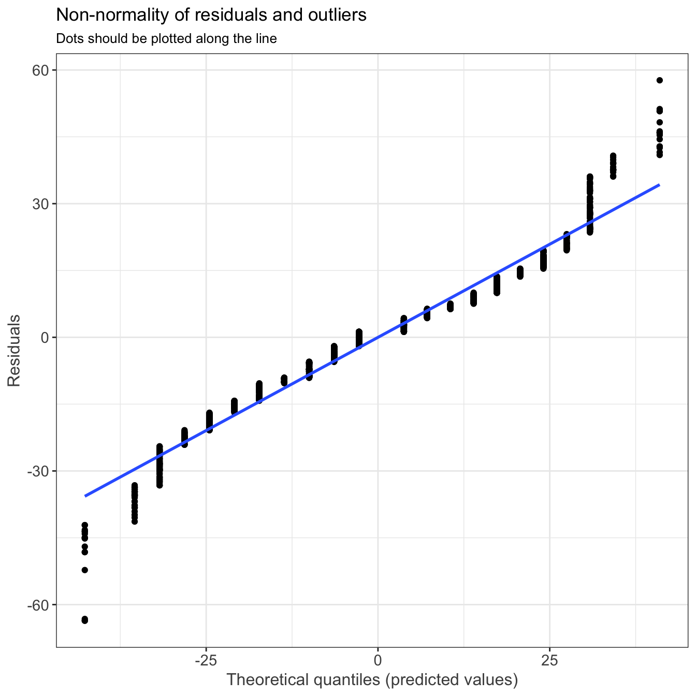
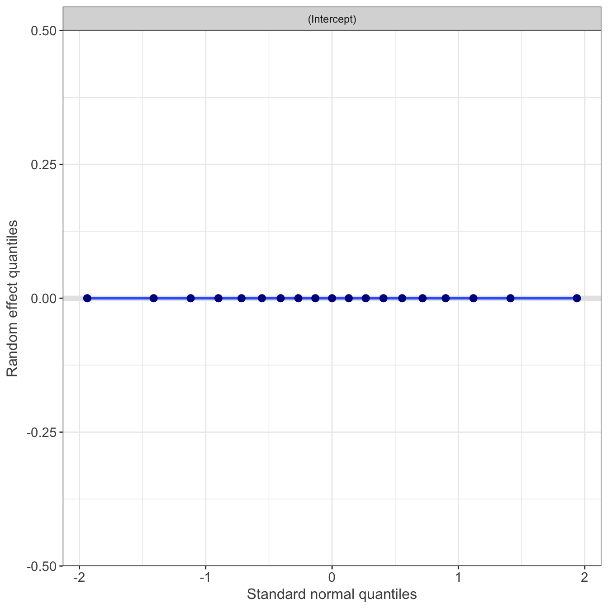
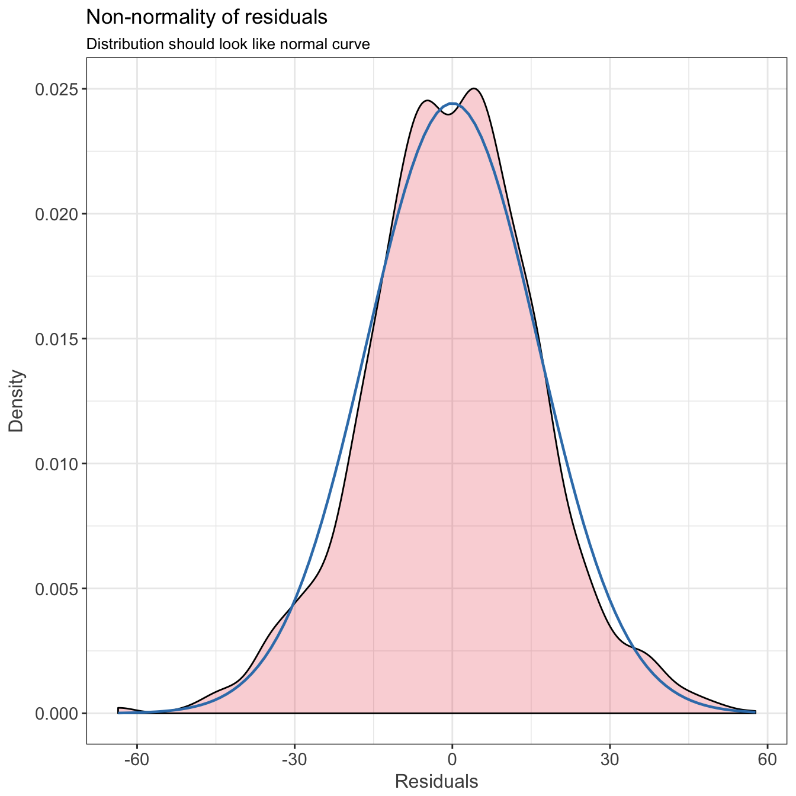
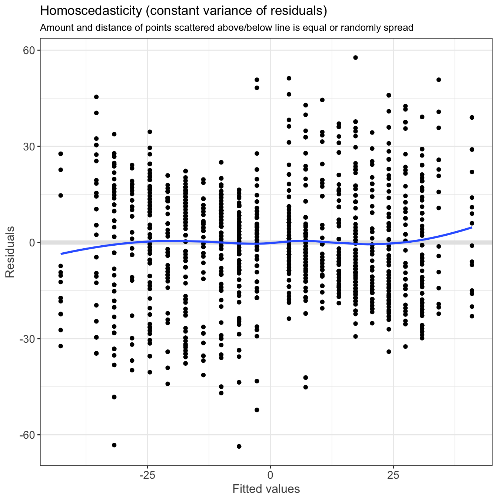

----

This script is part 3 of our analysis of the stimulus-response characteristics of the SPARS. This script describes the scale charateristics of the relationship between stimulus intensity and SPARS rating. 

Descriptive plots of the data are provided in _4A-stimulus-response-1.html_, modelling of the relationship is described in _4A-stimulus-reponse-2.html_, and diagnostics on the final linear mixed model are described in _4A-stimulus-response-4.html_.

----

# Import and cleaning

For detailed on the importing and cleaning of the data, please refer to: _4A-stimulus-response-1.html_.


----

# Scaling properties

In this analysis we examined whether there is a linear relationship between change in stimulus intensity and change in rating magnitude between two successive stimuli, irrespective of the direction of the change?

### Exploratory plots


```r
# Generate the plots for each individual
scale_plots <- data_scale %>%
    # Filter out 'no change'
    filter(change_direction != 'no change') %>% 
    # Nest data by PID
    group_by(PID) %>%
    nest() %>%
    # Plot data
    mutate(plot = map2(.x = data,
                       .y = unique(PID),
                       ~ ggplot(data = .x) +
                           aes(y = rating_delta,
                               x = intensity_delta,
                               colour = change_direction) +
                       geom_point() +
                       geom_smooth(method = 'lm') +
                       scale_color_brewer(name = 'Direction of\nintensity change',
                                          labels = c('Down', 'Up'),
                                          type = 'qual',
                                          palette = 'Dark2') +
                       scale_x_continuous(limits = c(-3.5, 3.5), 
                                          breaks = seq(from = -3, to = 3, by = 1),
                                          expand = c(0,0)) +
                       scale_y_continuous(limits = c(-70, 70), 
                                          breaks = seq(from = -60, to = 60, by = 20),
                                          expand = c(0,0)) +
                       labs(subtitle = paste0('[', .y, ']'),
                            x = expression(Delta~stimulus~intensity~(J)),
                            y = expression(Delta~SPARS~rating)) +
                       theme(legend.position = 'none'))) 

# Print plots
wrap_plots(scale_plots$plot, ncol = 4)
```


### Linear mixed model regression

To examine whether the relationship between change in rating intenisty and change in stimulus intensity was affected by the direction of the change in stimulus intensity (i.e., whether the preceeding stimulus was greater than or less than the current stimulus), we performed a linear mixed model regression (with random slope and intercept) that included an interaction term between change in stimulus intensity and the direction of the change in stimulus intensity ('up' or 'down'):

$$\Delta~SPARS~rating \thicksim \Delta~stimulus~intenisty~\ast~direction~of~change~+~(1~|~participant)$$

#### Process data


```r
data_reduced <- data_scale %>%
    # Filter out 'no change'
    filter(change_direction != 'no change') 

scale_lmm <- lmerTest::lmer(rating_delta ~ intensity_delta * change_direction + (1 | PID),
                            data = data_reduced)

knitr::kable(broom::tidy(lmerTest::anova(scale_lmm)),
             caption = 'ANOVA: Linear mixed model')
```


Table: ANOVA: Linear mixed model

term                                       sumsq         meansq   NumDF      DenDF     statistic     p.value
---------------------------------  -------------  -------------  ------  ---------  ------------  ----------
intensity_delta                     177310.39712   177310.39712       1   1773.998   663.4966140   0.0000000
change_direction                        27.74385       27.74385       1   1773.998     0.1038177   0.7473335
intensity_delta:change_direction       214.74231      214.74231       1   1773.998     0.8035671   0.3701506


```r
sjPlot::sjt.lmer(scale_lmm,
                 show.header = TRUE,
                 string.dv = "Response", 
                 string.pred = "Coefficients",
                 depvar.labels = '',
                 pred.labels = 'intensity',
                 string.est = 'Estimate',
                 string.ci = '95% CI',
                 string.p = 'p-value',
                 show.icc = FALSE,
                 show.r2 = FALSE)
```

<table style="border-collapse:collapse; border:none;border-bottom:double;">
<tr>
<td style="padding:0.2cm; border-top:double;" rowspan="2"><em>Coefficients</em></td>
<td colspan="4" style="padding:0.2cm; border-top:double; text-align:center; border-bottom:1px solid;"><em>Response</em></td>
</tr>

<td style=" padding-left:0.5em; padding-right:0.5em;">&nbsp;</td>
<td style="padding:0.2cm; text-align:center; " colspan="3"></td>
</tr>
<tr>
<td style="padding:0.2cm; font-style:italic;">&nbsp;</td>
<td style="padding-left:0.5em; padding-right:0.5em; font-style:italic;">&nbsp;</td>
<td style="padding:0.2cm; text-align:center; font-style:italic; ">Estimate</td>
<td style="padding:0.2cm; text-align:center; font-style:italic; ">95% CI</td>
<td style="padding:0.2cm; text-align:center; font-style:italic; ">p&#45;value</td> 
</tr>
<tr>
<td colspan="5" style="padding:0.2cm; text-align:left; border-top:1px solid; font-weight:bold; text-align:left;">Fixed Parts</td>
</tr>
<tr>
<td style="padding:0.2cm; text-align:left;">(Intercept)</td>
<td style="padding-left:0.5em; padding-right:0.5em; ">&nbsp;</td>
<td style="padding:0.2cm; text-align:center; ">0.87</td>
<td style="padding:0.2cm; text-align:center; ">&#45;1.12&nbsp;&ndash;&nbsp;2.87</td>
<td style="padding:0.2cm; text-align:center; ">.392</td>
</tr>
<tr>
<td style="padding:0.2cm; text-align:left;">intensity_delta</td>
<td style="padding-left:0.5em; padding-right:0.5em;">&nbsp;</td>
<td style="padding:0.2cm; text-align:center; ">14.51</td>
<td style="padding:0.2cm; text-align:center; ">13.02&nbsp;&ndash;&nbsp;16.01</td>
<td style="padding:0.2cm; text-align:center; ">&lt;.001</td>
</tr>
<tr>
<td style="padding:0.2cm; text-align:left;">change_directionup</td>
<td style="padding-left:0.5em; padding-right:0.5em;">&nbsp;</td>
<td style="padding:0.2cm; text-align:center; ">&#45;0.48</td>
<td style="padding:0.2cm; text-align:center; ">&#45;3.43&nbsp;&ndash;&nbsp;2.46</td>
<td style="padding:0.2cm; text-align:center; ">.747</td>
</tr>
<tr>
<td style="padding:0.2cm; text-align:left;">intensity_delta:change_directionup</td>
<td style="padding-left:0.5em; padding-right:0.5em;">&nbsp;</td>
<td style="padding:0.2cm; text-align:center; ">&#45;0.98</td>
<td style="padding:0.2cm; text-align:center; ">&#45;3.11&nbsp;&ndash;&nbsp;1.16</td>
<td style="padding:0.2cm; text-align:center; ">.370</td>
</tr><tr>
<td colspan="5" style="padding:0.2cm; padding-top:0.1cm; padding-bottom:0.1cm; text-align:left; font-weight:bold; text-align:left; padding-top:0.5em;">Random Parts</td>
</tr>

<tr>
<td style="padding:0.2cm; padding-top:0.1cm; padding-bottom:0.1cm; text-align:left;">&sigma;<sup>2</sup></td>
<td style="padding-left:0.5em; padding-right:0.5em;">&nbsp;</td><td style="padding:0.2cm; text-align:center; padding-top:0.1cm; padding-bottom:0.1cm;" colspan="3">267.236</td>
</tr>

<tr>
<td style="padding:0.2cm; padding-top:0.1cm; padding-bottom:0.1cm; text-align:left;">&tau;<sub>00, PID</sub></td>
<td style="padding-left:0.5em; padding-right:0.5em;">&nbsp;</td><td style="padding:0.2cm; text-align:center; padding-top:0.1cm; padding-bottom:0.1cm;" colspan="3">0.000</td>
</tr>

<tr>
<td style="padding:0.2cm; padding-top:0.1cm; padding-bottom:0.1cm; text-align:left;">N<sub>PID</sub></td>
<td style="padding-left:0.5em; padding-right:0.5em;">&nbsp;</td><td style="padding:0.2cm; text-align:center; padding-top:0.1cm; padding-bottom:0.1cm;" colspan="3">19</td>
</tr>

<tr>
<td style="padding:0.2cm; padding-top:0.1cm; padding-bottom:0.1cm; text-align:left; border-top:1px solid;">Observations</td>
<td style="padding-left:0.5em; padding-right:0.5em; border-top:1px solid;">&nbsp;</td><td style="padding:0.2cm; padding-top:0.1cm; padding-bottom:0.1cm; text-align:center; border-top:1px solid;" colspan="3">1778</td>
</tr>
</table>

#### Basic model diagnostics


```r
sjPlot::plot_model(scale_lmm,
                   type = 'diag')
```

```
## [[1]]
```



```
## 
## [[2]]
```



```
## 
## [[3]]
```



```
## 
## [[4]]
```



----

# Session information

```r
sessionInfo()
```

```
## R version 3.4.3 (2017-11-30)
## Platform: x86_64-apple-darwin15.6.0 (64-bit)
## Running under: macOS High Sierra 10.13.3
## 
## Matrix products: default
## BLAS: /Library/Frameworks/R.framework/Versions/3.4/Resources/lib/libRblas.0.dylib
## LAPACK: /Library/Frameworks/R.framework/Versions/3.4/Resources/lib/libRlapack.dylib
## 
## locale:
## [1] en_GB.UTF-8/en_GB.UTF-8/en_GB.UTF-8/C/en_GB.UTF-8/en_GB.UTF-8
## 
## attached base packages:
## [1] stats     graphics  grDevices utils     datasets  methods   base     
## 
## other attached packages:
##  [1] bindrcpp_0.2       robust_0.4-18      fit.models_0.5-14 
##  [4] patchwork_0.0.1    segmented_0.5-3.0  forcats_0.2.0     
##  [7] stringr_1.2.0      dplyr_0.7.4        purrr_0.2.4       
## [10] readr_1.1.1        tidyr_0.8.0        tibble_1.4.2      
## [13] ggplot2_2.2.1.9000 tidyverse_1.2.1    magrittr_1.5      
## 
## loaded via a namespace (and not attached):
##   [1] TH.data_1.0-8       minqa_1.2.4         colorspace_1.3-2   
##   [4] modeltools_0.2-21   sjlabelled_1.0.7    rprojroot_1.3-2    
##   [7] htmlTable_1.11.2    estimability_1.2    snakecase_0.8.1    
##  [10] base64enc_0.1-3     rstudioapi_0.7      glmmTMB_0.2.0      
##  [13] DT_0.4              mvtnorm_1.0-7       lubridate_1.7.1    
##  [16] coin_1.2-2          xml2_1.2.0          codetools_0.2-15   
##  [19] splines_3.4.3       mnormt_1.5-5        robustbase_0.92-8  
##  [22] knitr_1.19          sjmisc_2.7.0        effects_4.0-0      
##  [25] bayesplot_1.4.0     Formula_1.2-2       jsonlite_1.5       
##  [28] nloptr_1.0.4        ggeffects_0.3.1     broom_0.4.3        
##  [31] cluster_2.0.6       shiny_1.0.5         rrcov_1.4-3        
##  [34] compiler_3.4.3      httr_1.3.1          sjstats_0.14.1     
##  [37] emmeans_1.1         backports_1.1.2     assertthat_0.2.0   
##  [40] Matrix_1.2-12       lazyeval_0.2.1      survey_3.33        
##  [43] cli_1.0.0           acepack_1.4.1       htmltools_0.3.6    
##  [46] tools_3.4.3         lmerTest_2.0-36     coda_0.19-1        
##  [49] gtable_0.2.0        glue_1.2.0          reshape2_1.4.3     
##  [52] merTools_0.3.0      Rcpp_0.12.15        carData_3.0-0      
##  [55] cellranger_1.1.0    sjPlot_2.4.1        nlme_3.1-131       
##  [58] psych_1.7.8         lmtest_0.9-35       lme4_1.1-15        
##  [61] rvest_0.3.2         mime_0.5            stringdist_0.9.4.6 
##  [64] DEoptimR_1.0-8      MASS_7.3-48         zoo_1.8-1          
##  [67] scales_0.5.0.9000   hms_0.4.1           parallel_3.4.3     
##  [70] sandwich_2.4-0      pwr_1.2-1           TMB_1.7.12         
##  [73] RColorBrewer_1.1-2  yaml_2.1.16         gridExtra_2.3      
##  [76] rpart_4.1-12        latticeExtra_0.6-28 stringi_1.1.6      
##  [79] highr_0.6           pcaPP_1.9-73        checkmate_1.8.5    
##  [82] blme_1.0-4          rlang_0.1.6         pkgconfig_2.0.1    
##  [85] arm_1.9-3           evaluate_0.10.1     lattice_0.20-35    
##  [88] prediction_0.2.0    bindr_0.1           labeling_0.3       
##  [91] htmlwidgets_1.0     tidyselect_0.2.3    plyr_1.8.4         
##  [94] R6_2.2.2            Hmisc_4.1-1         multcomp_1.4-8     
##  [97] pillar_1.1.0        haven_1.1.1         foreign_0.8-69     
## [100] survival_2.41-3     abind_1.4-5         nnet_7.3-12        
## [103] modelr_0.1.1        crayon_1.3.4        rmarkdown_1.8      
## [106] grid_3.4.3          readxl_1.0.0        data.table_1.10.4-3
## [109] digest_0.6.15       xtable_1.8-2        httpuv_1.3.5       
## [112] stats4_3.4.3        munsell_0.4.3
```
