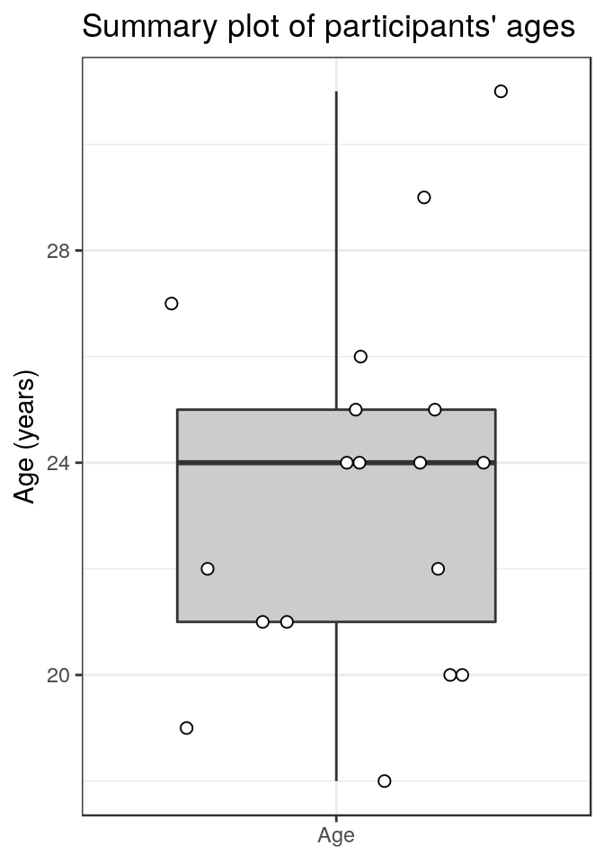
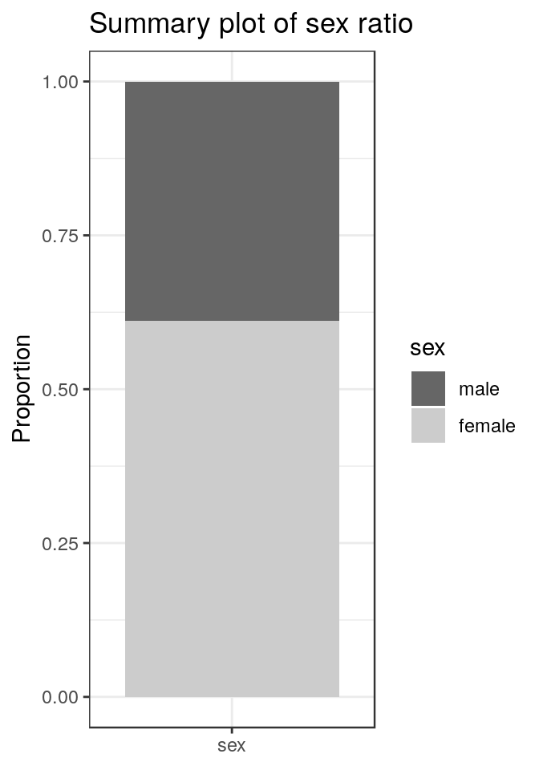
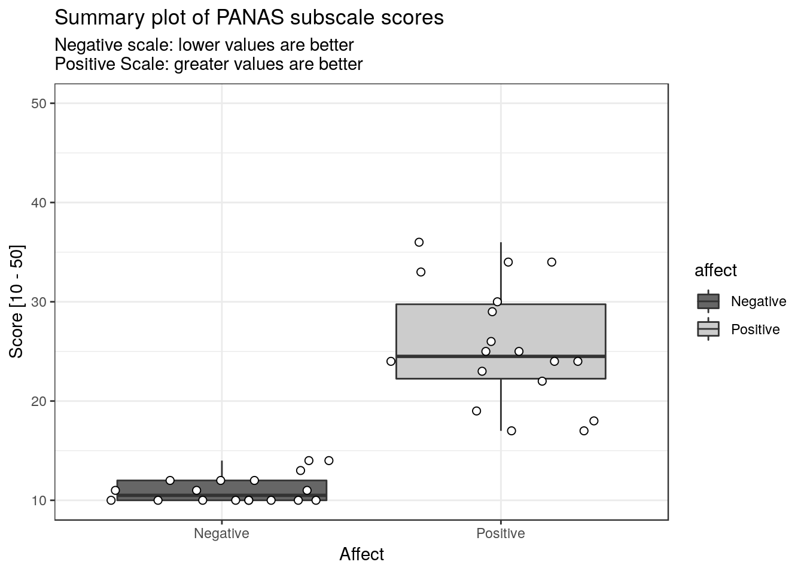
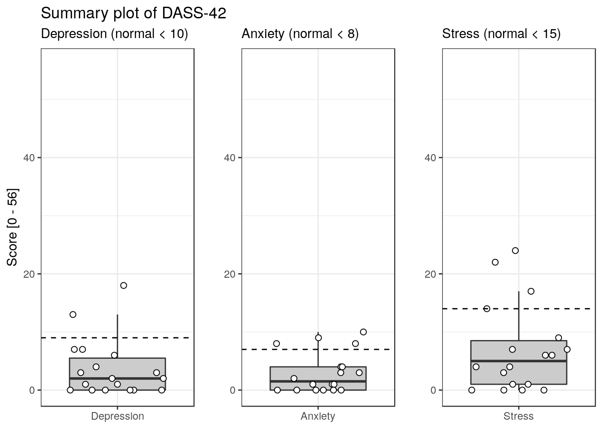

----

This script generates descriptive statistics of the SPARS (trial A) cohort, and includes assessments of:

- Age  
- Sex  
- Pain Catastrophizing Scale (PCS)  
- Positive and Negative Affect Schedule (PANAS)  
- Depression, Anxiety, and Stress Scale (DASS-42)

----

# Import and inspect data

```r
# Import
data <- read_rds('./data-cleaned/SPARS_A.rds')

# Inspect
dim(data)
```

```
## [1] 1927   19
```

```r
names(data)
```

```
##  [1] "PID"               "block"             "block_order"      
##  [4] "trial_number"      "intensity"         "intensity_char"   
##  [7] "rating"            "rating_positive"   "EDA"              
## [10] "age"               "sex"               "panas_positive"   
## [13] "panas_negative"    "dass42_depression" "dass42_anxiety"   
## [16] "dass42_stress"     "pcs_magnification" "pcs_rumination"   
## [19] "pcs_helplessness"
```

```r
head(data)
```

```
## # A tibble: 6 x 19
##   PID   block block_order trial_number intensity intensity_char rating
##   <chr> <chr>       <dbl>        <dbl>     <dbl> <chr>           <dbl>
## 1 ID01  C               1            1      3.75 3.75              -10
## 2 ID01  C               1            2      1.5  1.50              -40
## 3 ID01  C               1            3      3.25 3.25              -10
## 4 ID01  C               1            4      1.5  1.50              -25
## 5 ID01  C               1            5      3    3.00              -20
## 6 ID01  C               1            6      2.75 2.75              -25
## # ... with 12 more variables: rating_positive <dbl>, EDA <dbl>, age <dbl>,
## #   sex <dbl>, panas_positive <dbl>, panas_negative <dbl>,
## #   dass42_depression <dbl>, dass42_anxiety <dbl>, dass42_stress <dbl>,
## #   pcs_magnification <dbl>, pcs_rumination <dbl>, pcs_helplessness <dbl>
```

```r
tail(data)
```

```
## # A tibble: 6 x 19
##   PID   block block_order trial_number intensity intensity_char rating
##   <chr> <chr>       <dbl>        <dbl>     <dbl> <chr>           <dbl>
## 1 ID15  B               4           99      2.5  2.50              -40
## 2 ID15  B               4          100      2.5  2.50              -20
## 3 ID15  B               4          101      2.75 2.75              -25
## 4 ID15  B               4          102      4    4.00               15
## 5 ID15  B               4          103      1.75 1.75              -50
## 6 ID15  B               4          104      3    3.00              -20
## # ... with 12 more variables: rating_positive <dbl>, EDA <dbl>, age <dbl>,
## #   sex <dbl>, panas_positive <dbl>, panas_negative <dbl>,
## #   dass42_depression <dbl>, dass42_anxiety <dbl>, dass42_stress <dbl>,
## #   pcs_magnification <dbl>, pcs_rumination <dbl>, pcs_helplessness <dbl>
```

```r
glimpse(data)
```

```
## Observations: 1,927
## Variables: 19
## $ PID               <chr> "ID01", "ID01", "ID01", "ID01", "ID01", "ID0...
## $ block             <chr> "C", "C", "C", "C", "C", "C", "C", "C", "C",...
## $ block_order       <dbl> 1, 1, 1, 1, 1, 1, 1, 1, 1, 1, 1, 1, 1, 1, 1,...
## $ trial_number      <dbl> 1, 2, 3, 4, 5, 6, 7, 8, 9, 10, 11, 12, 13, 1...
## $ intensity         <dbl> 3.75, 1.50, 3.25, 1.50, 3.00, 2.75, 1.00, 2....
## $ intensity_char    <chr> "3.75", "1.50", "3.25", "1.50", "3.00", "2.7...
## $ rating            <dbl> -10, -40, -10, -25, -20, -25, -40, 2, -40, -...
## $ rating_positive   <dbl> 40, 10, 40, 25, 30, 25, 10, 52, 10, 40, 54, ...
## $ EDA               <dbl> 18315.239, 13904.177, 11543.449, 20542.834, ...
## $ age               <dbl> 21, 21, 21, 21, 21, 21, 21, 21, 21, 21, 21, ...
## $ sex               <dbl> 2, 2, 2, 2, 2, 2, 2, 2, 2, 2, 2, 2, 2, 2, 2,...
## $ panas_positive    <dbl> 36, 36, 36, 36, 36, 36, 36, 36, 36, 36, 36, ...
## $ panas_negative    <dbl> 10, 10, 10, 10, 10, 10, 10, 10, 10, 10, 10, ...
## $ dass42_depression <dbl> 0, 0, 0, 0, 0, 0, 0, 0, 0, 0, 0, 0, 0, 0, 0,...
## $ dass42_anxiety    <dbl> 1, 1, 1, 1, 1, 1, 1, 1, 1, 1, 1, 1, 1, 1, 1,...
## $ dass42_stress     <dbl> 0, 0, 0, 0, 0, 0, 0, 0, 0, 0, 0, 0, 0, 0, 0,...
## $ pcs_magnification <dbl> 6, 6, 6, 6, 6, 6, 6, 6, 6, 6, 6, 6, 6, 6, 6,...
## $ pcs_rumination    <dbl> 11, 11, 11, 11, 11, 11, 11, 11, 11, 11, 11, ...
## $ pcs_helplessness  <dbl> 10, 10, 10, 10, 10, 10, 10, 10, 10, 10, 10, ...
```

----

# Clean data

```r
# Select participant descriptive data
data %<>%
  select(PID, age:pcs_helplessness)

# Filter unique data for each individual
data %<>%
  group_by(PID) %>%
  distinct() %>%
  ungroup()

# Quick inspection for duplicates
data
```

```
## # A tibble: 19 x 11
##    PID     age   sex panas_positive panas_negative dass42_depressi…
##    <chr> <dbl> <dbl>          <dbl>          <dbl>            <dbl>
##  1 ID01     21     2             36             10                0
##  2 ID02     20     1             34             11                3
##  3 ID03     19     1             22             12                3
##  4 ID04     21     2             17             10                0
##  5 ID07     27     1             33             10                1
##  6 ID08     24     2             23             11                0
##  7 ID09     26     2             26             13                6
##  8 ID10     20     2             24             10                0
##  9 ID11     24     2             18             11                1
## 10 ID13     25     2             34             10                4
## 11 ID14     29     2             24             14                7
## 12 ID16     30     2             29             16                5
## 13 ID17     24     1             25             12                2
## 14 ID18     31     1             24             10                7
## 15 ID19     22     1             19             14               13
## 16 ID05     25     2             17             10                0
## 17 ID06     22     2             30             10                0
## 18 ID12     18     2             29             10               18
## 19 ID15     24     1             25             12                2
## # ... with 5 more variables: dass42_anxiety <dbl>, dass42_stress <dbl>,
## #   pcs_magnification <dbl>, pcs_rumination <dbl>, pcs_helplessness <dbl>
```

```r
# Remove ID15 duplicate (row 16, one miscoded value of 13 for dass42_anxiety)
data <- data[-16, ]
```

----

# Age 


```r
# Tabulate
data %>%
  select(age) %>%
  summarise(Mean = round(mean(age), 1),
            Median = median(age),
            iqr = paste(round(quantile(age, 0.25)), '-', 
                        round(quantile(age, 0.75))),
            range = paste(min(age), '-', max(age))) %>%
  knitr::kable(x = .,
               caption = 'Summary table of age in years',
               col.names = c('Mean', 'Median', 'IQR', 'Range'),
               align = 'rrrr')
```


Table: Summary table of age in years

 Mean   Median       IQR     Range
-----  -------  --------  --------
 23.7       24   21 - 26   18 - 31

```r
# Plot
data %>%
  select(age) %>%
  ggplot(data = .) +
  aes(x = 'Age',
      y = age) +
  geom_boxplot(outlier.size = -1,
               fill = '#cccccc') +
  geom_point(shape = 21,
             size = 2,
             fill = '#FFFFFF',
             position = position_jitter(height = 0)) +
  labs(title = "Summary plot of participants' ages",
       y = 'Age (years)') +
  theme_bw() +
  theme(axis.title.x = element_blank())
```



----

# Sex


```r
# Process data
sex <- data %>%
  select(sex) %>%
  mutate(sex = factor(sex),
         sex = fct_recode(sex, 
                          male = '1',
                          female = '2')) %>%
  group_by(sex) %>%
  summarise(count = n(),
            proportion = round(count / nrow(.), 2))

# Tabulate data
knitr::kable(x = sex,
             caption = 'Summary table sex ratio',
             col.names = c('', 'Count', 'Proportion'),
             align = 'lrr')
```


Table: Summary table sex ratio

          Count   Proportion
-------  ------  -----------
male          7         0.39
female       11         0.61

```r
# Plot
ggplot(data = sex) +
  aes(x = 'sex',
      y = count,
      fill = sex) +
  geom_col(position = position_fill()) +
  scale_fill_grey(start = 0.4) +
  labs(title = "Summary plot of sex ratio",
       y = 'Proportion') +
  theme_bw() +
  theme(axis.title.x = element_blank())
```



----

# Pain Catastrophizing Scale (PCS)

The Pain Catastrophizing Scale (PCS) [^0] is a 13-item scale, with each item rated on a 5-point Likert scale: 0 (not at all) to 4 (all the time). The PCS consists of three subscales being magnification (3 items), rumination (4 items), and helplessness (6 items).

[^0]: Sullivan M, Bishop SR, Pivik J. The pain catastrophizing scale: development and validation. _Psychol. Assess._ **7**: 524, 1995. [Download](http://sullivan-painresearch.mcgill.ca/pdf/abstracts/sullivanapr1995.pdf)


```r
# Process data 
pcs <- data %>%
  select(starts_with('pcs')) %>%
  mutate(pcs_total = rowSums(.)) 

# Tabulate
pcs %>%
  gather(key = subscale,
         value = score) %>%
  group_by(subscale) %>%
  summarise(Mean = round(mean(score), 1),
            Median = median(score),
            iqr = paste(round(quantile(score, 0.25)), '-', 
                        round(quantile(score, 0.75))),
            range = paste(min(score), '-', max(score))) %>%
  knitr::kable(x = .,
               caption = 'Summary table of PCS total and subscale scores',
               col.names = c('', 'Mean', 'Median', 'IQR', 'Range'),
               align = 'lrrrr')
```


Table: Summary table of PCS total and subscale scores

                     Mean   Median       IQR    Range
------------------  -----  -------  --------  -------
pcs_helplessness      6.1      6.0     4 - 9   0 - 11
pcs_magnification     3.7      4.0     1 - 6    0 - 9
pcs_rumination        7.2      7.5    4 - 10   0 - 13
pcs_total            16.9     17.5   12 - 25   1 - 31

```r
# Plot
total <- pcs %>%
  select(pcs_total) %>%
  ggplot(data = .) +
  aes(x = 'Total',
      y = pcs_total) +
  geom_boxplot(outlier.size = -1,
               fill = '#cccccc') +
  geom_point(shape = 21,
             size = 2,
             fill = '#FFFFFF',
             position = position_jitter(height = 0)) +
  geom_hline(yintercept = 30,
             linetype = 2) +
  lims(y = c(0, 52)) +
  labs(title = 'Summary plot of PCS total and subscale scores',
       subtitle = 'Total score (normal < 30)',
       y = 'Score [0 - 52]') +
  theme_bw() +
  theme(axis.title.x = element_blank())

rumination <- pcs %>%
  select(pcs_rumination) %>%
  ggplot(data = .) +
  aes(x = 'Rumination',
      y = pcs_rumination) +
  geom_boxplot(outlier.size = -1,
               fill = '#cccccc') +
  geom_point(shape = 21,
             size = 2,
             fill = '#FFFFFF',
             position = position_jitter(height = 0)) +
  lims(y = c(0, 16)) +
  labs(title = '',
       subtitle = 'Rumination score\n(max score = 16)',
       y = 'Score [0 - 16]') +
  theme_bw() +
  theme(axis.title.x = element_blank())

magnification <- pcs %>%
  select(pcs_magnification) %>%
  ggplot(data = .) +
  aes(x = 'Magnification',
      y = pcs_magnification) +
  geom_boxplot(outlier.size = -1,
               fill = '#cccccc') +
  geom_point(shape = 21,
             size = 2,
             fill = '#FFFFFF',
             position = position_jitter(height = 0)) +
  scale_y_continuous(breaks = c(0, 3, 6, 9, 12), limits = c(0, 12)) +
  labs(title = '',
       subtitle = 'Magnification score\n(max score = 12)',
       y = 'Score [0 - 12]') +
  theme_bw() +
  theme(axis.title.x = element_blank())

helplessness <- pcs %>%
  select(pcs_helplessness) %>%
  ggplot(data = .) +
  aes(x = 'Helplessness',
      y = pcs_helplessness) +
  geom_boxplot(outlier.size = -1,
               fill = '#cccccc') +
  geom_point(shape = 21,
             size = 2,
             fill = '#FFFFFF',
             position = position_jitter(height = 0)) +
  lims(y = c(0, 24)) +
  labs(title = '',
       subtitle = 'Helplessness score\n(max score = 24)',
       y = 'Score [0 - 24]') +
  theme_bw() +
  theme(axis.title.x = element_blank())

# Patch plots together
total + {magnification + rumination + helplessness} + plot_layout(nrow = 2)
```


----

# Positive and Negative Affect Schedule (PANAS)

The Positive and Negative Affect Schedule (PANAS) [^1] is a self-report questionnaire that consists of two 10-item scales to measure positive and negative affect. Each item is rated on a Likert scale of 1 (not at all) to 5 (very much).

[^1]: Crawford JR, Henry JD. The positive and negative affect schedule (PANAS): construct validity, measurement properties and normative data in a large non-clinical sample. _Br J Clin Psychol_ **43**: 245-65, 2004. PMID: [15333231](https://www.ncbi.nlm.nih.gov/pubmed/15333231).


```r
# Process
panas <- data %>%
  select(PID, starts_with('panas')) %>%
  gather(key = affect,
         value = score,
         -PID) %>%
  mutate(total_score = as.integer(score),
         affect = fct_recode(affect, 
                             Negative = 'panas_negative',
                             Positive = 'panas_positive'))

# Tabulate
panas %>%   
  group_by(affect) %>%
  summarise(median = median(score),
            iqr = paste(round(quantile(score, 0.25)), '-', 
                        round(quantile(score, 0.75))),
            range = paste(min(score), '-', max(score))) %>%
  knitr::kable(x = .,
               caption = 'Summary table of PANAS subscale scores',
               col.names = c('Affect', 'Median', 'IQR', 'Range'),
               align = 'lrrr')
```


Table: Summary table of PANAS subscale scores

Affect      Median       IQR     Range
---------  -------  --------  --------
Negative        11   10 - 12   10 - 16
Positive        25   23 - 30   17 - 36

```r
# Plot
ggplot(data = panas) +
  aes(x = affect,
      y = score,
      fill = affect) +
  geom_boxplot() +
  geom_point(shape = 21,
             size = 2,
             fill = '#FFFFFF',
             position = position_jitter(height = 0)) +
  scale_fill_grey(start = 0.4) +
  lims(y = c(10, 50)) +
  labs(title = 'Summary plot of PANAS subscale scores',
       x = 'Affect',
       y = 'Score [10 - 50]',
       subtitle = 'Negative scale: lower values are better\nPositive Scale: greater values are better') +
  theme_bw()
```



----

# Depression, Anxiety and Stress Scale (DASS-42)

The Depression Anxiety Stress Scales [^2] is a 42 self-report item scale assessing negative emotional symptoms. Each item is rated on a four-point Likert scale of frequency or severity of the participants' experiences over the last week with the intention of emphasising states over traits. These scores ranged from 0 (did not apply at all) to 4 (applied to them very much/most of the time).

[^2]: Crawford JR, Henry JD. The Depression Anxiety Stress Scales (DASS): normative 
data and latent structure in a large non-clinical sample. _Br J Clin Psychol_ **42**: 111-31, 2003. PMID: [12828802](https://www.ncbi.nlm.nih.gov/pubmed/12828802)


```r
# Tabulate
data %>%
  select(PID, dass42_depression, dass42_anxiety, dass42_stress) %>%
  rename(depression = dass42_depression,
         anxiety = dass42_anxiety,
         stress = dass42_stress) %>%
  gather(key = dimension,
         value = score,
         -PID) %>%
  group_by(dimension) %>%
  summarise(median = median(score),
            iqr = paste(round(quantile(score, 0.25)), '-', 
                        round(quantile(score, 0.75))),
            range = paste(min(score), '-', max(score))) %>%
  knitr::kable(x = .,
               caption = 'Summary table of DASS-42 dimension scores',
               col.names = c('Dimension', 'Median', 'IQR', 'Range'),
               align = 'lrrr')
```


Table: Summary table of DASS-42 dimension scores

Dimension     Median      IQR    Range
-----------  -------  -------  -------
anxiety          2.0    0 - 6   0 - 10
depression       2.5    0 - 6   0 - 18
stress           6.0   2 - 12   0 - 24

```r
# Process plots
depression <- data %>%
  select(PID, dass42_depression) %>%
  rename(depression = dass42_depression) %>%
  ggplot(data = .) +
  aes(x = 'Depression',
      y = depression) +
  geom_boxplot(outlier.size = -1,
               fill = '#cccccc') +
  geom_point(shape = 21,
             size = 2,
             fill = '#FFFFFF',
             position = position_jitter(height = 0)) +
  geom_hline(yintercept = 9, 
             linetype = 2) +
  lims(y = c(0, 56)) +
  labs(title = 'Summary plot of DASS-42',
       subtitle = 'Depression (normal < 10)',
       y = 'Score [0 - 56]') +
  theme_bw() +
  theme(axis.title.x = element_blank())

anxiety <- data %>%
  select(PID, dass42_anxiety) %>%
  rename(anxiety = dass42_anxiety) %>%
  ggplot(data = .) +
  aes(x = 'Anxiety',
      y = anxiety) +
  geom_boxplot(outlier.size = -1,
               fill = '#cccccc') +
  geom_point(shape = 21,
             size = 2,
             fill = '#FFFFFF',
             position = position_jitter(height = 0)) +
  geom_hline(yintercept = 7, 
             linetype = 2) +
  lims(y = c(0, 56)) +
  labs(title = '',
       subtitle = 'Anxiety (normal < 8)',
       y = '') +
  theme_bw() +
  theme(axis.title.x = element_blank())

stress <- data %>%
  select(PID, dass42_stress) %>%
  rename(stress = dass42_stress) %>%
  ggplot(data = .) +
  aes(x = 'Stress',
      y = stress) +
  geom_boxplot(outlier.size = -1,
               fill = '#cccccc') +
  geom_point(shape = 21,
             size = 2,
             fill = '#FFFFFF',
             position = position_jitter(height = 0)) +
  geom_hline(yintercept = 14, 
             linetype = 2) +
  lims(y = c(0, 56)) +
  labs(title = '',
       subtitle = 'Stress (normal < 15)',
       y = '') +
  theme_bw() +
  theme(axis.title.x = element_blank())

# Patch them together
depression + anxiety + stress + plot_layout(ncol = 3)
```



----

# Session information

```r
sessionInfo()
```

```
## R version 3.5.1 (2018-07-02)
## Platform: x86_64-apple-darwin15.6.0 (64-bit)
## Running under: macOS  10.14
## 
## Matrix products: default
## BLAS: /Library/Frameworks/R.framework/Versions/3.5/Resources/lib/libRblas.0.dylib
## LAPACK: /Library/Frameworks/R.framework/Versions/3.5/Resources/lib/libRlapack.dylib
## 
## locale:
## [1] en_GB.UTF-8/en_GB.UTF-8/en_GB.UTF-8/C/en_GB.UTF-8/en_GB.UTF-8
## 
## attached base packages:
## [1] stats     graphics  grDevices utils     datasets  methods   base     
## 
## other attached packages:
##  [1] bindrcpp_0.2.2  patchwork_0.0.1 forcats_0.3.0   stringr_1.3.1  
##  [5] dplyr_0.7.6     purrr_0.2.5     readr_1.1.1     tidyr_0.8.1    
##  [9] tibble_1.4.2    ggplot2_3.0.0   tidyverse_1.2.1 magrittr_1.5   
## 
## loaded via a namespace (and not attached):
##  [1] tidyselect_0.2.4 haven_1.1.2      lattice_0.20-35  colorspace_1.3-2
##  [5] htmltools_0.3.6  yaml_2.2.0       utf8_1.1.4       rlang_0.2.2     
##  [9] pillar_1.3.0     glue_1.3.0       withr_2.1.2      modelr_0.1.2    
## [13] readxl_1.1.0     bindr_0.1.1      plyr_1.8.4       munsell_0.5.0   
## [17] gtable_0.2.0     cellranger_1.1.0 rvest_0.3.2      evaluate_0.11   
## [21] labeling_0.3     knitr_1.20       fansi_0.3.0      highr_0.7       
## [25] broom_0.5.0      Rcpp_0.12.19     scales_1.0.0     backports_1.1.2 
## [29] jsonlite_1.5     hms_0.4.2        digest_0.6.17    stringi_1.2.4   
## [33] grid_3.5.1       rprojroot_1.3-2  cli_1.0.1        tools_3.5.1     
## [37] lazyeval_0.2.1   crayon_1.3.4     pkgconfig_2.0.2  xml2_1.2.0      
## [41] lubridate_1.7.4  assertthat_0.2.0 rmarkdown_1.10   httr_1.3.1      
## [45] rstudioapi_0.8   R6_2.2.2         nlme_3.1-137     compiler_3.5.1
```
