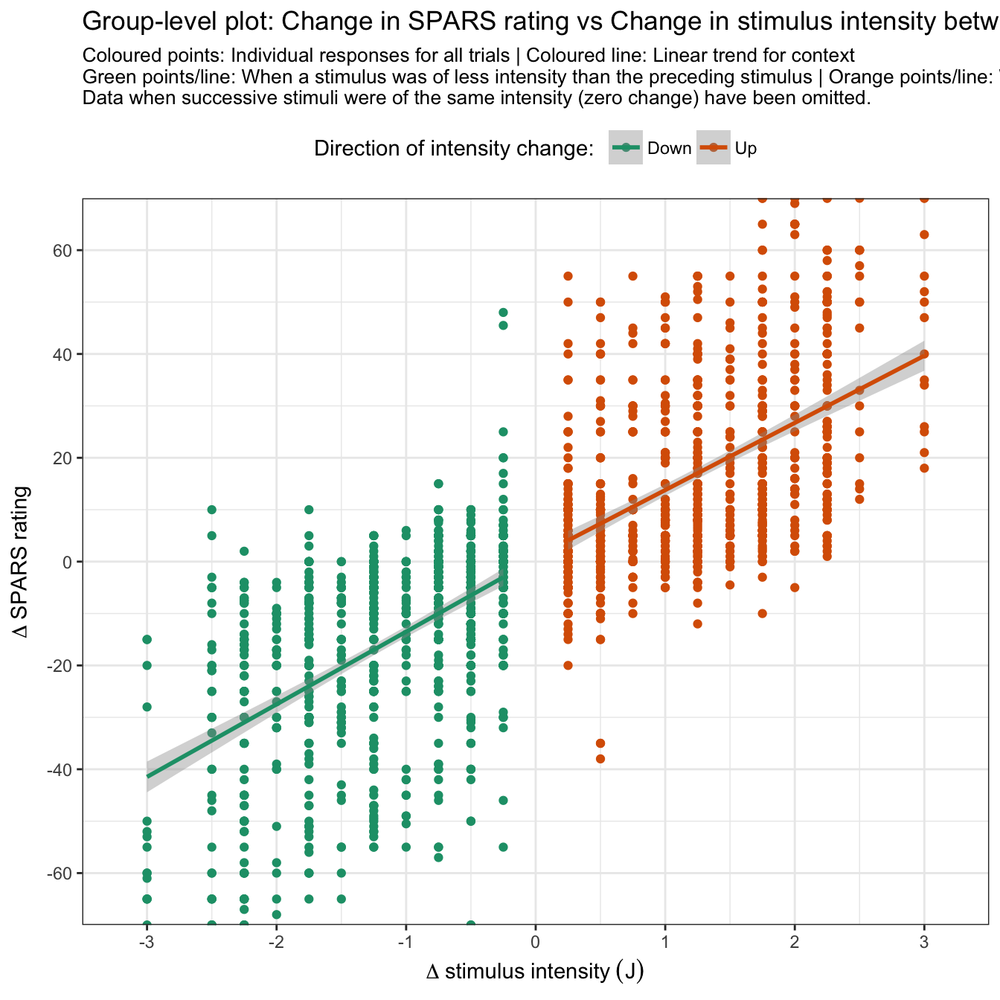
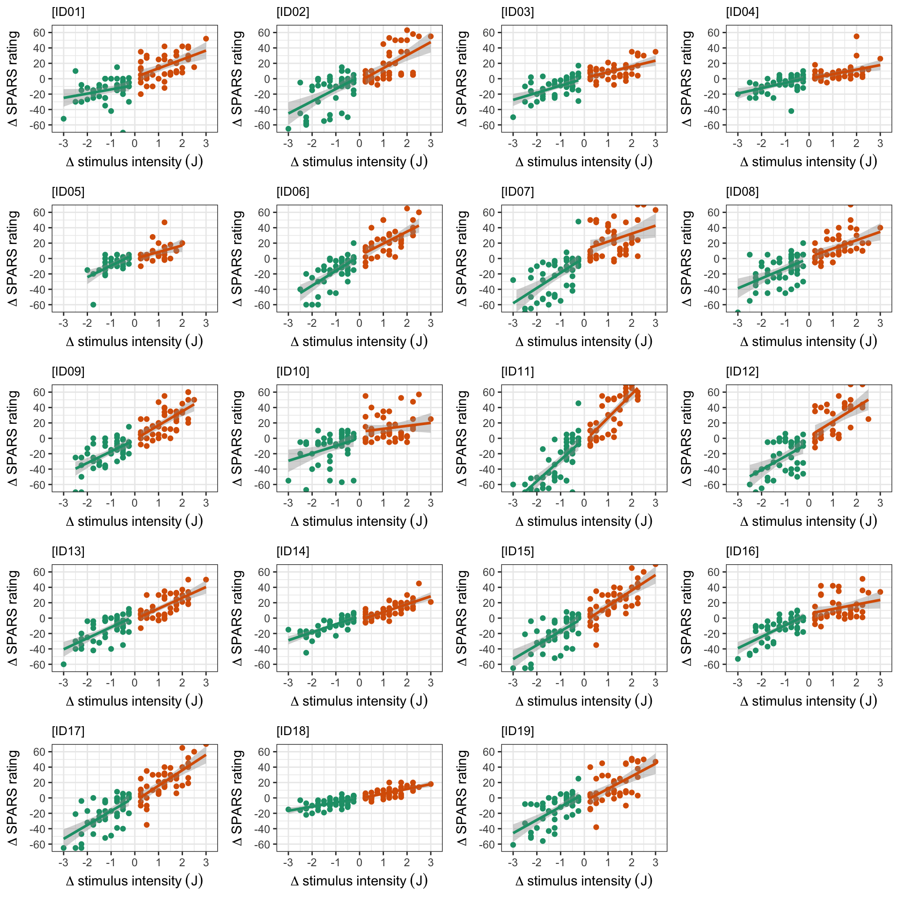
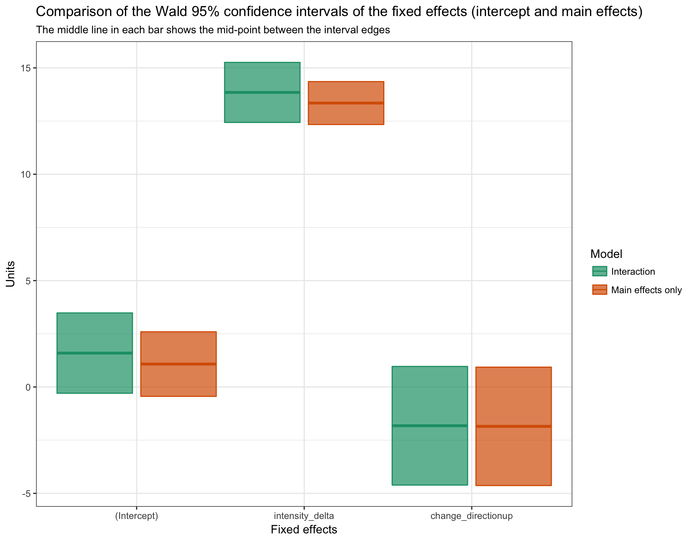
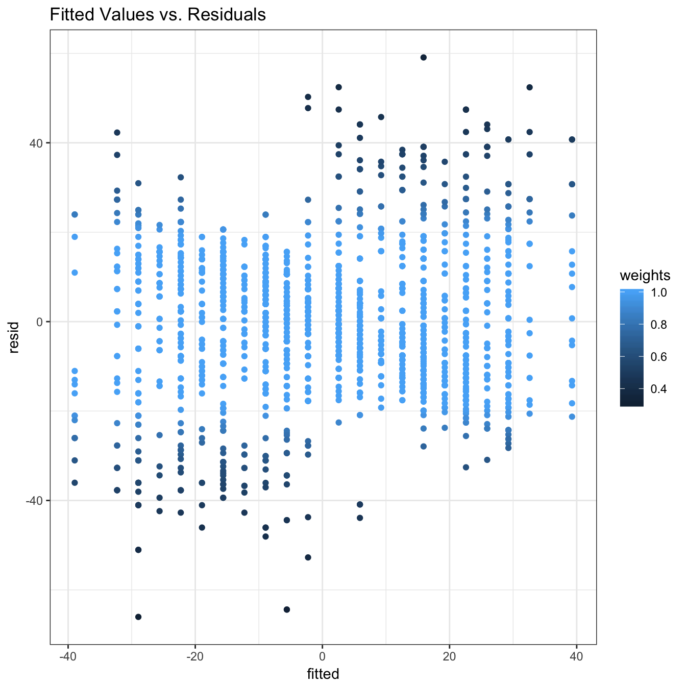
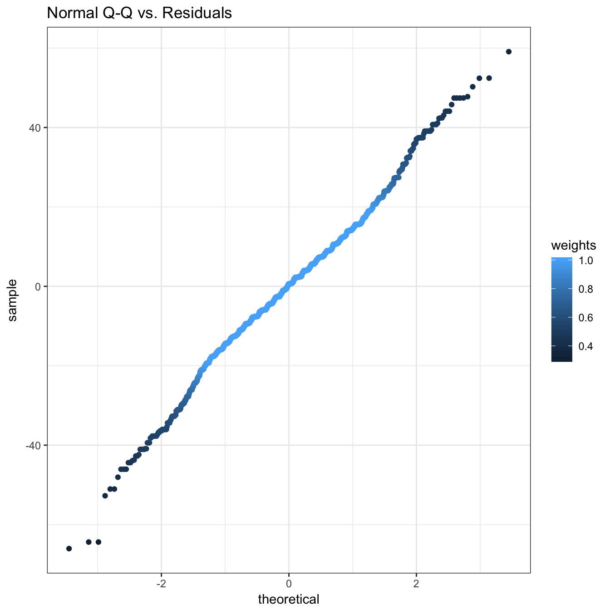
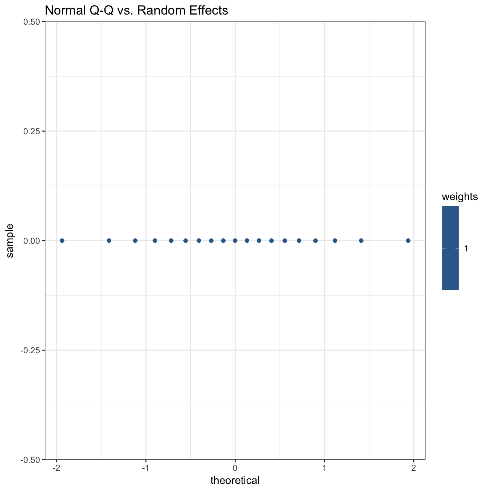
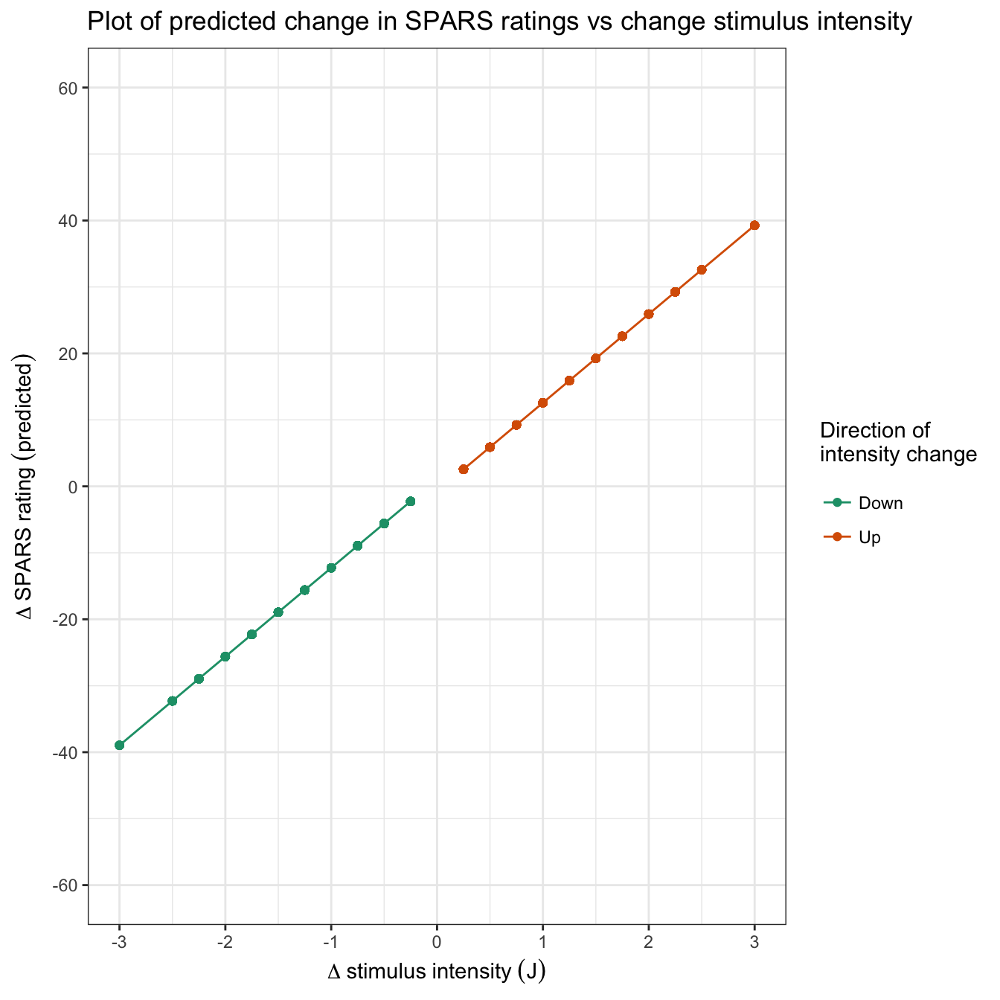

----

This script is part 3 of our analysis of the stimulus-response characteristics of the SPARS. In this analysis we examined whether there is a linear relationship between change in stimulus intensity and change in rating magnitude between two successive stimuli, irrespective of the direction of the change?

Descriptive plots of the data are provided in _4A-stimulus-response-1.html_, modelling of the relationship is described in _4A-stimulus-reponse-2.html_, and diagnostics on the final linear mixed model are described in _4A-stimulus-response-4.html_.

----

# Import and cleaning

For details on the importing and preliminary cleaning of the data, please refer to: _4A-stimulus-response-1.html_.


```r
############################################################
#                                                          #
#          Define Walf CI function for robust LMM          #
#                                                          #
############################################################
# Adapted from code provided Ben Bolker on StackExchange: https://stats.stackexchange.com/questions/233800/how-can-i-get-confidence-intervals-for-fixed-effects-using-the-rlmer-function-r

confint.rlmerMod <- function(object, level = 0.95) {
  # Extract beta coefficients
  beta <- fixef(object)
  # Extract names of coefficients
  parm <- names(beta)
  # Extract standard errors for the coefficients
  se <- sqrt(diag(vcov(object)))
  # Set level of confidence interval
  z <- qnorm((1 + level) / 2)
  # Calculate CI
  ctab <- cbind(beta - (z * se), 
                beta + (z * se))
  # label column names
  colnames(ctab) <- c(paste(100 * ((1 - level) / 2), '%'),
                      paste(100 * ((1 + level) / 2), '%'))
  # Output
  return(as.data.frame(ctab[parm, ]))
  }

############################################################
#                                                          #
#                    Generate core data                    #
#                                                          #
############################################################
# Calculate lagged data 
data_scale <- data %>%
    # Get lag-1 stimulus intensity and FEST rating by PID
    group_by(PID) %>%
    mutate(intensity_lag = lag(intensity),
           rating_lag = lag(rating)) %>%
    # Ungroup and remove incomplete cases greated by lag function
    ungroup() %>%
    filter(complete.cases(.))

# Calculate change in stimulus intensity and SPARS rating between successive stimuli
data_scale %<>%
    mutate(intensity_delta = intensity - intensity_lag,
           rating_delta = rating - rating_lag) %>%
    # Determine the direction of the change in stimulus intensity
    mutate(change_direction = case_when(
        intensity_delta > 0 ~ 'up',
        intensity_delta < 0 ~ 'down',
        intensity_delta == 0 ~ 'no change'
        ))

# Filter out 'no change' change_direction
data_reduced <- data_scale %>%
    filter(change_direction != 'no change') 
```

----

# Exporatory plots 

### Group-level


```r
# Generate the plots for each individual
data_scale %>%
    # Filter out 'no change'
    filter(change_direction != 'no change') %>% 
    ggplot(data = .) +
    aes(y = rating_delta,
        x = intensity_delta,
        colour = change_direction) +
    geom_point() +
    geom_smooth(method = 'lm') +
    scale_color_brewer(name = 'Direction of intensity change: ',
                       labels = c('Down', 'Up'),
                       type = 'qual',
                       palette = 'Dark2') +
    scale_x_continuous(limits = c(-3.5, 3.5), 
                       breaks = seq(from = -3, to = 3, by = 1),
                       expand = c(0,0)) +
    scale_y_continuous(limits = c(-70, 70), 
                       breaks = seq(from = -60, to = 60, by = 20),
                                    expand = c(0,0)) +
    labs(title = 'Group-level plot: Change in SPARS rating vs Change in stimulus intensity between two successive stimuli',
         subtitle = 'Coloured points: Individual responses for all trials | Coloured line: Linear trend for context\nGreen points/line: When a stimulus was of less intensity than the preceding stimulus | Orange points/line: When a stimulus was of greater intensity than the preceding stimulus\nData when successive stimuli were of the same intensity (zero change) have been omitted.',
         x = expression(Delta~stimulus~intensity~(J)),
         y = expression(Delta~SPARS~rating)) +
    theme(legend.position = 'top')
```



### Participant-level

**Participant-level plot: Change in SPARS rating vs change in stimulus intensity between two successive stimuli**  
Coloured points: Per trial responses | Coloured line: Linear trend for the group  
<span style="#009E79">Green points/line</span>: When a stimulus was less than the preceding stimulus intensity | <span style="E25E1E">Orange points/line</span>: When a stimulus was greater than the preceding stimulus intensity.  
Data when successive stimuli were of the same intensity (zero change) have been omitted.


```r
# Generate the plots for each individual
scale_plots <- data_scale %>%
    # Filter out 'no change'
    filter(change_direction != 'no change') %>% 
    # Nest data by PID
    group_by(PID) %>%
    nest() %>%
    # Plot data
    mutate(plot = map2(.x = data,
                       .y = unique(PID),
                       ~ ggplot(data = .x) +
                           aes(y = rating_delta,
                               x = intensity_delta,
                               colour = change_direction) +
                       geom_point() +
                       geom_smooth(method = 'lm') +
                       scale_color_brewer(name = 'Direction of\nintensity change',
                                          labels = c('Down', 'Up'),
                                          type = 'qual',
                                          palette = 'Dark2') +
                       scale_x_continuous(limits = c(-3.5, 3.5), 
                                          breaks = seq(from = -3, to = 3, by = 1),
                                          expand = c(0,0)) +
                       scale_y_continuous(limits = c(-70, 70), 
                                          breaks = seq(from = -60, to = 60, by = 20),
                                          expand = c(0,0)) +
                       labs(subtitle = paste0('[', .y, ']'),
                            x = expression(Delta~stimulus~intensity~(J)),
                            y = expression(Delta~SPARS~rating)) +
                       theme(legend.position = 'none'))) 

# Print plots
wrap_plots(scale_plots$plot, ncol = 4)
```



----

# Linear mixed model regression

To examine whether the relationship between change in rating intensity and change in stimulus intensity was affected by the direction of the change in stimulus intensity (i.e., whether the preceding stimulus was greater than or less than the current stimulus), we fit a linear mixed model regression (with random intercept) that included an interaction term between change in stimulus intensity and the direction of the change in stimulus intensity ('up' or 'down'):

$$\Delta~SPARS~rating \thicksim \Delta~stimulus~intenisty~\ast~direction~of~change~+~(1~|~participant)$$

### Generate Robust LMM

Preliminary analysis indicated that influence points may be an issue, and so we modelled the data using robust methods.

We generated two models. The first model included an interaction term between change in stimulus internist's and direction of change, and the second model did not. Comparing the models allows one you check whether the slope of the SPARS rating vs change in stimulus intensity relationship was dependent on the direction of the change in stimulus intensity.


```r
# Linear mixed model with interaction
scale_lmm <- rlmer(rating_delta ~ intensity_delta * change_direction + (1 | PID),
                   method = 'DASvar', 
                   data = data_reduced)

# Linear mixed model without interaction
scale_lmm2 <- rlmer(rating_delta ~ intensity_delta + change_direction + (1 | PID),
                    method = 'DASvar', 
                    data = data_reduced)

# Inspect models
## With interaction
summary(scale_lmm)
```

```
## Robust linear mixed model fit by DASvar 
## Formula: rating_delta ~ intensity_delta * change_direction + (1 | PID) 
##    Data: data_reduced 
## 
## Scaled residuals: 
##     Min      1Q  Median      3Q     Max 
## -4.3441 -0.6419  0.0219  0.6425  3.9253 
## 
## Random effects:
##  Groups   Name        Variance Std.Dev.
##  PID      (Intercept)   0.0     0.00   
##  Residual             226.9    15.06   
## Number of obs: 1778, groups: PID, 19
## 
## Fixed effects:
##                                    Estimate Std. Error t value
## (Intercept)                          1.5932     0.9628   1.655
## intensity_delta                     13.8459     0.7199  19.233
## change_directionup                  -1.8224     1.4222  -1.281
## intensity_delta:change_directionup  -0.9675     1.0292  -0.940
## 
## Correlation of Fixed Effects:
##             (Intr) intns_ chng_d
## intnsty_dlt  0.850              
## chng_drctnp -0.677 -0.575       
## intnsty_d:_ -0.594 -0.699 -0.051
## 
## Robustness weights for the residuals: 
##  1397 weights are ~= 1. The remaining 381 ones are summarized as
##    Min. 1st Qu.  Median    Mean 3rd Qu.    Max. 
##   0.310   0.584   0.749   0.740   0.906   0.999 
## 
## Robustness weights for the random effects: 
##  All 19 weights are ~= 1.
## 
## Rho functions used for fitting:
##   Residuals:
##     eff: smoothed Huber (k = 1.345, s = 10) 
##     sig: smoothed Huber, Proposal II (k = 1.345, s = 10) 
##   Random Effects, variance component 1 (PID):
##     eff: smoothed Huber (k = 1.345, s = 10) 
##     vcp: smoothed Huber, Proposal II (k = 1.345, s = 10)
```

```r
ci_interaction <- confint.rlmerMod(object = scale_lmm)
knitr::kable(ci_interaction,
             caption = 'Interaction model: Wald 95% confidence intervals of fixed effects')
```


Table: Interaction model: Wald 95% confidence intervals of fixed effects

                                           2.5 %       97.5 %
-----------------------------------  -----------  -----------
(Intercept)                           -0.2939063    3.4802539
intensity_delta                       12.4348856   15.2568704
change_directionup                    -4.6098420    0.9651317
intensity_delta:change_directionup    -2.9847235    1.0497943

```r
## Without interaction
summary(scale_lmm2)
```

```
## Robust linear mixed model fit by DASvar 
## Formula: rating_delta ~ intensity_delta + change_direction + (1 | PID) 
##    Data: data_reduced 
## 
## Scaled residuals: 
##     Min      1Q  Median      3Q     Max 
## -4.3861 -0.6245  0.0396  0.6267  3.9241 
## 
## Random effects:
##  Groups   Name        Variance Std.Dev.
##  PID      (Intercept)   0.0     0.00   
##  Residual             226.8    15.06   
## Number of obs: 1778, groups: PID, 19
## 
## Fixed effects:
##                    Estimate Std. Error t value
## (Intercept)          1.0767     0.7740   1.391
## intensity_delta     13.3467     0.5143  25.951
## change_directionup  -1.8502     1.4198  -1.303
## 
## Correlation of Fixed Effects:
##             (Intr) intns_
## intnsty_dlt  0.755       
## chng_drctnp -0.881 -0.856
## 
## Robustness weights for the residuals: 
##  1397 weights are ~= 1. The remaining 381 ones are summarized as
##    Min. 1st Qu.  Median    Mean 3rd Qu.    Max. 
##   0.307   0.583   0.742   0.740   0.905   0.998 
## 
## Robustness weights for the random effects: 
##  All 19 weights are ~= 1.
## 
## Rho functions used for fitting:
##   Residuals:
##     eff: smoothed Huber (k = 1.345, s = 10) 
##     sig: smoothed Huber, Proposal II (k = 1.345, s = 10) 
##   Random Effects, variance component 1 (PID):
##     eff: smoothed Huber (k = 1.345, s = 10) 
##     vcp: smoothed Huber, Proposal II (k = 1.345, s = 10)
```

```r
ci_main <- confint.rlmerMod(object = scale_lmm2)
knitr::kable(ci_main,
             caption = 'Main effects model: Wald 95% confidence intervals of fixed effects')
```


Table: Main effects model: Wald 95% confidence intervals of fixed effects

                           2.5 %       97.5 %
-------------------  -----------  -----------
(Intercept)           -0.4403447    2.5938338
intensity_delta       12.3386421   14.3546592
change_directionup    -4.6329263    0.9325214

```r
## Compare the models
### Prepare for plotting
ci_interaction %<>%
    rownames_to_column(var = 'Fixed effects') %>%
    mutate(model = 'interaction') %>% 
    filter(`Fixed effects` != 'intensity_delta:change_directionup')

ci_main %<>%
    rownames_to_column(var = 'Fixed effects') %>%
    mutate(model = 'main effects')

ci <- bind_rows(ci_main, ci_interaction)

ci %>% 
    mutate(`Fixed effects` = fct_relevel(`Fixed effects`,
                                         '(Intercept)', 
                                         'intensity_delta', 
                                         'change_directionup')) %>%
    ggplot(data = .) +
    aes(x = `Fixed effects`,
        y = (`2.5 %` + `97.5 %`) / 2,
        ymin = `2.5 %`,
        ymax = `97.5 %`,
        colour = model,
        fill = model) +
    geom_crossbar(position = position_dodge(width = 1),
                  alpha = 0.7) +
    scale_fill_brewer(name = 'Model', 
                      labels = c('Interaction', 'Main effects only'),
                      type = 'qual', 
                      palette = 'Dark2') +
    scale_colour_brewer(name = 'Model', 
                        labels = c('Interaction', 'Main effects only'),
                        type = 'qual', 
                        palette = 'Dark2') +
    labs(title = 'Comparison of the Wald 95% confidence intervals of the fixed effects (intercept and main effects)',
         subtitle = 'The middle line in each bar shows the mid-point between the interval edges',
         y = 'Units')
```



Using the confidence intervals of the fixed effect estimates to assess significance (intervals that excluded zero were considered significant at the 5% level), we assessed the interaction term to be not significant. When comparing the models, the fixed effect estimates for the two models were similar (see the plot above), and therefore we conclude that the direction of the change in stimulus intensity between two successive stimuli does not influence the slope of the relationship between change in stimulus intensity and change in SPARS rating.

### Model diagnostics

A basic diagnostic assessment did not identify any violations of the model assumptions.


```r
# Generate plots
p_list <- list(plot(scale_lmm2, which = 1), 
               plot(scale_lmm2, which = 2),
               plot(scale_lmm2, which = 3))

# Print plots
walk(p_list, ~print(.x))
```



### Plot of predicted values


```r
# Predicted values from the main effects model
## Generate 'newdata'
new_data <- data_reduced %>%
    select(intensity_delta, change_direction, PID)

## Get predictions
yhat <- data_frame(y = predict(object = scale_lmm2,
                               newdata = new_data))

## Bind to 'new_data/extra_data'
predicted <- bind_cols(yhat, new_data) %>%
    rename(x = intensity_delta,
           group = change_direction)

## Plot
ggplot(data = predicted) +
    aes(x = x,
        y = y,
        colour = group) +
    geom_line() +
    geom_point() +
    scale_color_brewer(name = 'Direction of\nintensity change',
                       labels = c('Down', 'Up'),
                       type = 'qual',
                       palette = 'Dark2') +
    scale_x_continuous(limits = c(-3, 3), 
                       breaks = seq(from = -3, to = 3, by = 1)) +
    scale_y_continuous(limits = c(-60, 60), 
                       breaks = seq(from = -60, to = 60, by = 20)) +
    labs(title = 'Plot of predicted change in SPARS ratings vs change stimulus intensity',
         x = expression(Delta~stimulus~intensity~(J)),
         y = expression(Delta~SPARS~rating~(predicted)))
```



----

# Summary

There is linear scaling between change in stimulus intensity and change in SPARS rating, and the sensitivity of this response (the slope of the curve) is consistent across increasing and decreasing changes in stimulus intensities. The estimate for change in the change in stimulus intensity (intensity_delta) main effect was 13.3 (95% CI: 12.3 to 14.4), indicating that a single unit change (1 J) in stimulus intensity results in 12.3 to 14.4 unit change in SPARS rating.

----

# Session information

```r
sessionInfo()
```

```
## R version 3.4.3 (2017-11-30)
## Platform: x86_64-apple-darwin15.6.0 (64-bit)
## Running under: macOS High Sierra 10.13.3
## 
## Matrix products: default
## BLAS: /Library/Frameworks/R.framework/Versions/3.4/Resources/lib/libRblas.0.dylib
## LAPACK: /Library/Frameworks/R.framework/Versions/3.4/Resources/lib/libRlapack.dylib
## 
## locale:
## [1] en_GB.UTF-8/en_GB.UTF-8/en_GB.UTF-8/C/en_GB.UTF-8/en_GB.UTF-8
## 
## attached base packages:
## [1] stats     graphics  grDevices utils     datasets  methods   base     
## 
## other attached packages:
##  [1] bindrcpp_0.2       influence.ME_0.9-9 sjPlot_2.4.1      
##  [4] robustlmm_2.1-4    lmerTest_2.0-36    lme4_1.1-15       
##  [7] Matrix_1.2-12      patchwork_0.0.1    forcats_0.2.0     
## [10] stringr_1.2.0      dplyr_0.7.4        purrr_0.2.4       
## [13] readr_1.1.1        tidyr_0.8.0        tibble_1.4.2      
## [16] ggplot2_2.2.1.9000 tidyverse_1.2.1    magrittr_1.5      
## 
## loaded via a namespace (and not attached):
##   [1] TH.data_1.0-8       minqa_1.2.4         colorspace_1.3-2   
##   [4] modeltools_0.2-21   sjlabelled_1.0.7    rprojroot_1.3-2    
##   [7] estimability_1.2    snakecase_0.8.1     htmlTable_1.11.2   
##  [10] base64enc_0.1-3     rstudioapi_0.7      glmmTMB_0.2.0      
##  [13] DT_0.4              mvtnorm_1.0-7       lubridate_1.7.1    
##  [16] coin_1.2-2          xml2_1.2.0          codetools_0.2-15   
##  [19] splines_3.4.3       mnormt_1.5-5        robustbase_0.92-8  
##  [22] knitr_1.19          sjmisc_2.7.0        effects_4.0-0      
##  [25] bayesplot_1.4.0     Formula_1.2-2       jsonlite_1.5       
##  [28] nloptr_1.0.4        ggeffects_0.3.1     broom_0.4.3        
##  [31] cluster_2.0.6       shiny_1.0.5         compiler_3.4.3     
##  [34] httr_1.3.1          sjstats_0.14.1      emmeans_1.1        
##  [37] backports_1.1.2     assertthat_0.2.0    lazyeval_0.2.1     
##  [40] survey_3.33         cli_1.0.0           acepack_1.4.1      
##  [43] htmltools_0.3.6     tools_3.4.3         coda_0.19-1        
##  [46] gtable_0.2.0        glue_1.2.0          reshape2_1.4.3     
##  [49] merTools_0.3.0      Rcpp_0.12.15        carData_3.0-0      
##  [52] cellranger_1.1.0    nlme_3.1-131        psych_1.7.8        
##  [55] lmtest_0.9-35       rvest_0.3.2         mime_0.5           
##  [58] stringdist_0.9.4.6  DEoptimR_1.0-8      MASS_7.3-48        
##  [61] zoo_1.8-1           scales_0.5.0.9000   hms_0.4.1          
##  [64] parallel_3.4.3      sandwich_2.4-0      pwr_1.2-1          
##  [67] TMB_1.7.12          RColorBrewer_1.1-2  yaml_2.1.16        
##  [70] gridExtra_2.3       rpart_4.1-12        latticeExtra_0.6-28
##  [73] stringi_1.1.6       highr_0.6           blme_1.0-4         
##  [76] checkmate_1.8.5     rlang_0.1.6         pkgconfig_2.0.1    
##  [79] arm_1.9-3           evaluate_0.10.1     lattice_0.20-35    
##  [82] prediction_0.2.0    bindr_0.1           labeling_0.3       
##  [85] htmlwidgets_1.0     tidyselect_0.2.3    plyr_1.8.4         
##  [88] R6_2.2.2            Hmisc_4.1-1         multcomp_1.4-8     
##  [91] pillar_1.1.0        haven_1.1.1         foreign_0.8-69     
##  [94] survival_2.41-3     abind_1.4-5         nnet_7.3-12        
##  [97] modelr_0.1.1        crayon_1.3.4        rmarkdown_1.8      
## [100] grid_3.4.3          readxl_1.0.0        data.table_1.10.4-3
## [103] digest_0.6.15       xtable_1.8-2        httpuv_1.3.5       
## [106] stats4_3.4.3        munsell_0.4.3
```
