----

This analysis examines the _'reproducibility'_ of the stimulus-response characateristics of the SPARS. We assessed reproducibility by examining what proportion of SPARS ratings recorded during Trial B fell within the 95% prediction interval of the cubic model of the stimulus-response relationship described in Trial A. 

Please note that the modelling process for Trial A (and hence the calculation of the 95% predictuion interval of the model) used Tukey trimeans of the raw SPARS rating generated by each participant at each stimulus intensity. Also stimulus intensities used in Trial A ranged from 1.00 to 4.00J (and were the same for each participant), whereas the stimulus intensities used in Trial B ranged from 1.75 to 4.50J (and could differ between participants). Therefore, for some participants in Trial B, the upper range of the stimulus intensities they were exposed to lay outside of the range used to calculate the 95% prediction interval for Trial A. These 'outlying' values were not included in the analysis.

We assessed _'reproducibility'_ under two conditions:

1.  Raw SPARS ratings collected for each participant in Trial B at each stimulus intensity (each participant had 8 exposures to each of the stimulus intensities they were tested at) were assessed for inclusion in the 95% prediction interval.

2. Tukey trimeans calculated from of SPARS ratings for each participant in Trial B at each stimulus intensity were assessed for inclusion in the 95% prediction interval.

Condition 1 assesses whether once-off recordings fall with a prediction interval calculated using data 'averaged' across multiple recordings. Condition 2 assesses whether data generated in a similar manner to that used to calculate the prediction interval (using 'averaged' data) fall within the interval. 

----

# Import and inspect data

```r
# Import and inspect
## Trial A
data_A <- read_rds('./data-cleaned/SPARS_A.rds')
glimpse(data_A)
```

```
## Observations: 1,927
## Variables: 19
## $ PID               <chr> "ID01", "ID01", "ID01", "ID01", "ID01", "ID0...
## $ block             <chr> "A", "A", "A", "A", "A", "A", "A", "A", "A",...
## $ block_order       <dbl> 1, 1, 1, 1, 1, 1, 1, 1, 1, 1, 1, 1, 1, 1, 1,...
## $ trial_number      <dbl> 1, 2, 3, 4, 5, 6, 7, 8, 9, 10, 11, 12, 13, 1...
## $ intensity         <dbl> 3.75, 1.50, 3.25, 1.50, 3.00, 2.75, 1.00, 2....
## $ intensity_char    <chr> "3.75", "1.50", "3.25", "1.50", "3.00", "2.7...
## $ rating            <dbl> -10, -40, -10, -25, -20, -25, -40, 2, -40, -...
## $ rating_positive   <dbl> 40, 10, 40, 25, 30, 25, 10, 52, 10, 40, 54, ...
## $ EDA               <dbl> 18315.239, 13904.177, 11543.449, 20542.834, ...
## $ age               <dbl> 21, 21, 21, 21, 21, 21, 21, 21, 21, 21, 21, ...
## $ sex               <dbl> 2, 2, 2, 2, 2, 2, 2, 2, 2, 2, 2, 2, 2, 2, 2,...
## $ panas_positive    <dbl> 36, 36, 36, 36, 36, 36, 36, 36, 36, 36, 36, ...
## $ panas_negative    <dbl> 10, 10, 10, 10, 10, 10, 10, 10, 10, 10, 10, ...
## $ dass42_depression <dbl> 0, 0, 0, 0, 0, 0, 0, 0, 0, 0, 0, 0, 0, 0, 0,...
## $ dass42_anxiety    <dbl> 1, 1, 1, 1, 1, 1, 1, 1, 1, 1, 1, 1, 1, 1, 1,...
## $ dass42_stress     <dbl> 0, 0, 0, 0, 0, 0, 0, 0, 0, 0, 0, 0, 0, 0, 0,...
## $ pcs_magnification <dbl> 6, 6, 6, 6, 6, 6, 6, 6, 6, 6, 6, 6, 6, 6, 6,...
## $ pcs_rumination    <dbl> 11, 11, 11, 11, 11, 11, 11, 11, 11, 11, 11, ...
## $ pcs_helplessness  <dbl> 10, 10, 10, 10, 10, 10, 10, 10, 10, 10, 10, ...
```

```r
## Trial B
data_B <- read_rds('./data-cleaned/SPARS_B.rds')
glimpse(data_B)
```

```
## Observations: 2,256
## Variables: 9
## $ PID             <chr> "ID01", "ID01", "ID01", "ID01", "ID01", "ID01"...
## $ scale           <chr> "SPARS", "SPARS", "SPARS", "SPARS", "SPARS", "...
## $ block_number    <int> 2, 2, 2, 4, 4, 4, 6, 6, 6, 8, 8, 8, 11, 11, 11...
## $ trial_number    <int> 9, 15, 23, 7, 20, 25, 9, 18, 22, 3, 17, 23, 3,...
## $ intensity       <dbl> 2.25, 2.25, 2.25, 2.25, 2.25, 2.25, 2.25, 2.25...
## $ intensity_char  <chr> "2.25", "2.25", "2.25", "2.25", "2.25", "2.25"...
## $ intensity_rank  <int> 1, 1, 1, 1, 1, 1, 1, 1, 1, 1, 1, 1, 1, 1, 1, 1...
## $ rating          <int> -31, -20, -48, -48, -21, -23, -48, -45, -47, -...
## $ rating_positive <dbl> 19, 30, 2, 2, 29, 27, 2, 5, 3, 0, 1, 3, 50, 50...
```

----

# Clean data


```r
############################################################
#                                                          #
#                 Define tri.mean function                 #
#                                                          #
############################################################
tri.mean <- function(x) {
  # Calculate quantiles
  q1 <- quantile(x, probs = 0.25, na.rm = TRUE)[[1]]
  q2 <- median(x, na.rm = TRUE)
  q3 <- quantile(x, probs = 0.75, na.rm = TRUE)[[1]]
  # Calculate trimean
  tm <- (q2 + ((q1 + q3) / 2)) / 2
  # Convert to integer
  tm <- as.integer(round(tm))
  return(tm)
}

############################################################
#                                                          #
#                       Trial A data                       #
#                                                          #
############################################################
data_tmA <- data_A %>%
    # Select columns
    select(PID, intensity, rating) %>%
    # Calculate tri.mean
    group_by(PID, intensity) %>% 
    summarise(tri_mean = tri.mean(rating))
    
############################################################
#                                                          #
#                       Trial B data                       #
#                                                          #
############################################################
data_B %<>%
    # Only retain SPARS data
    filter(scale == 'SPARS')

data_tmB <- data_B %>% 
    # Select columns
    select(PID, intensity, rating) %>% 
    # Calculate tri.mean
    group_by(PID, intensity) %>% 
    summarise(tri_mean = tri.mean(rating))
```

----

# Trial A 95% prediction interval vs 'raw' Trial B comparison

### Exploratory plots


```r
############################################################
#                                                          #
#                    Trial A quantiles                     #
#                                                          #
############################################################
# Quantile model with 2.5, 25, 50, 75, and 97.5% quantiles
qmm <- lqmm(fixed = tri_mean ~ poly(intensity, 3),
            random = ~ intensity,
            group = PID,
            data = data_tmA,
            tau = c(0.025, 0.975))

# Get predicted values
## Level 0 (conditional, note difference to the lmer diagnostics)
quant_predict <- as.data.frame(predict(qmm, level = 0))
names(quant_predict) <- paste0('Q', c(2.5, 97.5))

# Join with 'data_tmA'
data_tmA %<>%
  bind_cols(quant_predict)

# Trim prediction to upper and lower limits of the scale
data_tmA %<>%
  mutate_if(is.numeric,
            funs(ifelse(. > 50,
                        yes = 50,
                        no = ifelse(. < -50,
                                    yes = -50,
                                    no = .))))

############################################################
#                                                          #
#             Trial B within Trial A quantiles             #
#                                                          #
############################################################
# Process data
raw_predictionPlots <- data_B %>%
    group_by(PID) %>%
    nest() %>%
    # Plot data
    mutate(plots = map2(.x = data,
                        .y = PID,
                       ~ ggplot() +
                           geom_ribbon(data = data_tmA,
                                       aes(x = intensity,
                                           ymin = `Q2.5`,
                                           ymax = `Q97.5`),
                                       fill = '#CCCCCC') +
                           geom_point(data = .x,
                                      aes(x = intensity,
                                          y = rating),
                                      colour = cb_palette[[2]]) +
                           geom_smooth(data = .x,
                                      aes(x = intensity,
                                          y = rating),
                                      colour = cb_palette[[2]],
                                      method = 'loess',
                                      se = FALSE) +
                           geom_hline(yintercept = 0,
                                      linetype = 2) +
                           labs(title = paste0(.y, ': Raw SPARS ratings vs stimulus intensity from Trial B, facetted by experimental block'),
                                subtitle = 'Blue circles: raw data points | Blue lines: loess curve | Grey area: 95% prediction interval of the Trial A dataset\nThe prediction interval extends to the limits of the range of stimulus intensities used in Trial A (1 to 4J)',
                                x = 'Stimulus intensity (J)',
                                y = 'SPARS rating [-50 to 50]') +
                           scale_y_continuous(limits = c(-50, 50)) +
                           scale_x_continuous(limits = c(1, 5)) +
                           facet_wrap(~block_number, ncol = 2))) 

# Print output
walk(.x = raw_predictionPlots$plots, ~print(.x))
```

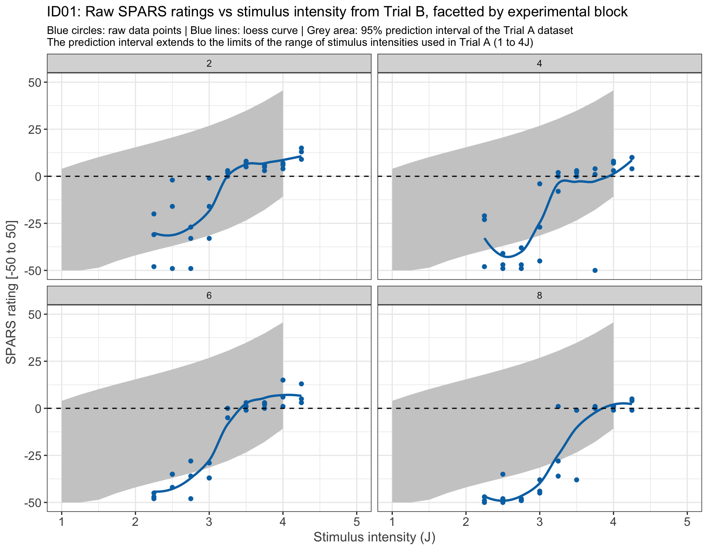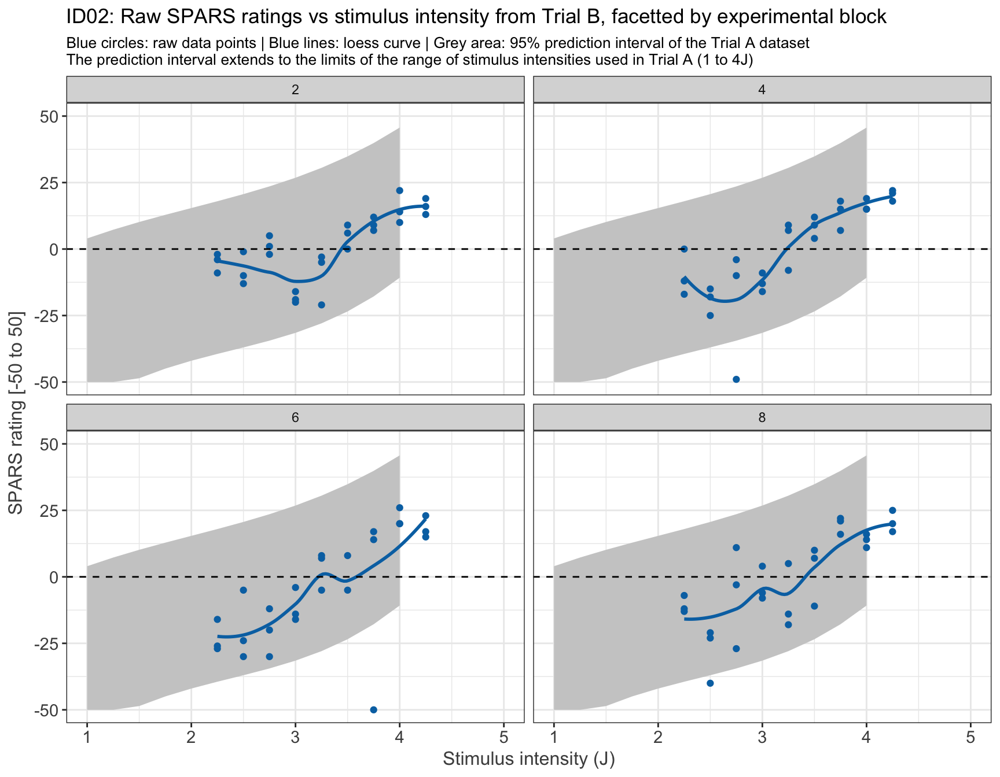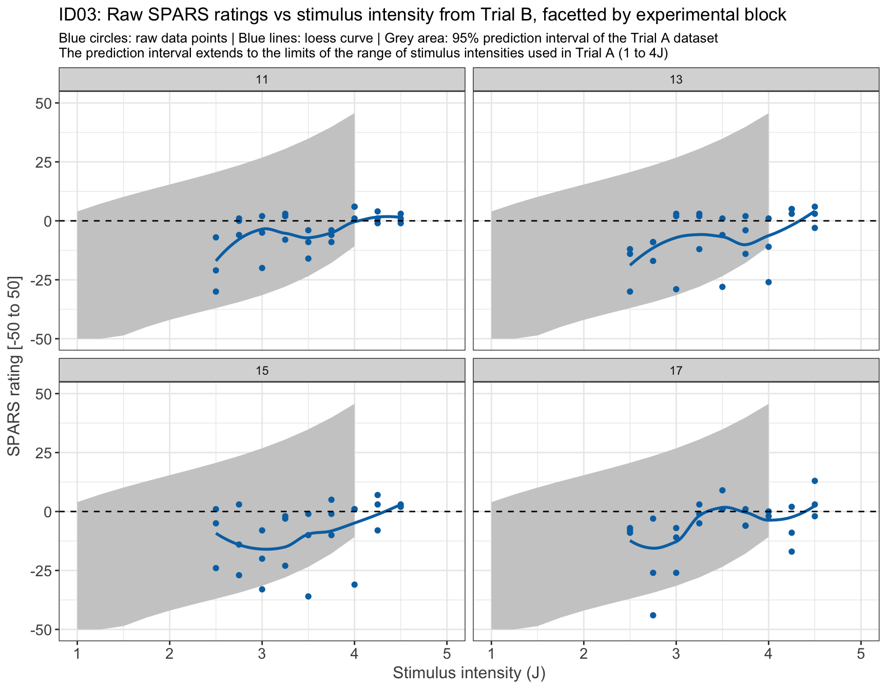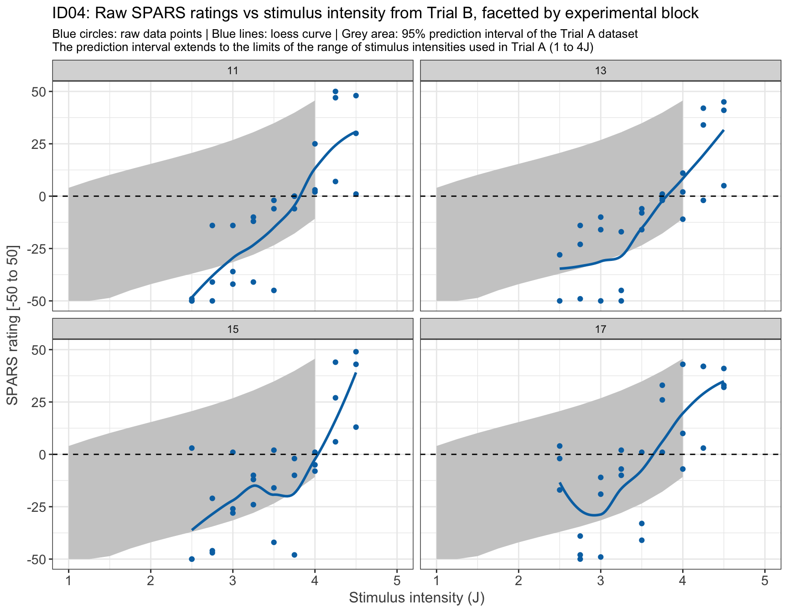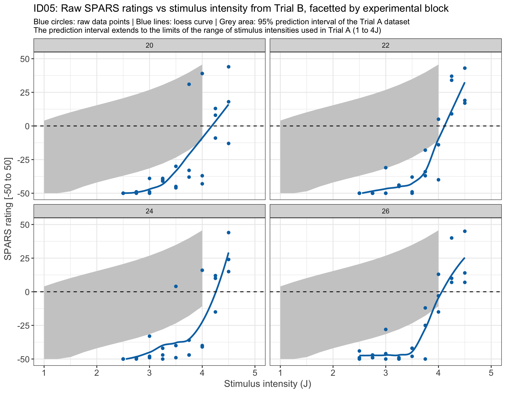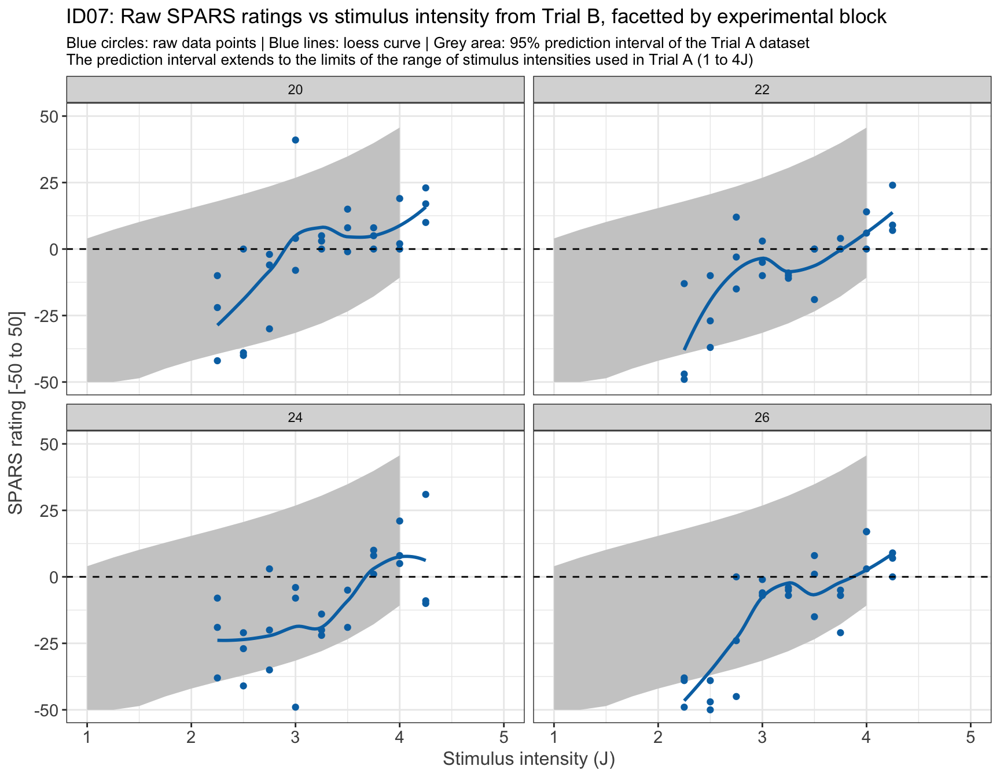

Participant 5 (ID05) has very odd data, with a dog-leg shaped response curve and virtually all the data falling outside of the prediction interval. 

### Quantification


```r
# Get Trial A prediction interval bounds for each stimulus intensity 
pred_bounds <- data_tmA %>%
    ungroup() %>%
    select(intensity, Q2.5, Q97.5) %>%
    # `base::unique` giving 15 instead of 13 rows, so move to plan B
    group_by(intensity) %>%
    summarise(Q2.5 = mean(Q2.5),
              Q97.5 = mean(Q97.5))

# View prediction interval bounds
knitr::kable(pred_bounds,
             caption = '95% prediction interval bounds for Trial A (cubic model) at each stimulus intensity', 
             col.names = c('Stimulus intensity', 'Q2.5', 'Q97.5'), 
             digits = 2,
             align = 'lrr')
```


Table: 95% prediction interval bounds for Trial A (cubic model) at each stimulus intensity

Stimulus intensity      Q2.5   Q97.5
-------------------  -------  ------
1.00                  -50.00    4.00
1.25                  -50.00    7.27
1.50                  -48.58   10.18
1.75                  -44.96   12.86
2.00                  -42.00   15.42
2.25                  -39.43   17.98
2.50                  -37.00   20.65
2.75                  -34.45   23.56
3.00                  -31.51   26.82
3.25                  -27.93   30.54
3.50                  -23.46   34.85
3.75                  -17.83   39.85
4.00                  -10.78   45.68

```r
# Filter Trial B data to the stimulus range used in Trial A (1 to 4J)
data_BReduceRAW <- data_B %>% 
    ungroup() %>% 
    filter(intensity >= 1 & intensity <= 4)

# Calculate whether raw points are inside or outside the 
# prediction interval at each stimulus intensity
predict_RAW <- data_BReduceRAW %>% 
    # Nest data by stimulus intensity
    group_by(intensity) %>%
    nest() %>%
    arrange(intensity) %>%
    # Join with pred_bounds
    left_join(pred_bounds) %>% 
    # Perform calculation 
    mutate(analysis = pmap(.l = list(data, Q2.5, Q97.5),
                           ~ mutate(.data = ..1,
                                    included = case_when(
                                        rating >= ..2 & rating <= ..3 ~ 'yes',
                                        TRUE ~ 'no'
                                    )))) %>%
    # Drop columns and bring it all back together
    select(-data, -(starts_with('Q'))) %>%
    unnest()
    
# Plot
predict_RAW %>%
    # Calculate counts
    group_by(intensity, included) %>% 
    summarise(count = n()) %>%
    ungroup() %>% 
    mutate(intensity = sprintf('%.2f', intensity)) %>%
    # Plot
    ggplot(data = .) +
    aes(y = count,
        x = intensity,
        fill = included) +
    geom_bar(stat = 'identity', 
             position = position_fill()) +
    labs(title = 'Proportion of raw SPARS ratings falling within the 95% prediction interval of the Trial A (cubic model)',
         x = 'Stimulus intensity (J)',
         y = 'Proportion of ratings') +
    scale_fill_manual(name = 'Included in interval: ',
                      values = rev(cb_palette[2:3])) +
    theme(legend.position = 'top')
```

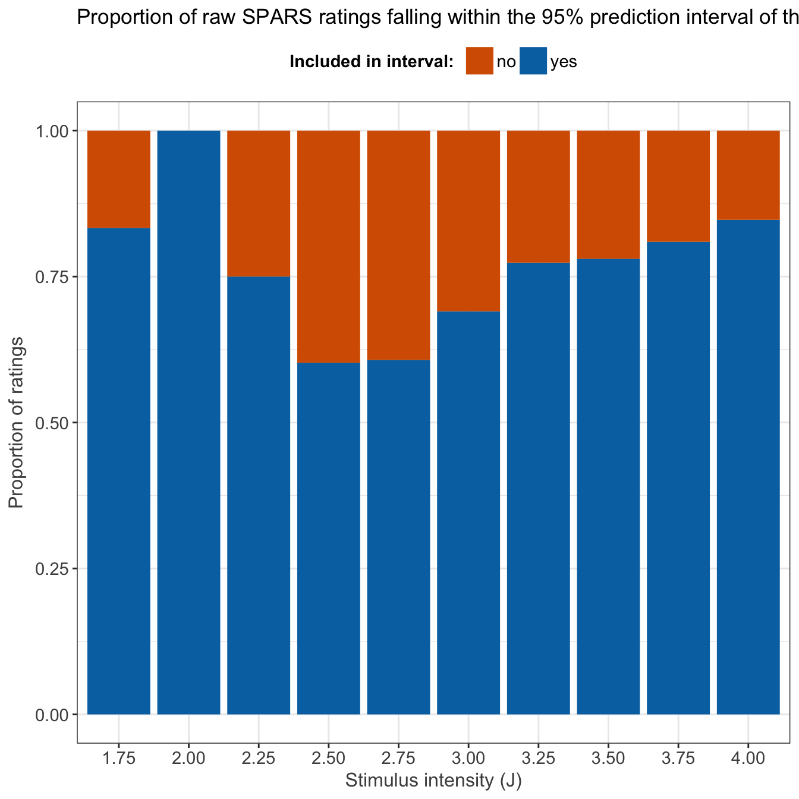

### Quantification after omitting ID05


```r
# Plot
predict_RAW %>%
    # Filter out ID05
    filter(PID != 'ID05') %>%
    # Calculate counts
    group_by(intensity, included) %>% 
    summarise(count = n()) %>%
    ungroup() %>% 
    mutate(intensity = sprintf('%.2f', intensity)) %>%
    # Plot
    ggplot(data = .) +
    aes(y = count,
        x = intensity,
        fill = included) +
    geom_bar(stat = 'identity', 
             position = position_fill()) +
    labs(title = 'Proportion of raw SPARS ratings falling within the 95% prediction interval of the Trial A (cubic model)',
         subtitle = '[WITH ID05 REMOVED]',
         x = 'Stimulus intensity (J)',
         y = 'Proportion of ratings') +
    scale_fill_manual(name = 'Included in interval: ',
                      values = rev(cb_palette[2:3])) +
    theme(legend.position = 'top')
```

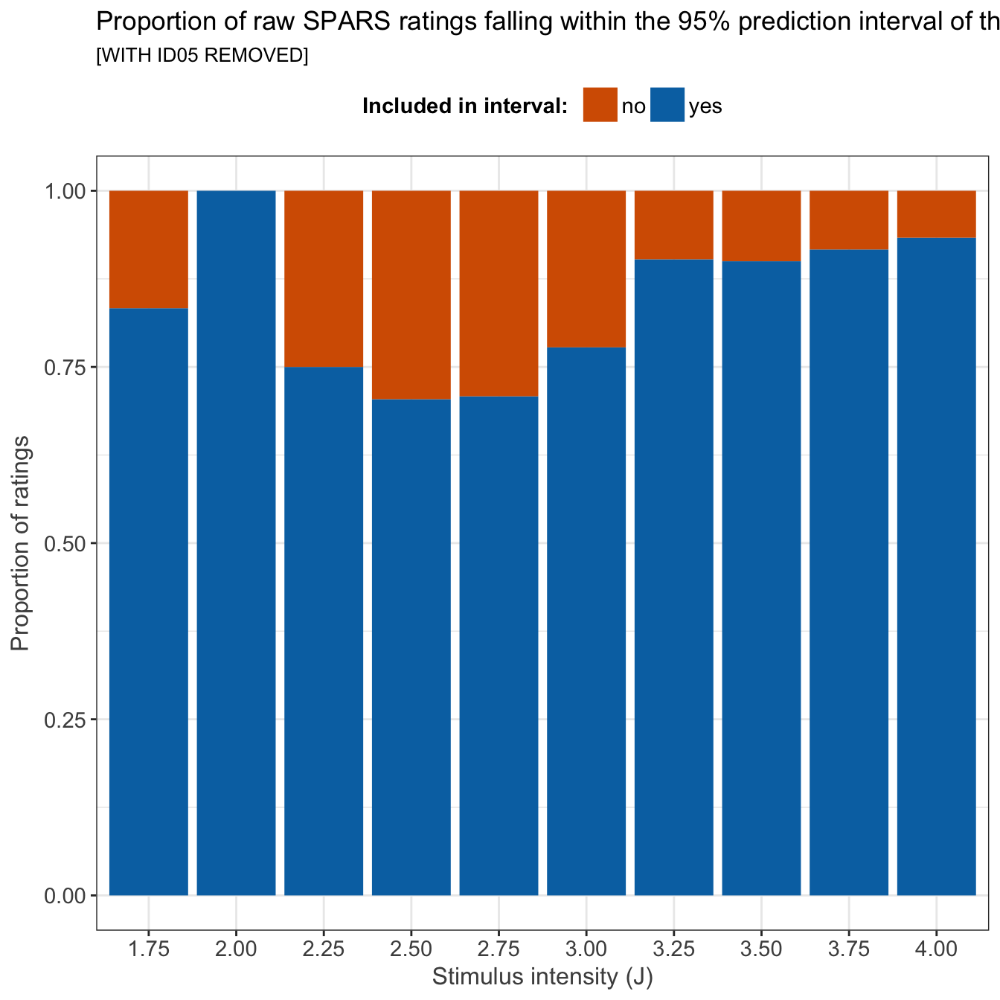

The proportion of values falling outside the prediction interval falls after removing ID05, but the pattern of the relationship between stimulus intensity and inclusion within the prediction interval does not change much. 

----

# Trial A 95% prediction interval vs 'Tukey trimean' Trial B comparison

### Exploratory plots


```r
# Process data
tm_predictionPlots <- data_tmB %>%
    group_by(PID) %>%
    nest() %>%
    # Plot data
    mutate(plots = map2(.x = data,
                        .y = PID,
                       ~ ggplot() +
                           geom_ribbon(data = data_tmA,
                                       aes(x = intensity,
                                           ymin = `Q2.5`,
                                           ymax = `Q97.5`),
                                       fill = '#CCCCCC') +
                           geom_point(data = .x,
                                      aes(x = intensity,
                                          y = tri_mean),
                                      colour = cb_palette[[2]]) +
                           geom_smooth(data = .x,
                                      aes(x = intensity,
                                          y = tri_mean),
                                      colour = cb_palette[[2]],
                                      method = 'loess',
                                      se = FALSE) +
                           geom_hline(yintercept = 0,
                                      linetype = 2) +
                           labs(title = paste0(.y, ': Tukey trimeans of raw SPARS ratings vs stimulus intensity from Trial B, facetted by experimental block'),
                                subtitle = 'Blue circles: Tukey trimean data points | Blue lines: loess curve | Grey area: 95% prediction interval of the Trial A dataset\nThe prediction interval extends to the limits of the range of stimulus intensities used in Trial A (1 to 4J)',
                                x = 'Stimulus intensity (J)',
                                y = 'SPARS rating [-50 to 50]') +
                           scale_y_continuous(limits = c(-50, 50)) +
                           scale_x_continuous(limits = c(1, 5)))) 

# Print output
walk(.x = tm_predictionPlots$plots, ~print(.x))
```

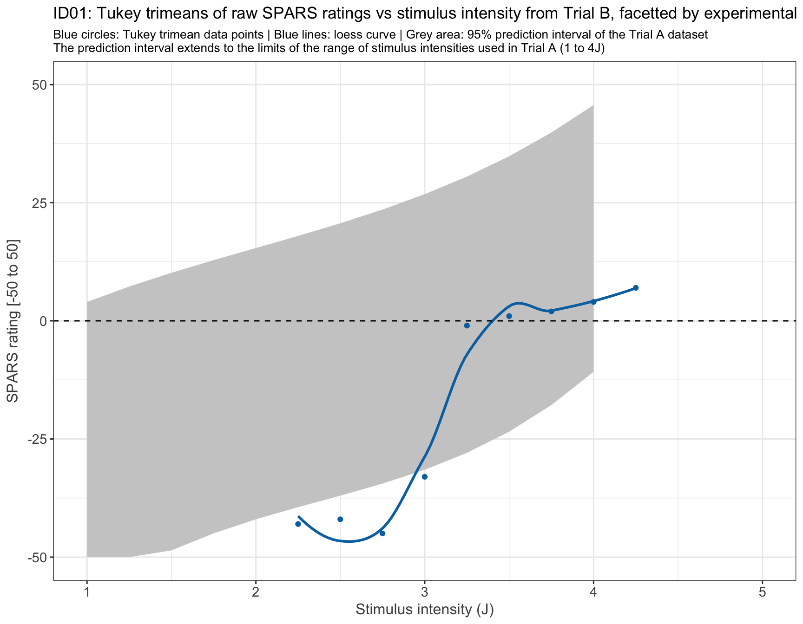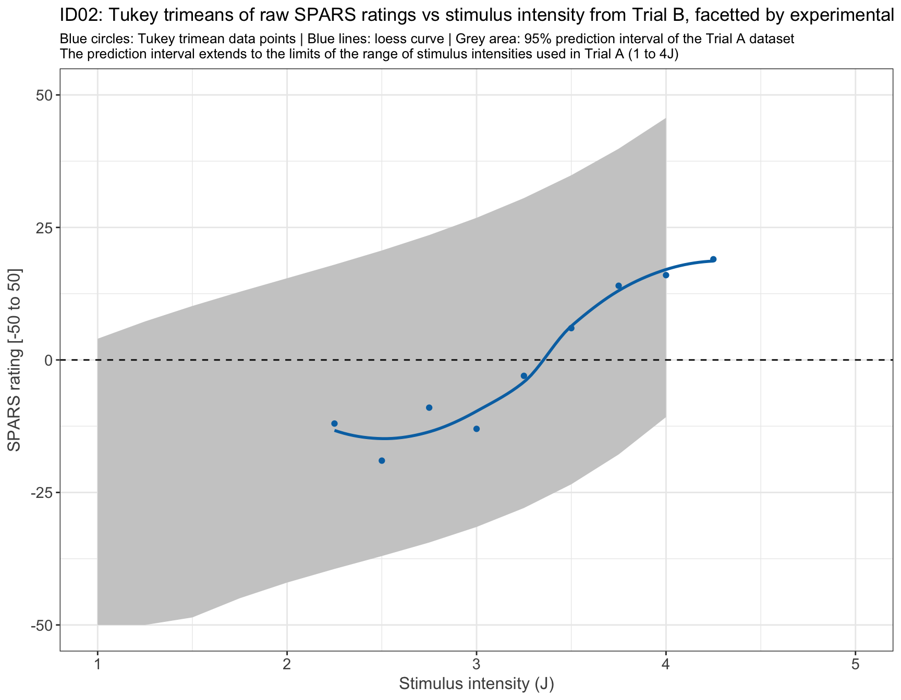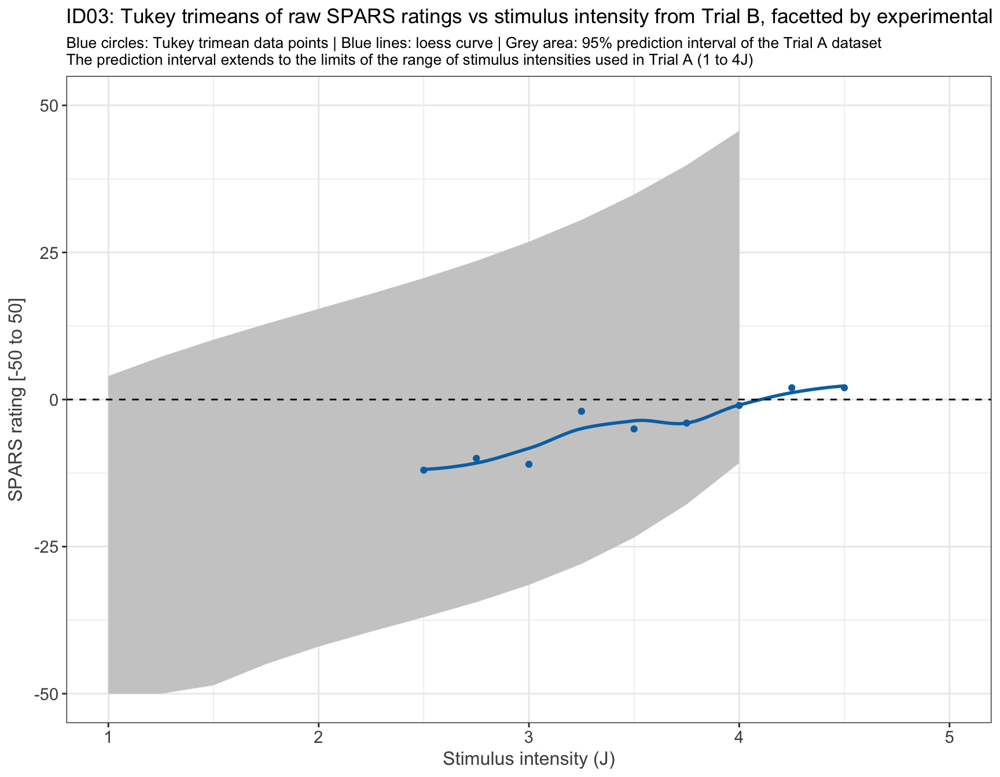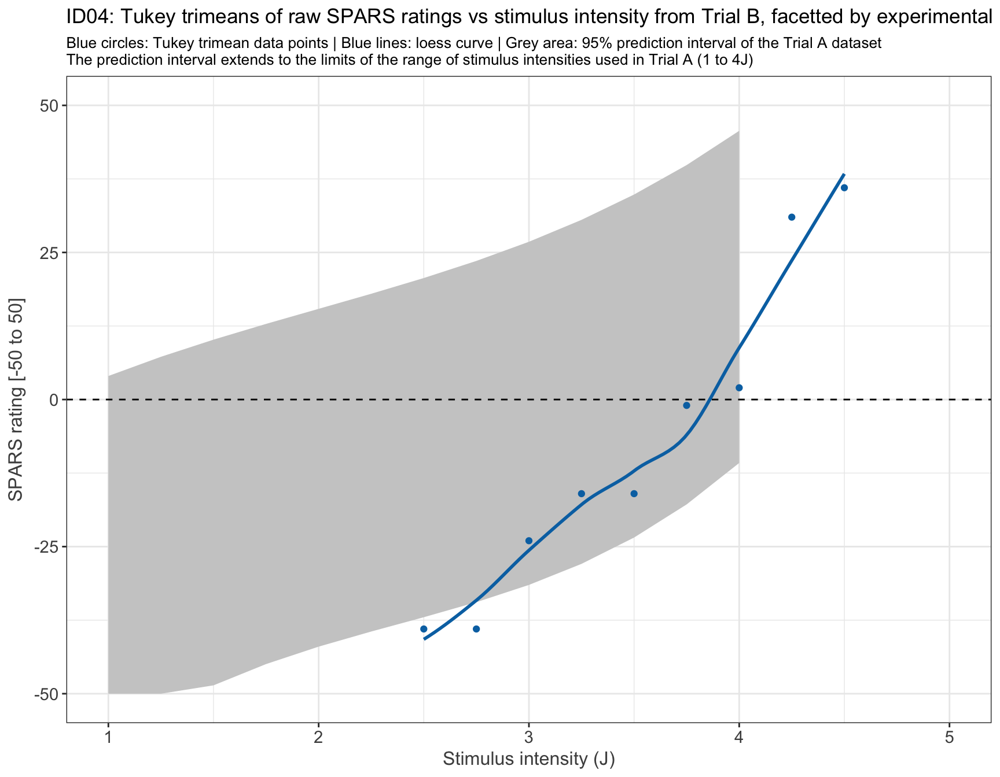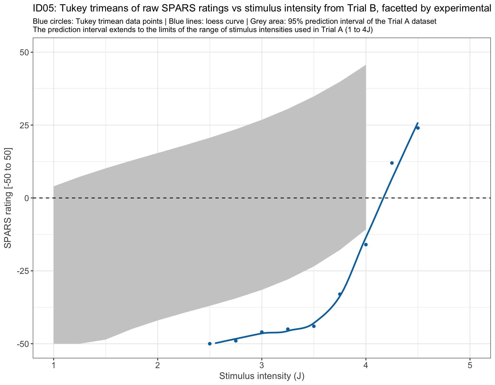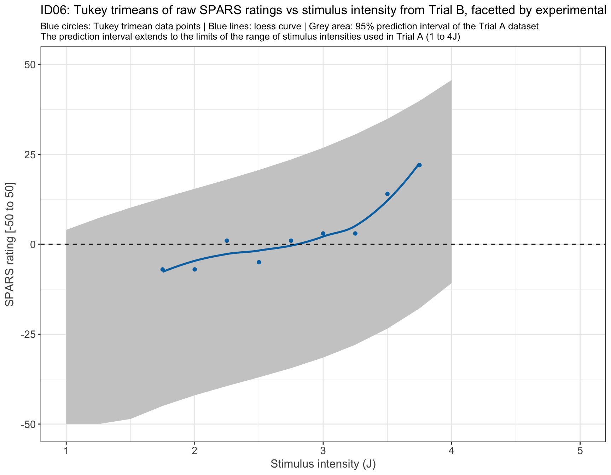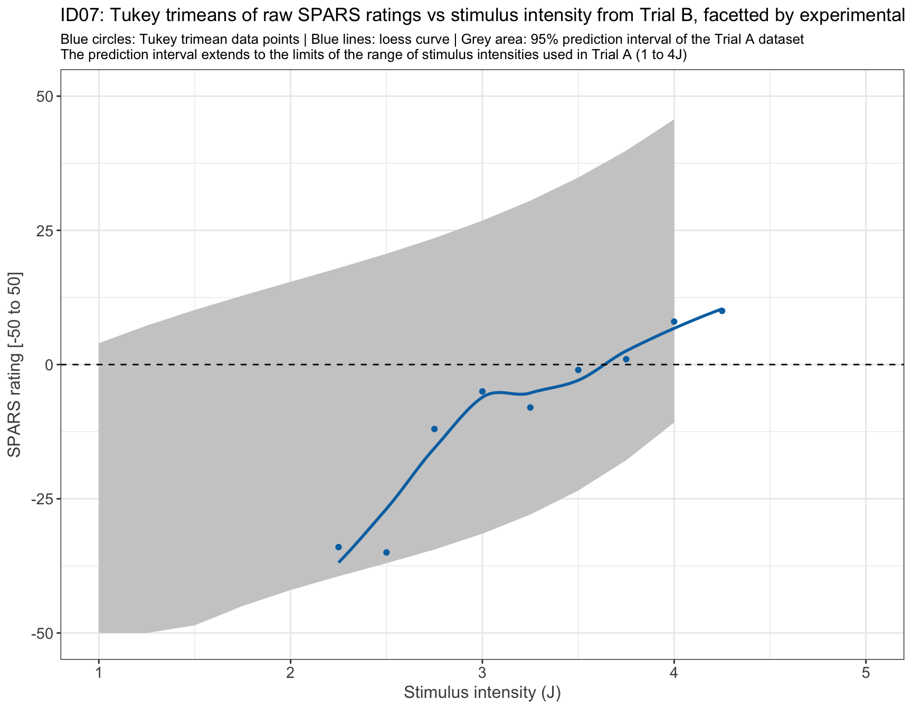

As expected the raw data plots, participant 5 (ID05) has very odd data, with a dog-leg shaped response curve and **all** the Tukey trimean values falling outside of the prediction interval. 

### Quantification


```r
# Filter Trial B data to the stimulus range used in Trial A (1 to 4J)
data_BReduceTM <- data_tmB %>% 
    ungroup() %>% 
    filter(intensity >= 1 & intensity <= 4)

# Calculate whether raw points are inside or outside the 
# prediction interval at each stimulus intensity
predict_TM <- data_BReduceTM %>% 
    # Nest data by stimulus intensity
    group_by(intensity) %>%
    nest() %>%
    arrange(intensity) %>%
    # Join with pred_bounds
    left_join(pred_bounds) %>% 
    # Perform calculation 
    mutate(analysis = pmap(.l = list(data, Q2.5, Q97.5),
                           ~ mutate(.data = ..1,
                                    included = case_when(
                                        tri_mean >= ..2 & tri_mean <= ..3 ~ 'yes',
                                        TRUE ~ 'no'
                                    )))) %>%
    # Drop columns and bring it all back together
    select(-data, -(starts_with('Q'))) %>%
    unnest()
    
# Plot
predict_TM %>%
    # Calculate counts
    group_by(intensity, included) %>% 
    summarise(count = n()) %>%
    ungroup() %>% 
    mutate(intensity = sprintf('%.2f', intensity)) %>%
    # Plot
    ggplot(data = .) +
    aes(y = count,
        x = intensity,
        fill = included) +
    geom_bar(stat = 'identity', 
             position = position_fill()) +
    labs(title = 'Proportion of Tukey trimeans of raw SPARS ratings falling within the 95% prediction interval of the Trial A (cubic model)',
         x = 'Stimulus intensity (J)',
         y = 'Proportion of ratings') +
    scale_fill_manual(name = 'Included in interval: ',
                      values = rev(cb_palette[2:3])) +
    theme(legend.position = 'top')
```

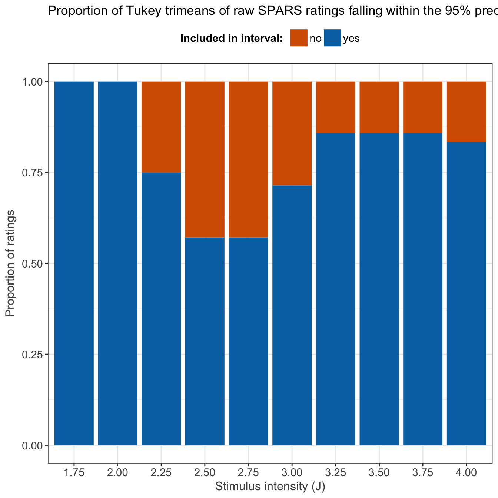

### Quantification without ID05


```r
# Plot
predict_TM %>%
    # Filter out ID05
    filter(PID != 'ID05') %>%
    # Calculate counts
    group_by(intensity, included) %>% 
    summarise(count = n()) %>%
    ungroup() %>% 
    mutate(intensity = sprintf('%.2f', intensity)) %>%
    # Plot
    ggplot(data = .) +
    aes(y = count,
        x = intensity,
        fill = included) +
    geom_bar(stat = 'identity', 
             position = position_fill()) +
    labs(title = 'Proportion of Tukey trimeans of raw SPARS ratings falling within the 95% prediction interval of the Trial A (cubic model)',
         subtitle = '[WITH ID05 REMOVED]',
         x = 'Stimulus intensity (J)',
         y = 'Proportion of ratings') +
    scale_fill_manual(name = 'Included in interval: ',
                      values = rev(cb_palette[2:3])) +
    theme(legend.position = 'top')
```

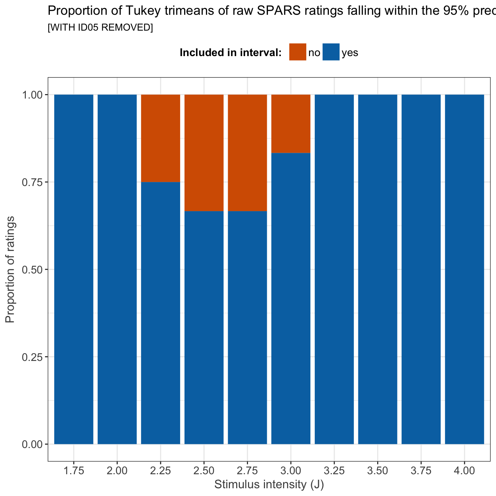

When using Tukey trimean data, omitting ID05 results in a substantial change improvement in the proportion of data falling within the prediction interval. However, there are still issues in the stimulus intensity range: 2.25 to 3.00J.

----

# Session information

```r
sessionInfo()
```

```
## R version 3.4.3 (2017-11-30)
## Platform: x86_64-apple-darwin15.6.0 (64-bit)
## Running under: macOS High Sierra 10.13.3
## 
## Matrix products: default
## BLAS: /Library/Frameworks/R.framework/Versions/3.4/Resources/lib/libRblas.0.dylib
## LAPACK: /Library/Frameworks/R.framework/Versions/3.4/Resources/lib/libRlapack.dylib
## 
## locale:
## [1] en_GB.UTF-8/en_GB.UTF-8/en_GB.UTF-8/C/en_GB.UTF-8/en_GB.UTF-8
## 
## attached base packages:
## [1] stats     graphics  grDevices utils     datasets  methods   base     
## 
## other attached packages:
##  [1] bindrcpp_0.2       lqmm_1.5.3         forcats_0.2.0     
##  [4] stringr_1.2.0      dplyr_0.7.4        purrr_0.2.4       
##  [7] readr_1.1.1        tidyr_0.8.0        tibble_1.4.2      
## [10] ggplot2_2.2.1.9000 tidyverse_1.2.1    magrittr_1.5      
## 
## loaded via a namespace (and not attached):
##  [1] nlme_3.1-131       lubridate_1.7.1    httr_1.3.1        
##  [4] rprojroot_1.3-2    SparseGrid_0.8.2   TMB_1.7.12        
##  [7] tools_3.4.3        backports_1.1.2    DT_0.4            
## [10] R6_2.2.2           sjlabelled_1.0.7   lazyeval_0.2.1    
## [13] colorspace_1.3-2   nnet_7.3-12        tidyselect_0.2.3  
## [16] mnormt_1.5-5       emmeans_1.1        compiler_3.4.3    
## [19] cli_1.0.0          rvest_0.3.2        xml2_1.2.0        
## [22] sandwich_2.4-0     labeling_0.3       effects_4.0-0     
## [25] scales_0.5.0.9000  lmtest_0.9-35      mvtnorm_1.0-7     
## [28] psych_1.7.8        blme_1.0-4         digest_0.6.15     
## [31] foreign_0.8-69     minqa_1.2.4        rmarkdown_1.8     
## [34] stringdist_0.9.4.6 pkgconfig_2.0.1    htmltools_0.3.6   
## [37] lme4_1.1-15        highr_0.6          htmlwidgets_1.0   
## [40] pwr_1.2-1          rlang_0.1.6        readxl_1.0.0      
## [43] rstudioapi_0.7     shiny_1.0.5        bindr_0.1         
## [46] zoo_1.8-1          jsonlite_1.5       sjPlot_2.4.1      
## [49] modeltools_0.2-21  bayesplot_1.4.0    Matrix_1.2-12     
## [52] Rcpp_0.12.15       munsell_0.4.3      abind_1.4-5       
## [55] prediction_0.2.0   merTools_0.3.0     stringi_1.1.6     
## [58] multcomp_1.4-8     yaml_2.1.16        snakecase_0.8.1   
## [61] carData_3.0-0      MASS_7.3-48        plyr_1.8.4        
## [64] grid_3.4.3         parallel_3.4.3     sjmisc_2.7.0      
## [67] crayon_1.3.4       lattice_0.20-35    ggeffects_0.3.1   
## [70] haven_1.1.1        splines_3.4.3      sjstats_0.14.1    
## [73] hms_0.4.1          knitr_1.19         pillar_1.1.0      
## [76] estimability_1.2   reshape2_1.4.3     codetools_0.2-15  
## [79] stats4_3.4.3       glue_1.2.0         evaluate_0.10.1   
## [82] modelr_0.1.1       httpuv_1.3.5       nloptr_1.0.4      
## [85] cellranger_1.1.0   gtable_0.2.0       assertthat_0.2.0  
## [88] mime_0.5           coin_1.2-2         xtable_1.8-2      
## [91] broom_0.4.3        survey_3.33        coda_0.19-1       
## [94] survival_2.41-3    arm_1.9-3          glmmTMB_0.2.0     
## [97] TH.data_1.0-8
```
