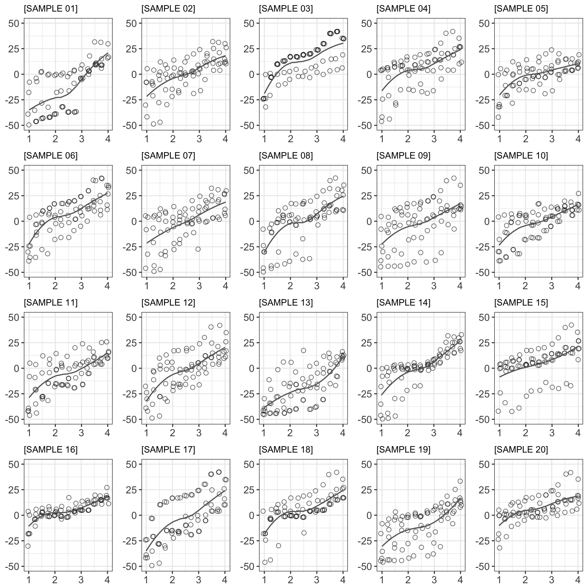
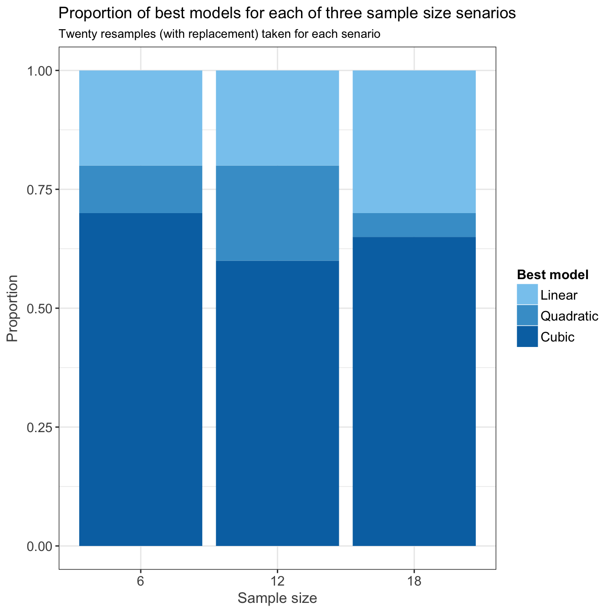

----

This analysis examines the _'stability'_ of the stimulus-response characateristics of the SPARS. It is a descriptive analysis (see plots). We assessed stability by examining the stimulus-response relationship of SPARS under three sample size senarios: n = 6, n = 12, and n = 18 (original sample: n = 19). Under each sample size senario, we generated 20 random samples (with replacement) and examined the stimulus-response relationship for each replicate. 

----

# Import and inspect data


```r
# Import
data <- read_rds('./data-cleaned/SPARS_A.rds')

# Inspect
glimpse(data)
```

```
## Observations: 1,927
## Variables: 19
## $ PID               <chr> "ID01", "ID01", "ID01", "ID01", "ID01", "ID0...
## $ block             <chr> "A", "A", "A", "A", "A", "A", "A", "A", "A",...
## $ block_order       <dbl> 1, 1, 1, 1, 1, 1, 1, 1, 1, 1, 1, 1, 1, 1, 1,...
## $ trial_number      <dbl> 1, 2, 3, 4, 5, 6, 7, 8, 9, 10, 11, 12, 13, 1...
## $ intensity         <dbl> 3.75, 1.50, 3.25, 1.50, 3.00, 2.75, 1.00, 2....
## $ intensity_char    <chr> "3.75", "1.50", "3.25", "1.50", "3.00", "2.7...
## $ rating            <dbl> -10, -40, -10, -25, -20, -25, -40, 2, -40, -...
## $ rating_positive   <dbl> 40, 10, 40, 25, 30, 25, 10, 52, 10, 40, 54, ...
## $ EDA               <dbl> 18315.239, 13904.177, 11543.449, 20542.834, ...
## $ age               <dbl> 21, 21, 21, 21, 21, 21, 21, 21, 21, 21, 21, ...
## $ sex               <dbl> 2, 2, 2, 2, 2, 2, 2, 2, 2, 2, 2, 2, 2, 2, 2,...
## $ panas_positive    <dbl> 36, 36, 36, 36, 36, 36, 36, 36, 36, 36, 36, ...
## $ panas_negative    <dbl> 10, 10, 10, 10, 10, 10, 10, 10, 10, 10, 10, ...
## $ dass42_depression <dbl> 0, 0, 0, 0, 0, 0, 0, 0, 0, 0, 0, 0, 0, 0, 0,...
## $ dass42_anxiety    <dbl> 1, 1, 1, 1, 1, 1, 1, 1, 1, 1, 1, 1, 1, 1, 1,...
## $ dass42_stress     <dbl> 0, 0, 0, 0, 0, 0, 0, 0, 0, 0, 0, 0, 0, 0, 0,...
## $ pcs_magnification <dbl> 6, 6, 6, 6, 6, 6, 6, 6, 6, 6, 6, 6, 6, 6, 6,...
## $ pcs_rumination    <dbl> 11, 11, 11, 11, 11, 11, 11, 11, 11, 11, 11, ...
## $ pcs_helplessness  <dbl> 10, 10, 10, 10, 10, 10, 10, 10, 10, 10, 10, ...
```

----

# Functions


```r
############################################################
#                                                          #
#              Define Tukey trimean function               #
#                                                          #
############################################################
tri.mean <- function(x) {
  # Calculate quantiles
  q1 <- quantile(x, probs = 0.25, na.rm = TRUE)[[1]]
  q2 <- median(x, na.rm = TRUE)
  q3 <- quantile(x, probs = 0.75, na.rm = TRUE)[[1]]
  # Calculate trimean
  tm <- (q2 + ((q1 + q3) / 2)) / 2
  # Convert to integer
  tm <- as.integer(round(tm))
  return(tm)
}

############################################################
#                                                          #
#             Define random sampling function              #
#                                                          #
############################################################
sampler <- function(x = data_ref, y = data_nest, size = 6, by = 'PID') {
    foo <- sample_n(x, size = size, replace = TRUE) %>%
        inner_join(x = ., y = y, by = by) %>%
        arrange(PID)
    return(foo)
}
```

----

# Clean data


```r
# Calculate trimeans
data_tm <- data %>%
    # Select columns
    select(PID, intensity, rating) %>%
    # Calculate tri.mean
    group_by(PID, intensity) %>% 
    summarise(tri_mean = tri.mean(rating))

# Generated nested table of data_tm
data_nest <- data_tm %>% 
    group_by(PID) %>% 
    nest()

# Generate sampling reference
data_ref <- select(data_nest, PID)
```

----

# Sampling

### Senario 1 (n = 6)


```r
# Set random seed
set.seed(1234)

# Generate data
n6 <- map(1:20, ~ sampler(size = 6))

# Unnest data and clean-up
n6 %<>% map2(.x = .,
             .y = sprintf('%02i', 1:20),
             # Unnest each list item
             ~ unnest(.x) %>%
                 # Add a column with the sample label to each list item
                 mutate(sample = .y) %>%
                 # Select required column in each list item
                 select(sample, PID, intensity, tri_mean) %>%
                 # Re-nest each list item dataframe under the sample label
                 group_by(sample) %>%
                 nest())

# Convert n5 to a single dataframe
n6 %<>% map_df(~ data.frame(.x))

# Add plots
n6 %<>% mutate(plot = map2(.x = data,
                           .y = sample,
                   ~ ggplot(data = .x) +
                       aes(x = intensity,
                           y = tri_mean) +
                       geom_point(colour = '#000000',
                                  shape = 21,
                                  size = 2,
                                  alpha = 0.6,
                                  position = position_jitter(width = 0.05)) +
                       geom_smooth(method = 'loess',
                                   se = FALSE,
                                   colour = '#666666', 
                                   size = 0.6) +
                       labs(subtitle = paste0('[SAMPLE ', .y, ']')) +
                       scale_y_continuous(limits = c(-50, 50)) +
                       scale_x_continuous(breaks = seq(from = 1, to = 4, by = 1)) +
                       theme(legend.position = 'none',
                             axis.title = element_blank())))

# Add linear, quadratic and cubic model
n6 %<>% mutate(L.model = map(.x = data,
                           ~ lmer(tri_mean ~ poly(intensity, 1) + (intensity | PID),
                                  data = .x,
                                  REML = FALSE)),
               Q.model = map(.x = data,
                           ~ lmer(tri_mean ~ poly(intensity, 2) + (intensity | PID),
                                  data = .x,
                                  REML = FALSE)),
               C.model = map(.x = data,
                           ~ lmer(tri_mean ~ poly(intensity, 3) + (intensity | PID),
                                  data = .x,
                                  REML = FALSE)))

# Compare models using likelihood test
n6 %<>% mutate(compare = pmap(.l = list(L.model, Q.model, C.model),
                              ~ anova(..1, ..2, ..3) %>%
                                  mutate(Model = c('Linear', 'Quadratic', 'Cubic')) %>%
                                  select(Model, everything())))

# Extract the name of the best model
n6 %<>% mutate(best_model = map(.x = compare,
                                ~ filter(.x, 
                                         `Pr(>Chisq)` == min(`Pr(>Chisq)`, 
                                                             na.rm = TRUE)) %>%
                                    mutate(Model = case_when(
                                        `Pr(>Chisq)` < 0.05 ~ Model,
                                        TRUE ~ 'Linear'
                                        )) %>%
                                    .$Model))
```

**Composite plot of SPAR rating vs stimulus intensity for 20 random samples (n = 6)**  
Open circles: participant trimeans | Grey curve: loess curve  
_[Sampling was performed with replacement]_


### Senario 2 (n = 12)


```r
# Set random seed
set.seed(5678)

# Generate data
n12 <- map(1:20, ~ sampler(size = 6))

# Unnest data and clean-up
n12 %<>% map2(.x = .,
             .y = sprintf('%02i', 1:20),
             # Unnest each list item
             ~ unnest(.x) %>%
                 # Add a column with the sample label to each list item
                 mutate(sample = .y) %>%
                 # Select required column in each list item
                 select(sample, PID, intensity, tri_mean) %>%
                 # Re-nest each list item dataframe under the sample label
                 group_by(sample) %>%
                 nest())

# Convert n5 to a single dataframe
n12 %<>% map_df(~ data.frame(.x))

# Add plots
n12 %<>% mutate(plot = map2(.x = data,
                           .y = sample,
                   ~ ggplot(data = .x) +
                       aes(x = intensity,
                           y = tri_mean) +
                       geom_point(colour = '#000000',
                                  shape = 21,
                                  size = 2,
                                  alpha = 0.6,
                                  position = position_jitter(width = 0.05)) +
                       geom_smooth(method = 'loess',
                                   se = FALSE,
                                   colour = '#666666', 
                                   size = 0.6) +
                       labs(subtitle = paste0('[SAMPLE ', .y, ']')) +
                       scale_y_continuous(limits = c(-50, 50)) +
                       scale_x_continuous(breaks = seq(from = 1, to = 4, by = 1)) +
                       theme(legend.position = 'none',
                             axis.title = element_blank())))

# Add linear, quadratic and cubic model
n12 %<>% mutate(L.model = map(.x = data,
                           ~ lmer(tri_mean ~ poly(intensity, 1) + (intensity | PID),
                                  data = .x,
                                  REML = FALSE)),
               Q.model = map(.x = data,
                           ~ lmer(tri_mean ~ poly(intensity, 2) + (intensity | PID),
                                  data = .x,
                                  REML = FALSE)),
               C.model = map(.x = data,
                           ~ lmer(tri_mean ~ poly(intensity, 3) + (intensity | PID),
                                  data = .x,
                                  REML = FALSE)))

# Compare models using likelihood test
n12 %<>% mutate(compare = pmap(.l = list(L.model, Q.model, C.model),
                              ~ anova(..1, ..2, ..3) %>%
                                  mutate(Model = c('Linear', 'Quadratic', 'Cubic')) %>%
                                  select(Model, everything())))

# Extract the name of the best model
n12 %<>% mutate(best_model = map(.x = compare,
                                ~ filter(.x, 
                                         `Pr(>Chisq)` == min(`Pr(>Chisq)`, 
                                                             na.rm = TRUE)) %>%
                                    mutate(Model = case_when(
                                        `Pr(>Chisq)` < 0.05 ~ Model,
                                        TRUE ~ 'Linear'
                                        )) %>%
                                    .$Model))
```

**Composite plot of SPAR rating vs stimulus intensity for 20 random samples (n = 12)**  
Open circles: participant trimeans | Grey curve: loess curve  
_[Sampling was performed with replacement]_



### Senario 3 (n = 18)


```r
# Set random seed
set.seed(91011)

# Generate data
n18 <- map(1:20, ~ sampler(size = 6))

# Unnest data and clean-up
n18 %<>% map2(.x = .,
             .y = sprintf('%02i', 1:20),
             # Unnest each list item
             ~ unnest(.x) %>%
                 # Add a column with the sample label to each list item
                 mutate(sample = .y) %>%
                 # Select required column in each list item
                 select(sample, PID, intensity, tri_mean) %>%
                 # Re-nest each list item dataframe under the sample label
                 group_by(sample) %>%
                 nest())

# Convert n5 to a single dataframe
n18 %<>% map_df(~ data.frame(.x))

# Add plots
n18 %<>% mutate(plot = map2(.x = data,
                           .y = sample,
                   ~ ggplot(data = .x) +
                       aes(x = intensity,
                           y = tri_mean) +
                       geom_point(colour = '#000000',
                                  shape = 21,
                                  size = 2,
                                  alpha = 0.6,
                                  position = position_jitter(width = 0.05)) +
                       geom_smooth(method = 'loess',
                                   se = FALSE,
                                   colour = '#666666', 
                                   size = 0.6) +
                       labs(subtitle = paste0('[SAMPLE ', .y, ']')) +
                       scale_y_continuous(limits = c(-50, 50)) +
                       scale_x_continuous(breaks = seq(from = 1, to = 4, by = 1)) +
                       theme(legend.position = 'none',
                             axis.title = element_blank())))

# Add linear, quadratic and cubic model
n18 %<>% mutate(L.model = map(.x = data,
                           ~ lmer(tri_mean ~ poly(intensity, 1) + (intensity | PID),
                                  data = .x,
                                  REML = FALSE)),
               Q.model = map(.x = data,
                           ~ lmer(tri_mean ~ poly(intensity, 2) + (intensity | PID),
                                  data = .x,
                                  REML = FALSE)),
               C.model = map(.x = data,
                           ~ lmer(tri_mean ~ poly(intensity, 3) + (intensity | PID),
                                  data = .x,
                                  REML = FALSE)))

# Compare models using likelihood test
n18 %<>% mutate(compare = pmap(.l = list(L.model, Q.model, C.model),
                              ~ anova(..1, ..2, ..3) %>%
                                  mutate(Model = c('Linear', 'Quadratic', 'Cubic')) %>%
                                  select(Model, everything())))

# Extract the name of the best model
n18 %<>% mutate(best_model = map(.x = compare,
                                ~ filter(.x, 
                                         `Pr(>Chisq)` == min(`Pr(>Chisq)`, 
                                                             na.rm = TRUE)) %>%
                                    mutate(Model = case_when(
                                        `Pr(>Chisq)` < 0.05 ~ Model,
                                        TRUE ~ 'Linear'
                                        )) %>%
                                    .$Model))
```

**Composite plot of SPAR rating vs stimulus intensity for 20 random samples (n = 18)**  
Open circles: participant trimeans | Grey curve: loess curve  
_[Sampling was performed with replacement]_


----

# Summary of best model


```r
# Extract data
n6_best <- n6 %>%
    select(sample, best_model) %>% 
    unnest() %>% 
    mutate(n_sample = '6')

n12_best <- n12 %>% 
    select(sample, best_model) %>% 
    unnest() %>% 
    mutate(sample = sprintf('%02.0f', 21:40)) %>% 
    mutate(n_sample = '12')

n18_best <- n18 %>% 
    select(sample, best_model) %>% 
    unnest() %>% 
    mutate(sample = sprintf('%02.0f', 41:60)) %>% 
    mutate(n_sample = '18')

# Join datasets
model_combined <- bind_rows(n6_best, n12_best, n18_best) %>% 
    mutate(n_sample = fct_relevel(n_sample, 
                                  '6', '12', '18'),
           best_model = fct_relevel(best_model,
                                    'Linear', 'Quadratic', 'Cubic'))

# Plot
foo <- colorRampPalette(colors = c('#88caef', '#0072B2'))(3)

ggplot(data = model_combined) +
    aes(n_sample,
        fill = best_model) +
    geom_bar(position = position_fill()) +
    labs(title = 'Proportion of best models for each of three sample size senarios',
         subtitle = 'Twenty resamples (with replacement) taken for each senario',
         x = 'Sample size',
         y = 'Proportion') +
    scale_fill_manual(name = 'Best model',
                      values = foo)
```



----

# Session information

```r
sessionInfo()
```

```
## R version 3.4.3 (2017-11-30)
## Platform: x86_64-apple-darwin15.6.0 (64-bit)
## Running under: macOS High Sierra 10.13.3
## 
## Matrix products: default
## BLAS: /Library/Frameworks/R.framework/Versions/3.4/Resources/lib/libRblas.0.dylib
## LAPACK: /Library/Frameworks/R.framework/Versions/3.4/Resources/lib/libRlapack.dylib
## 
## locale:
## [1] en_GB.UTF-8/en_GB.UTF-8/en_GB.UTF-8/C/en_GB.UTF-8/en_GB.UTF-8
## 
## attached base packages:
## [1] methods   stats     graphics  grDevices utils     datasets  base     
## 
## other attached packages:
##  [1] bindrcpp_0.2       patchwork_0.0.1    lme4_1.1-15       
##  [4] Matrix_1.2-12      forcats_0.2.0      stringr_1.2.0     
##  [7] dplyr_0.7.4        purrr_0.2.4        readr_1.1.1       
## [10] tidyr_0.8.0        tibble_1.4.2       ggplot2_2.2.1.9000
## [13] tidyverse_1.2.1    magrittr_1.5      
## 
## loaded via a namespace (and not attached):
##  [1] nlme_3.1-131       lubridate_1.7.1    httr_1.3.1        
##  [4] rprojroot_1.3-2    tools_3.4.3        TMB_1.7.12        
##  [7] backports_1.1.2    DT_0.4             R6_2.2.2          
## [10] sjlabelled_1.0.7   lazyeval_0.2.1     colorspace_1.3-2  
## [13] nnet_7.3-12        withr_2.1.1.9000   tidyselect_0.2.3  
## [16] mnormt_1.5-5       emmeans_1.1        compiler_3.4.3    
## [19] cli_1.0.0          rvest_0.3.2        xml2_1.2.0        
## [22] sandwich_2.4-0     labeling_0.3       effects_4.0-0     
## [25] scales_0.5.0.9000  lmtest_0.9-35      mvtnorm_1.0-7     
## [28] psych_1.7.8        blme_1.0-4         digest_0.6.15     
## [31] foreign_0.8-69     minqa_1.2.4        rmarkdown_1.8     
## [34] stringdist_0.9.4.6 pkgconfig_2.0.1    htmltools_0.3.6   
## [37] htmlwidgets_1.0    pwr_1.2-1          rlang_0.1.6       
## [40] readxl_1.0.0       rstudioapi_0.7     shiny_1.0.5       
## [43] bindr_0.1          zoo_1.8-1          jsonlite_1.5      
## [46] sjPlot_2.4.1       modeltools_0.2-21  bayesplot_1.4.0   
## [49] Rcpp_0.12.15       munsell_0.4.3      abind_1.4-5       
## [52] prediction_0.2.0   merTools_0.3.0     stringi_1.1.6     
## [55] multcomp_1.4-8     yaml_2.1.16        snakecase_0.8.1   
## [58] carData_3.0-0      MASS_7.3-48        plyr_1.8.4        
## [61] grid_3.4.3         parallel_3.4.3     sjmisc_2.7.0      
## [64] crayon_1.3.4       lattice_0.20-35    ggeffects_0.3.1   
## [67] haven_1.1.1        splines_3.4.3      sjstats_0.14.1    
## [70] hms_0.4.1          knitr_1.19         pillar_1.1.0      
## [73] estimability_1.2   reshape2_1.4.3     codetools_0.2-15  
## [76] stats4_3.4.3       glue_1.2.0         evaluate_0.10.1   
## [79] modelr_0.1.1       httpuv_1.3.5       nloptr_1.0.4      
## [82] cellranger_1.1.0   gtable_0.2.0       assertthat_0.2.0  
## [85] mime_0.5           coin_1.2-2         xtable_1.8-2      
## [88] broom_0.4.3        survey_3.33        coda_0.19-1       
## [91] survival_2.41-3    arm_1.9-3          glmmTMB_0.2.0     
## [94] TH.data_1.0-8
```
