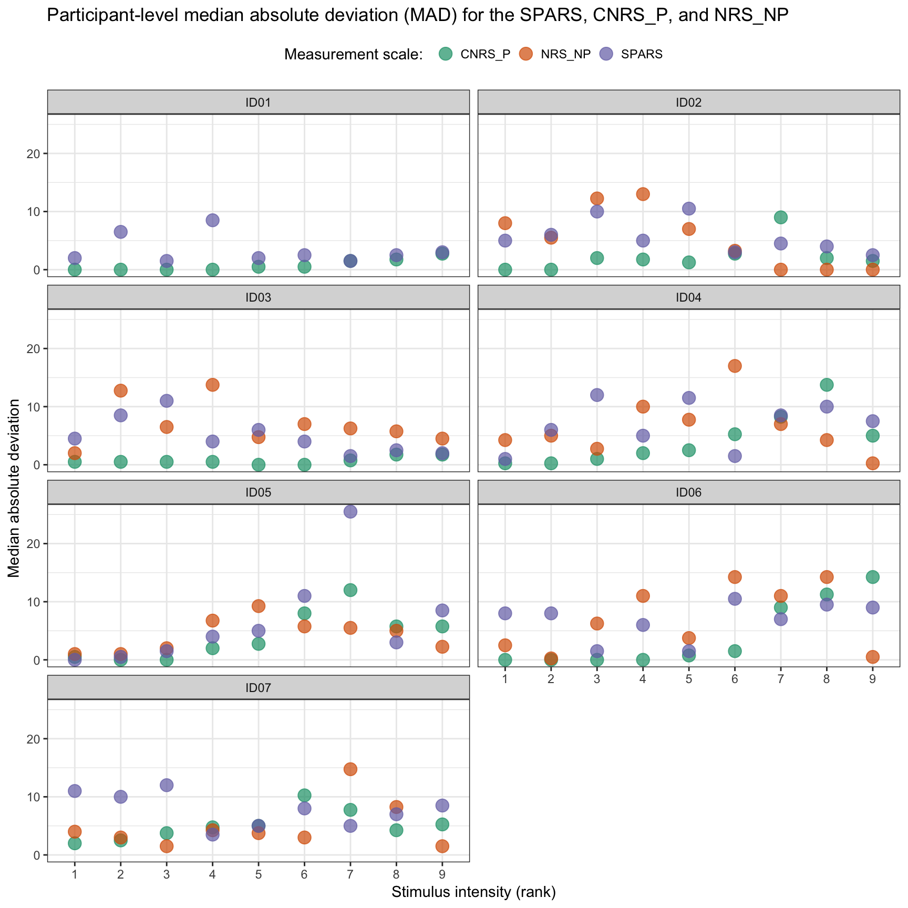
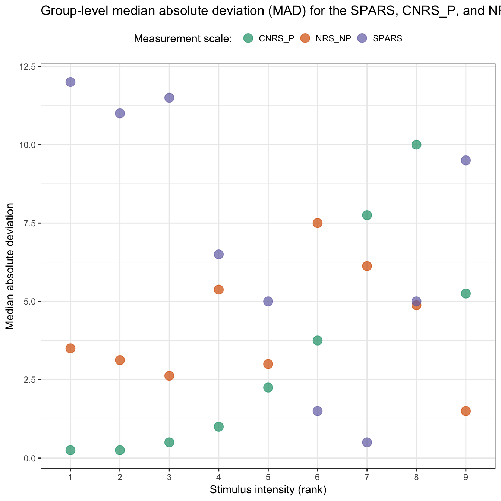
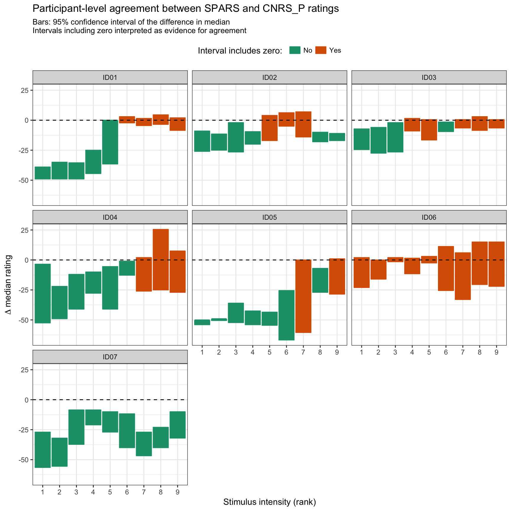
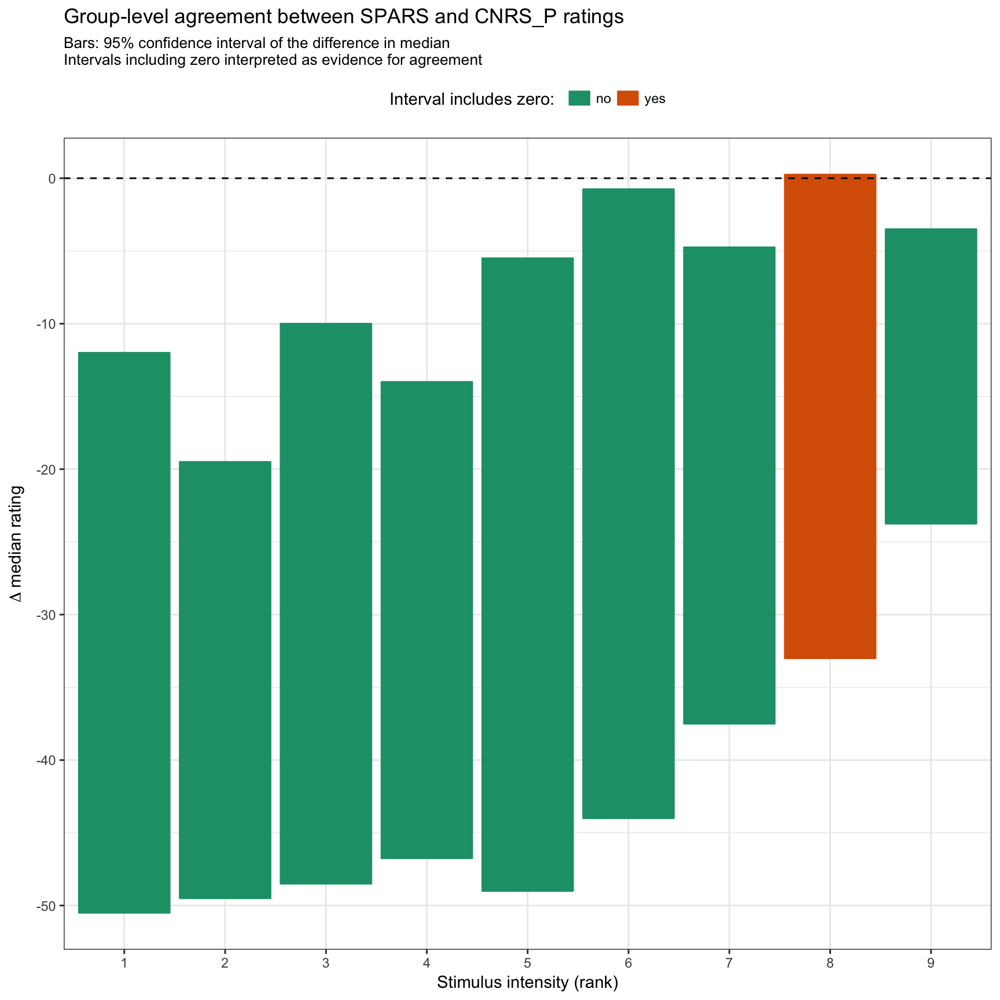
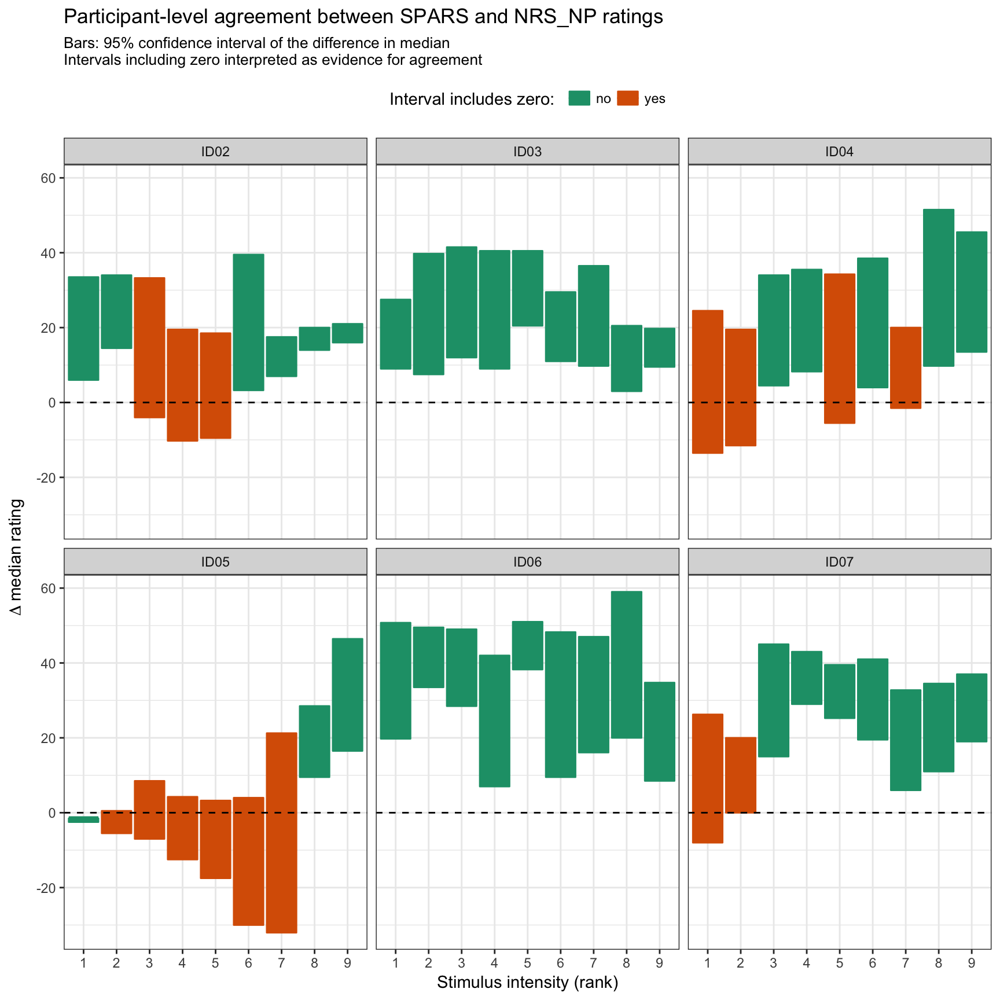
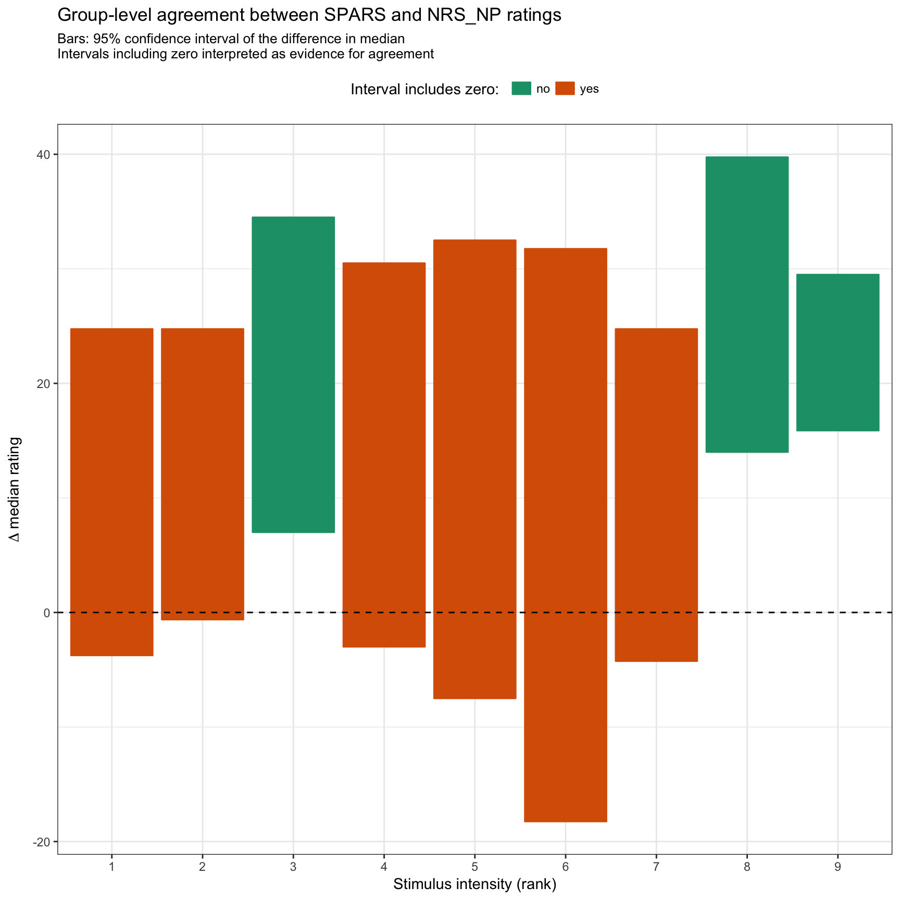

----

This script assesses the agreement between the SPARS and the scaled NRS_NP and CNRS_P.[^1]

Because the three measurement scales were not used concurrently to rate each stimulus, we could not assess agreement using the Bland-Altman method. Instead, for each participant, and at each stimulus intensity, we generated 50,000 bootstrap resamples _(sampled with replacement)_ of ratings for each of the scales. We then calculated the median rating for each scale for each of the resamples and subtracted the values as follows: 

$$ Median_{(SPARS)} - Median_{(CNRS\_P~/~NRS\_NP)} $$

These data were then used to calculate a 95% bootstrap confidence interval (bias-corrected and accelerated method, BCa [^2]) of the difference in medians at each stimulus intensity. Confidence intervals that included 0 were interpreted as indicating agreement between the two measurements scale at a particular stimulus intensity. When the upper limit of the confidence interval was < 0, we interpreted the finding as the SPARS being consitently less than the rating on the other scale, and _visa versa_ when the lower bound of the confidence interval was > 0. 

To get a feel for rating agreement at the group-level, we used the point estimates of the differences in medians (a side-effect of the above-mentioned confidence interval calculation) to calculate a 95% bootstrap interval _(50,000 resamples, BCa method)_ for the cohort at each stimulus intensity.

[^1]: Raw scores for the CNRS_P and NRS_NP scales (both rated on 0 to 100 scales) were converted to SPARS equivalent ranges (-50 to +50). CNRS_P ratings were a converted to a 0 to 50 range by dividing 2, such that after the scaling, 0 = _no pain_ and 50 = _worst pain you can imagine_. NRS_NP ratings were converted to a -50 to 0 range by subtracting 100, and then dividing 2, such that after the scaling, -50 = _no sensation_ and 0 = _pain_. This is equivalent to the negative range of the SPARS.

[^2]: Bias-corrected accelerated intervals work best for larger samples (>25), and therefore we increased our resample rate to 50,000 to help ensure a stable distribution.

----

# Import and inspect data


```r
# Import
data <- read_rds('./data-cleaned/SPARS_B.rds')

# Inspect
glimpse(data)
```

```
## Observations: 2,256
## Variables: 10
## $ PID               <chr> "ID01", "ID01", "ID01", "ID01", "ID01", "ID0...
## $ scale             <chr> "SPARS", "SPARS", "SPARS", "SPARS", "SPARS",...
## $ block_number      <int> 2, 2, 2, 4, 4, 4, 6, 6, 6, 8, 8, 8, 11, 11, ...
## $ trial_number      <int> 9, 15, 23, 7, 20, 25, 9, 18, 22, 3, 17, 23, ...
## $ intensity         <dbl> 2.25, 2.25, 2.25, 2.25, 2.25, 2.25, 2.25, 2....
## $ intensity_char    <chr> "2.25", "2.25", "2.25", "2.25", "2.25", "2.2...
## $ intensity_rank    <int> 1, 1, 1, 1, 1, 1, 1, 1, 1, 1, 1, 1, 1, 1, 1,...
## $ rating            <dbl> -31, -20, -48, -48, -21, -23, -48, -45, -47,...
## $ rating_positive   <dbl> 19, 30, 2, 2, 29, 27, 2, 5, 3, 0, 1, 3, 50, ...
## $ rating_equivalent <dbl> -31, -20, -48, -48, -21, -23, -48, -45, -47,...
```

----

# Clean and transform data


```r
############################################################
#                                                          #
#                          Clean                           #
#                                                          #
############################################################
data %<>%
    # Select required columns
    select(PID, scale, intensity_rank, rating_equivalent) 

############################################################
#                                                          #
#                Define bootstrap function                 #
#                                                          #
############################################################
# Participant-level bootstrap function
boot_deltaP <- function(d, i) {
    foo <- d[i, ]
    # Extract a random sample of SPARS rating data, and calculate a median
    spars <- foo[foo$scale == 'SPARS', ]
    spars <- spars$rating_equivalent
    spars <- median(spars, na.rm = TRUE)
    # Extract a random sample of OTHER rating data, and calculate a median
    other <- foo[foo$scale == 'OTHER', ]
    other <- other$rating_equivalent
    other <- median(other, na.rm = TRUE)
    # Calculate the difference in medians
    spars - other
}

# Group-level bootstrap function
boot_deltaG <- function(d, i) {
    foo <- d[i, ]
    # Extract a random sample of delta median estimates 
    # and calculate the median
    median(foo$statistic, na.rm = TRUE)
}
```

----

# Comparison of scale variance

Before assessing scale agreement, we wanted to get an overview the the inherent intra-individual and inter-individual variability in scoring on the SPARS, CNRS_P and NRS_NP at each pain intensity. 

Our analysis of the SPARS data from trial A indicated that the Tukey trimean is a good measure of intra-individual centrality for the scale, but since we also are analysing the CNRS_P and NRS_NP, we chose to use the median as a measure of centrality for both intra- and inter-individual rating variance. To calculate intra-individual variance, for each scale and for each stimulus intensity (rank), we calculated the median absolute deviation (MAD, a robust measure of dispersion) using the ratings from repeated stimuli at each stimulus intensity. We also used the MAD for calculating inter-individual variance for each scale and at each intensity, but used the median ratings by individuals at each intensity as the input.

**Median absolute deviation**  

$$MAD = median(|X_i - median(X)|)$$ 

### Intra-individual variation (participant-level)


```r
# Calculate MAD
data_varianceP <- data %>%
    group_by(PID, scale, intensity_rank) %>%
    summarise(MAD = mad(x = rating_equivalent,
                     constant = 1, 
                     na.rm = TRUE)) %>%
    ungroup()

# Plot
ggplot(data = data_varianceP) +
    aes(y = MAD,
        x = factor(intensity_rank),
        fill = scale,
        colour = scale) +
    geom_point(shape = 21,
               size = 4,
               alpha = 0.7) +
    labs(title = 'Participant-level median absolute deviation (MAD) for the SPARS, CNRS_P, and NRS_NP',
         y = 'Median absolute deviation',
         x = 'Stimulus intensity (rank)') +
    scale_fill_brewer(name = 'Measurement scale: ',
                      type = 'qual',
                      palette = 'Dark2') +
    scale_colour_brewer(name = 'Measurement scale: ',
                        type = 'qual',
                        palette = 'Dark2') +
    facet_wrap(~ PID, ncol = 2) +
    theme(legend.position = 'top')
```



There is no clear pattern in intra-individual variance in intensity rating between the three scales or within each scale, and the variance is frequently high. Please note that the CNRS_P only assesses painful stimuli, which may account for the low MAD at lower stimulus intensities, and _visa versa_ for the NRS_P.  

### Inter-individual variation (group-level)


```r
# Process data for plotting
data_varianceG <- data %>% 
    # Calculate median rating at each stimulus intensity for each scale per PID
    group_by(PID, scale, intensity_rank) %>%
    summarise(median = median(rating_equivalent, 
                              na.rm = TRUE)) %>%
    # Calculate group MAD
    group_by(scale, intensity_rank) %>%
    summarise(MAD = mad(median,
                        constant = 1,
                        na.rm = TRUE)) %>%
    ungroup()
    

# Plot
ggplot(data = data_varianceG) +
    aes(y = MAD,
        x = factor(intensity_rank),
        fill = scale,
        colour = scale) +
    geom_point(shape = 21,
               size = 4,
               alpha = 0.7) +
    labs(title = 'Group-level median absolute deviation (MAD) for the SPARS, CNRS_P, and NRS_NP',
         y = 'Median absolute deviation',
         x = 'Stimulus intensity (rank)') +
    scale_fill_brewer(name = 'Measurement scale: ',
                      type = 'qual',
                      palette = 'Dark2') +
    scale_colour_brewer(name = 'Measurement scale: ',
                        type = 'qual',
                        palette = 'Dark2') +
    theme(legend.position = 'top')
```



There is no clear pattern in inter-individual variance in intensity rating between the three scales, and the variance can be high. Within the scales, however, the SPARS variance follows a 'U-shaped' response (minimum value at stimulus rank = 7), and the CNRS_P has low variance at low stimulus intensities (see above: Intra-individual variance  for explanation). The NRS_NP does not show a clear pattern.

----

# Agreement between SPARS and CNRS_P

### Participant-level agreement


```r
# Set random seed
set.seed(1234)

# Generate SPRS vs CNRS_P data
cnrs_agreement <- data %>%
    # Remove NRS_NP data
    filter(scale != 'NRS_NP') %>%
    # Recode CNRS_P to OTHER
    mutate(scale = case_when(
        scale == 'CNRS_P' ~ 'OTHER',
        TRUE ~ 'SPARS'
    )) %>%
    # Group and nest by PID and stimulus intensity
    group_by(PID, intensity_rank) %>%
    nest()

# Perform bootstrap
cnrs_agreementP <- cnrs_agreement %>%
    mutate(boot = map(.x = data,
                      ~ boot::boot(data = .x, 
                                   statistic = boot_deltaP,
                                   R = 50000,
                                   stype = 'i')))

# Calculate 95% CI
cnrs_agreementP %<>%
    mutate(boot_ci = map(.x = boot,
                         ~ boot::boot.ci(boot.out = .x,
                                         type = 'bca')))

# Extract data
cnrs_agreementP %<>%
   mutate(statistic = map(.x = boot_ci,
                          ~ .x$t0),
          lower_ci = map(.x = boot_ci,
                         ~ .x$bca[[4]]),
          upper_ci = map(.x = boot_ci,
                         ~ .x$bca[[5]]))

# Clean-up
cnrs_agreementP %<>%
    select(-data, -boot, -boot_ci) %>%
    unnest() %>%
    # Add colour coding column
    mutate(includes_zero = case_when(
        lower_ci <= 0 & upper_ci >= 0 ~ 'yes',
        TRUE ~ 'no'
    ))
    

# Plot
ggplot(data = cnrs_agreementP) +
    aes(x = as.factor(intensity_rank),
        y = statistic,
        ymin = lower_ci,
        ymax = upper_ci,
        fill = includes_zero,
        colour = includes_zero) +
    geom_crossbar() +
    geom_hline(yintercept = 0,
               linetype = 2) +
    scale_fill_brewer(name = 'Interval includes zero: ',
                      labels = c('No', 'Yes'),
                      type = 'qual',
                      palette = 'Dark2') +
    scale_colour_brewer(name = 'Interval includes zero: ',
                        labels = c('No', 'Yes'),
                        type = 'qual',
                        palette = 'Dark2') +
    labs(title = 'Participant-level agreement between SPARS and CNRS_P ratings',
         subtitle = 'Bars: 95% confidence interval of the difference in median\nIntervals including zero interpreted as evidence for agreement',
         x = 'Stimulus intensity (rank)',
         y = expression(Delta~median~rating)) +
    facet_wrap(~ PID) +
    theme(legend.position = 'top')
```



There were significant participant-level discrepancies in agreement, but particularly at the lower stimulus intensities. There was a tendency for the SPARS ratings to be less than the CNRS_P ratings across all stimulus intensities, and this trend is most apparent at the low end of the intensity range. However, this effect at the lower end of the intensity range is likely an artefact of the two instruments, where SPARS continues to record (using a negative range) non-painful stimuli, while the CNRS_P reaches a floor value of zero when the stimulus intensity is no longer perceived as being painful. When there was agreement, it tended to be in the upper ranges of stimulus intensity. There was significant heterogeneity across participants. 

### Group-level


```r
# Set random seed
set.seed(1234)

# Perform bootstrap
cnrs_agreementG <- cnrs_agreementP %>%
    group_by(intensity_rank) %>%
    nest() %>% 
    mutate(boot = map(.x = data,
                      ~ boot::boot(data = .x, 
                                   statistic = boot_deltaG,
                                   R = 50000,
                                   stype = 'i')))

# Calculate 95% CI
cnrs_agreementG %<>%
    mutate(boot_ci = map(.x = boot,
                         ~ boot::boot.ci(boot.out = .x,
                                         type = 'bca')))

# Extract data
cnrs_agreementG %<>%
   mutate(statistic = map(.x = boot_ci,
                          ~ .x$t0),
          lower_ci = map(.x = boot_ci,
                         ~ .x$bca[[4]]),
          upper_ci = map(.x = boot_ci,
                         ~ .x$bca[[5]]))

# Clean-up
cnrs_agreementG %<>%
    select(-data, -boot, -boot_ci) %>%
    unnest() %>%
    # Add colour coding column
    mutate(includes_zero = case_when(
        lower_ci <= 0 & upper_ci >= 0 ~ 'yes',
        TRUE ~ 'no'
    ))
    

# Plot
ggplot(data = cnrs_agreementG) +
    aes(x = as.factor(intensity_rank),
        y = statistic,
        ymin = lower_ci,
        ymax = upper_ci,
        fill = includes_zero,
        colour = includes_zero) +
    geom_crossbar() +
    geom_hline(yintercept = 0,
               linetype = 2) +
    scale_fill_brewer(name = 'Interval includes zero: ',
                      type = 'qual',
                      palette = 'Dark2') +
    scale_colour_brewer(name = 'Interval includes zero: ',
                        type = 'qual',
                        palette = 'Dark2') +
    labs(title = 'Group-level agreement between SPARS and CNRS_P ratings',
         subtitle = 'Bars: 95% confidence interval of the difference in median\nIntervals including zero interpreted as evidence for agreement',
         x = 'Stimulus intensity (rank)',
         y = expression(Delta~median~rating)) +
    theme(legend.position = 'top')
```



As expected from the participan-level plots, agreement between the two scales was poor at the low range of stimulus intensities. At higher stimulus intensities, the upper limits of the 95% confidence intervals tend to approach zero, but except for the 8^th^ most intense stimulus, the intervals do not include zero (we believe that the 8^th^ stimulus finding results from sampling variation rather than being a true effect). Across the range of stimulus intensities, the width of the interval was large, and reflects high inter-individual variation in SPARS and CNRS_P ratings at each stimulus intensity. 

----

# Agreement between SPARS and NRS_NP

Please note that ID01 did not have NRS_NP data, and has therefore their data has been omitted from these analyses.

### Participant-level agreement


```r
# Set random seed
set.seed(1234)

# Generate SPRS vs NRS_NP data
nrs_agreement <- data %>%
    # Remove NRS_NP data
    filter(scale != 'CNRS_P') %>%
    # Remove ID01 (no NRS_NP data)
    filter(PID != 'ID01') %>%
    # Recode CNRS_P to OTHER
    mutate(scale = case_when(
        scale == 'NRS_NP' ~ 'OTHER',
        TRUE ~ 'SPARS'
    )) %>%
    # Group and nest by PID and stimulus intensity
    group_by(PID, intensity_rank) %>%
    nest()

# Perform bootstrap
nrs_agreementP <- nrs_agreement %>%
    mutate(boot = map(.x = data,
                      ~ boot::boot(data = .x, 
                                   statistic = boot_deltaP,
                                   R = 50000,
                                   stype = 'i')))

# Calculate 95% CI
nrs_agreementP %<>%
    mutate(boot_ci = map(.x = boot,
                         ~ boot::boot.ci(boot.out = .x,
                                         type = 'bca')))

# Extract data
nrs_agreementP %<>%
   mutate(statistic = map(.x = boot_ci,
                          ~ .x$t0),
          lower_ci = map(.x = boot_ci,
                         ~ .x$bca[[4]]),
          upper_ci = map(.x = boot_ci,
                         ~ .x$bca[[5]]))

# Clean-up
nrs_agreementP %<>%
    select(-data, -boot, -boot_ci) %>%
    unnest() %>%
    # Add colour coding column
    mutate(includes_zero = case_when(
        lower_ci <= 0 & upper_ci >= 0 ~ 'yes',
        TRUE ~ 'no'
    ))
    

# Plot
ggplot(data = nrs_agreementP) +
    aes(x = as.factor(intensity_rank),
        y = statistic,
        ymin = lower_ci,
        ymax = upper_ci,
        fill = includes_zero,
        colour = includes_zero) +
    geom_crossbar() +
    geom_hline(yintercept = 0,
               linetype = 2) +
    scale_fill_brewer(name = 'Interval includes zero: ',
                      type = 'qual',
                      palette = 'Dark2') +
    scale_colour_brewer(name = 'Interval includes zero: ',
                        type = 'qual',
                        palette = 'Dark2') +
    labs(title = 'Participant-level agreement between SPARS and NRS_NP ratings',
         subtitle = 'Bars: 95% confidence interval of the difference in median\nIntervals including zero interpreted as evidence for agreement',
         x = 'Stimulus intensity (rank)',
         y = expression(Delta~median~rating)) +
    facet_wrap(~ PID) +
    theme(legend.position = 'top')
```



As with the SPARS / CNRS_P data, and consistent with the participant-level SPARS / NRS_NP data, there were significant participant-level discrepancies in agreement. In this case, however, the problem was most apparent at the higher stimulus intensities. At least at the high end of the intensity range, the consistently greater SPARS ratings compared to NRS_NP ratings was likely the result of the NRS_NP reaches a ceiling value of zero when the stimulus intensity is first perceived as painful, while the SPARS continued providing information stimulus intensity in its positive range. When there was agreement, it tended to be in the lower ranges of stimulus intensity. There was significant heterogeneity across participants. 

### Group-level


```r
# Set random seed
set.seed(1234)

# Perform bootstrap
nrs_agreementG <- nrs_agreementP %>%
    group_by(intensity_rank) %>%
    nest() %>% 
    mutate(boot = map(.x = data,
                      ~ boot::boot(data = .x, 
                                   statistic = boot_deltaG,
                                   R = 50000,
                                   stype = 'i')))

# Calculate 95% CI
nrs_agreementG %<>%
    mutate(boot_ci = map(.x = boot,
                         ~ boot::boot.ci(boot.out = .x,
                                         type = 'bca')))

# Extract data
nrs_agreementG %<>%
   mutate(statistic = map(.x = boot_ci,
                          ~ .x$t0),
          lower_ci = map(.x = boot_ci,
                         ~ .x$bca[[4]]),
          upper_ci = map(.x = boot_ci,
                         ~ .x$bca[[5]]))

# Clean-up
nrs_agreementG %<>%
    select(-data, -boot, -boot_ci) %>%
    unnest() %>%
    # Add colour coding column
    mutate(includes_zero = case_when(
        lower_ci <= 0 & upper_ci >= 0 ~ 'yes',
        TRUE ~ 'no'
    ))
    

# Plot
ggplot(data = nrs_agreementG) +
    aes(x = as.factor(intensity_rank),
        y = statistic,
        ymin = lower_ci,
        ymax = upper_ci,
        fill = includes_zero,
        colour = includes_zero) +
    geom_crossbar() +
    geom_hline(yintercept = 0,
               linetype = 2) +
    scale_fill_brewer(name = 'Interval includes zero: ',
                      type = 'qual',
                      palette = 'Dark2') +
    scale_colour_brewer(name = 'Interval includes zero: ',
                        type = 'qual',
                        palette = 'Dark2') +
    labs(title = 'Group-level agreement between SPARS and NRS_NP ratings',
         subtitle = 'Bars: 95% confidence interval of the difference in median\nIntervals including zero interpreted as evidence for agreement',
         x = 'Stimulus intensity (rank)',
         y = expression(Delta~median~rating)) +
    theme(legend.position = 'top')
```



Compared to the SPARS / CNRS_P group-level agreement, group-level agreement for the SPARS / NRS_NP was better (more intervals included zero), but the intervals were wide, and the inclusion of zero was quite marginal in most cases. In general, the SPARS ratings tended to be greater than the NRS_NP ratings on average for a given stimulus intensity.

----

# Summary

There was significant heterogeneity in rating within each scale and between the scales, at each stimulus intensity. In general, the ratings provided on the SPARS were less than those provided on the CNRS_P (even at higher stimulus intensities), and greater than those provided on the NRS_NP (even at lower stimulus intensities). This indicates that the extra dimensionality of the SPARS compared to the other two scales (the SPARS allowing the ratings of stimulus intensities from _no sensation_ to _worst pain imaginable_) leads to a compression of the numeric value of the ratings into a narrower band around 0 (pain thershold) compared to the two polar scales (measuring either noxious or non-nonxious stimulus ranges).

(Please also see: _outputs/5B-stimulus-response.html #Summary plots (group-level)_)

----

# Session information

```r
sessionInfo()
```

```
## R version 3.4.3 (2017-11-30)
## Platform: x86_64-apple-darwin15.6.0 (64-bit)
## Running under: macOS High Sierra 10.13.3
## 
## Matrix products: default
## BLAS: /Library/Frameworks/R.framework/Versions/3.4/Resources/lib/libRblas.0.dylib
## LAPACK: /Library/Frameworks/R.framework/Versions/3.4/Resources/lib/libRlapack.dylib
## 
## locale:
## [1] en_GB.UTF-8/en_GB.UTF-8/en_GB.UTF-8/C/en_GB.UTF-8/en_GB.UTF-8
## 
## attached base packages:
## [1] stats     graphics  grDevices utils     datasets  base     
## 
## other attached packages:
##  [1] bindrcpp_0.2       boot_1.3-20        forcats_0.2.0     
##  [4] stringr_1.2.0      dplyr_0.7.4        purrr_0.2.4       
##  [7] readr_1.1.1        tidyr_0.8.0        tibble_1.4.2      
## [10] ggplot2_2.2.1.9000 tidyverse_1.2.1    magrittr_1.5      
## 
## loaded via a namespace (and not attached):
##  [1] tidyselect_0.2.3   reshape2_1.4.3     haven_1.1.1       
##  [4] lattice_0.20-35    colorspace_1.3-2   htmltools_0.3.6   
##  [7] yaml_2.1.16        rlang_0.1.6        pillar_1.1.0      
## [10] foreign_0.8-69     glue_1.2.0         RColorBrewer_1.1-2
## [13] modelr_0.1.1       readxl_1.0.0       bindr_0.1         
## [16] plyr_1.8.4         munsell_0.4.3      gtable_0.2.0      
## [19] cellranger_1.1.0   rvest_0.3.2        psych_1.7.8       
## [22] evaluate_0.10.1    labeling_0.3       knitr_1.19        
## [25] parallel_3.4.3     broom_0.4.3        methods_3.4.3     
## [28] Rcpp_0.12.15       scales_0.5.0.9000  backports_1.1.2   
## [31] jsonlite_1.5       mnormt_1.5-5       hms_0.4.1         
## [34] digest_0.6.15      stringi_1.1.6      grid_3.4.3        
## [37] rprojroot_1.3-2    cli_1.0.0          tools_3.4.3       
## [40] lazyeval_0.2.1     crayon_1.3.4       pkgconfig_2.0.1   
## [43] xml2_1.2.0         lubridate_1.7.1    assertthat_0.2.0  
## [46] rmarkdown_1.8      httr_1.3.1         rstudioapi_0.7    
## [49] R6_2.2.2           nlme_3.1-131       compiler_3.4.3
```
