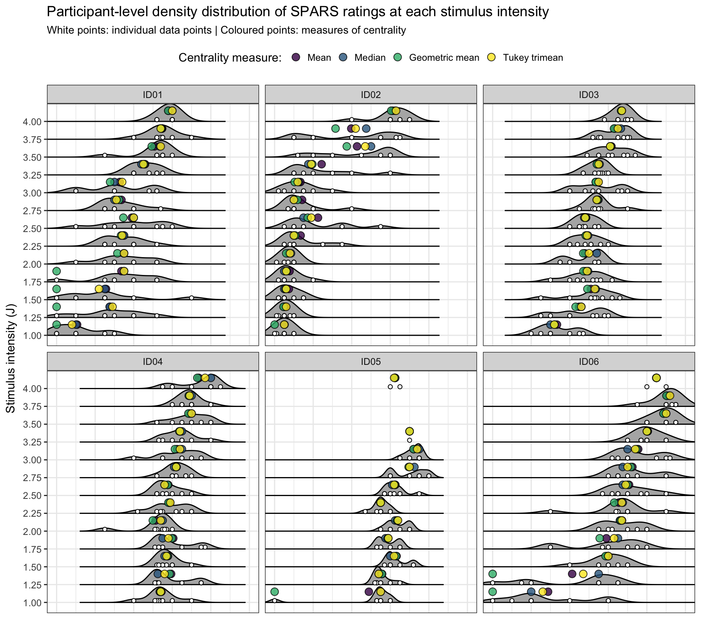
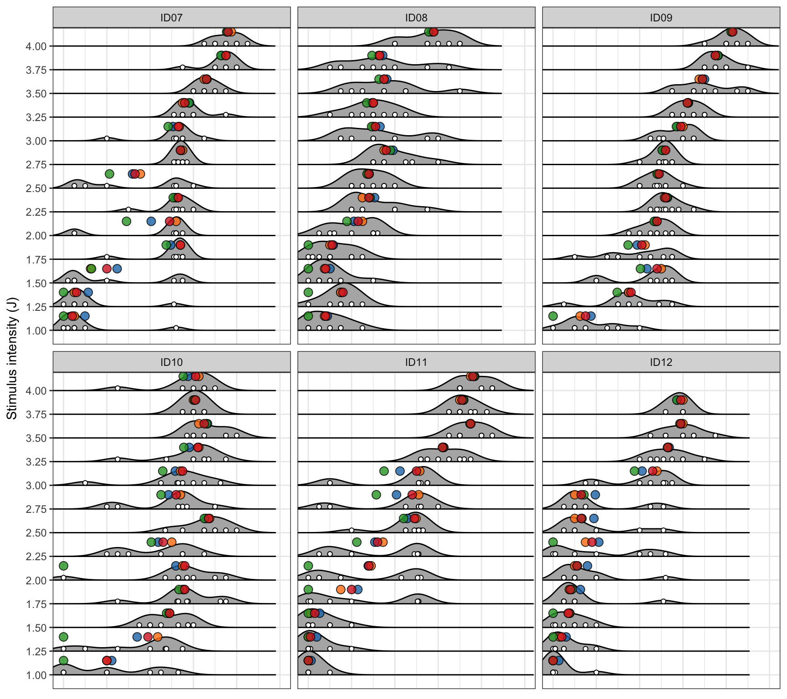
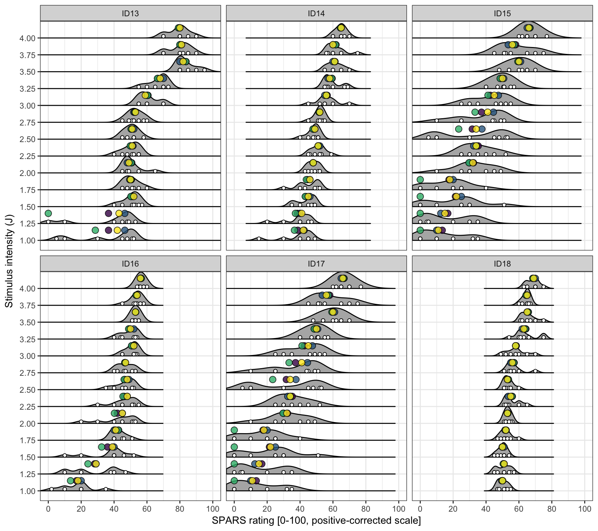

----

In this experiment, there are two levels of correlated data:

1) Correlation at the level of the individual, with each individual tested at each stimulus intensity (the individual is the observational unit).

2) Correlation at each stimulus intensity within each individual, with each stimulus intensity being assessed several times in each individual (stimulus intensity is the observational unit). 

This double layer of correlation creates problems for analysis. One solution is to remove the second layer of correlation (correlation at each stimulus intensity within each individual) by calculating a single summary measure of the repeated measurement at each stimulus intensity. But what is the best measure of location (central tendency) for these data?

Measures of central tendency provide information on what the _'average'_ value of a set of numbers is; a useful summary measure of a dataset. Some examples of measures of central tendency are:

1. Arithmetic mean (`base::mean`)  
2. Median (`stats::median`)  
3. Geometric mean (`psych::geometric.mean`, mathematical definition below)  
4. Tukey trimean (`user-defined::tri.mean`, mathematical definition and function specification below)

Each measure has strengths and limitations. The _arithmetic mean_ is best suited to symmetrical distributions, and hence asymmetrical distributions (right or left-skewed data) reduced the usefulness of the measure as a measure of central tendency. The _geometric mean_ is equivalent to the _arithmetic mean_, but the additive structure is on the logarithm of the original data [^2]. As such, the _geometric mean_ handles skewed data better than does the _arithmetic mean_, particularly right-skewed data. The _median_ is the middle element in a sorted set of numbers (the centre-point of the data), and therefore it is not influenced by extreme values. However using the _median_ means that information about the distribution of the data is lost, and it can be biased in small samples. The fourth measure is the _Tukey trimean_. The _Tukey trimean_ combines the median's emphasis on centre values with the midhinge's (average of the 25^th^ and 75^th^ percentiles) attention to the extremes [^1]. As such, the distribution of the data is incorporated to some extent into the measure of central tendency.

[^1]: Weisberg, H. F. (1992). Central Tendency and Variability. Sage University. ISBN 0-8039-4007-6

[^2]: Because the calculation of geometric mean requires values $\geq 0$, `rating_positive` data (SPARS rating + 50) were used to calculate all measures of central tendency.  

Judging the suitability of the four measures of central tendency was done by visually inspecting modified 'Raw, Descriptive, Inference (RDI)' plots [^3]. The plots included individual data points, smoothed densities, and the four measures of central tendency, but dropping the 'inference' component. 

### Definition of the geometric mean

The _geometric mean_ is defined as the n^th^ root of the product of a set of numbers.

$$ G_{mean} = (\prod_{i = 1}^{n} x_{i})^\frac{1}{n} = \sqrt[n]{x_1 x_2 ...x_n} $$
Where:

- $x_i$ = elements in a set of numbers  
- $n$ = number of elements in the set  

### Definition of the Tukey trimean (and function)

The _Tukey trimean_ is defined as the weighted average of the distribution's median and its two quartiles. 

$$ T_{mean} = \frac{1}{2}(Q_2 + \frac{Q_1 + Q_3}{2}) $$

Where:

- $Q_1$ = 25^th^ percentile  
- $Q_2$ = 50^th^ percentile (median)  
- $Q_3$ = 75^th^ percentile


```r
# Specify tri.mean function
tri.mean <- function(x) {
  # Calculate quantiles
  q1 <- quantile(x, probs = 0.25, na.rm = TRUE)[[1]]
  q2 <- median(x, na.rm = TRUE)
  q3 <- quantile(x, probs = 0.75, na.rm = TRUE)[[1]]
  # Calculate trimean
  tm <- (q2 + ((q1 + q3) / 2)) / 2
  # Convert to integer
  tm <- as.integer(round(tm))
  return(tm)
}
```

----

# Import and inspect data


```r
# Import
data <- read_rds('./data-cleaned/SPARS_A.rds')

# Inspect
glimpse(data)
```

```
## Observations: 1,927
## Variables: 19
## $ PID               <chr> "ID01", "ID01", "ID01", "ID01", "ID01", "ID0...
## $ block             <chr> "A", "A", "A", "A", "A", "A", "A", "A", "A",...
## $ block_order       <dbl> 1, 1, 1, 1, 1, 1, 1, 1, 1, 1, 1, 1, 1, 1, 1,...
## $ trial_number      <dbl> 1, 2, 3, 4, 5, 6, 7, 8, 9, 10, 11, 12, 13, 1...
## $ intensity         <dbl> 3.75, 1.50, 3.25, 1.50, 3.00, 2.75, 1.00, 2....
## $ intensity_char    <chr> "3.75", "1.50", "3.25", "1.50", "3.00", "2.7...
## $ rating            <dbl> -10, -40, -10, -25, -20, -25, -40, 2, -40, -...
## $ rating_positive   <dbl> 40, 10, 40, 25, 30, 25, 10, 52, 10, 40, 54, ...
## $ EDA               <dbl> 18315.239, 13904.177, 11543.449, 20542.834, ...
## $ age               <dbl> 21, 21, 21, 21, 21, 21, 21, 21, 21, 21, 21, ...
## $ sex               <dbl> 2, 2, 2, 2, 2, 2, 2, 2, 2, 2, 2, 2, 2, 2, 2,...
## $ panas_positive    <dbl> 36, 36, 36, 36, 36, 36, 36, 36, 36, 36, 36, ...
## $ panas_negative    <dbl> 10, 10, 10, 10, 10, 10, 10, 10, 10, 10, 10, ...
## $ dass42_depression <dbl> 0, 0, 0, 0, 0, 0, 0, 0, 0, 0, 0, 0, 0, 0, 0,...
## $ dass42_anxiety    <dbl> 1, 1, 1, 1, 1, 1, 1, 1, 1, 1, 1, 1, 1, 1, 1,...
## $ dass42_stress     <dbl> 0, 0, 0, 0, 0, 0, 0, 0, 0, 0, 0, 0, 0, 0, 0,...
## $ pcs_magnification <dbl> 6, 6, 6, 6, 6, 6, 6, 6, 6, 6, 6, 6, 6, 6, 6,...
## $ pcs_rumination    <dbl> 11, 11, 11, 11, 11, 11, 11, 11, 11, 11, 11, ...
## $ pcs_helplessness  <dbl> 10, 10, 10, 10, 10, 10, 10, 10, 10, 10, 10, ...
```

----

# Clean data


```r
# Basic clean-up
data %<>%
  # Select required columns
  select(PID, block, block_order, intensity, 
         intensity_char, rating, rating_positive) 
```

----

# Participant-level: Best measure of central tendency

### Calculate measures of central tendency


```r
# Calculate participant-level centrality measures 
central <- data %>% 
  group_by(PID, intensity_char) %>%
  summarise(mean = mean(rating_positive, na.rm = TRUE),
            median = median(rating_positive, na.rm = TRUE),
            geometric_mean = psych::geometric.mean(rating_positive),
            tri_mean = tri.mean(rating_positive)) %>%
  ungroup() %>%
  # Change from wide to long format for plotting
  gather(key = type,
         value = value,
         mean:tri_mean) %>%
  # Order measurement types
  mutate(type = fct_relevel(factor(type),
                            'mean', 'median',
                            'geometric_mean',
                            'tri_mean'))
```

### Plots


```r
# Divide participants into batches of 6 (for better plot layout)
pid_a <- c(paste0('ID0', 1:6))
pid_b <- c(paste0('ID0', 7:9), 'ID10', 'ID11', 'ID12')
pid_c <- c(paste0('ID', 13:18))

# Plot first 6 participants
p_1to6 <- data %>%
  filter(PID %in% pid_a) %>%
  # Plot
  ggplot(data = .) +
  aes(x = rating_positive, 
      y = intensity_char) + 
  geom_density_ridges2(scale = 1) +
  geom_point(position = position_nudge(y = 0.1),
             shape = 21,
             fill = '#FFFFFF') +
  geom_point(data = central[central$PID %in% pid_a, ], 
             aes(x = value, fill = type),
             shape = 21, 
             size = 3,
             alpha = 0.8,
             position = position_nudge(y = 0.6)) +
  scale_fill_viridis_d(name = 'Centrality measure:',
                    labels = c('Mean', 'Median', 
                               'Geometric mean', 
                               'Tukey trimean')) +
  scale_x_continuous(limits = c(-5, 105), 
                     breaks = seq(from = 0, to = 100, by = 20),
                     expand = c(0,0)) +
  labs(title = 'Participant-level density distribution of SPARS ratings at each stimulus intensity',
       subtitle = 'White points: individual data points | Coloured points: measures of centrality',
       y = 'Stimulus intensity (J)') +
  facet_wrap(~PID, ncol = 3) +
  theme_bw() +
  theme(axis.title.x = element_blank(),
        axis.text.x = element_blank(),
        axis.ticks.x = element_blank(),
        legend.position = 'top')

# Plot participants 7-12
p_7to12 <- data %>%
  # Filter participants 7-12
  filter(PID %in% pid_b) %>%
  # Plot
  ggplot(data = .) +
  aes(x = rating_positive, 
      y = intensity_char) + 
  geom_density_ridges2(scale = 1) +
  geom_point(position = position_nudge(y = 0.1),
             shape = 21,
             fill = '#FFFFFF') +
  geom_point(data = central[central$PID %in% pid_b, ], 
             aes(x = value, fill = type),
             shape = 21, 
             size = 3,
             alpha = 0.8,
             position = position_nudge(y = 0.6)) +
  scale_fill_viridis_d(name = 'Centrality measure:',
                    labels = c('Mean', 'Median', 
                               'Geometric mean', 
                               'Tukey trimean')) +
  scale_x_continuous(limits = c(-5, 105), 
                     breaks = seq(from = 0, to = 100, by = 20),
                     expand = c(0,0)) +
  labs(y = 'Stimulus intensity (J)') +
  facet_wrap(~PID, ncol = 3) +
  theme_bw() +
  theme(axis.title.x = element_blank(),
        axis.text.x = element_blank(),
        axis.ticks.x = element_blank(),
        legend.position = 'none')

# Plot participants 13-18
p_13to18 <- data %>%
  # Filter participants 13-18
  filter(PID %in% pid_c) %>%
  # Plot
  ggplot(data = .) +
  aes(x = rating_positive, 
      y = intensity_char) + 
  geom_density_ridges2(scale = 1) +
  geom_point(position = position_nudge(y = 0.1),
             shape = 21,
             fill = '#FFFFFF') +
  geom_point(data = central[central$PID %in% pid_c, ], 
             aes(x = value, fill = type),
             shape = 21, 
             size = 3,
             alpha = 0.8,
             position = position_nudge(y = 0.6)) +
  scale_fill_viridis_d(name = 'Centrality measure',
                    labels = c('Mean', 'Median', 
                               'Geometric mean', 
                               'Tukey trimean')) +
  scale_x_continuous(limits = c(-5, 105), 
                     breaks = seq(from = 0, to = 100, by = 20),
                     expand = c(0,0)) +
  labs(x = 'SPARS rating [0-100, positive-corrected scale]',
       y = 'Stimulus intensity (J)') +
  facet_wrap(~PID, ncol = 3) +
  theme_bw() +
  theme(legend.position = 'none')
```


```r
# Print plots
p_1to6; p_7to12; p_13to18
```



### Conclusion

There was significant heterogeneity in the grouping of ratings within and between individuals, with a tendency for data to be left skewed (a few very low values). The heterogeneity makes selecting a measure of centrality difficult. Of the measures of centrality, the _Tukey trimean_ and _median_ showed the best stability across all stimulus intensities (as expected). The _geometric mean_ performed very poorly when there was a strong left skew in the data. The _arithmetic mean_ was similarly affected by skewed data. When there was a strong skew, the _Tukey mean_ was pulled slightly away from the _median_ and towards the affected tail, but otherwise the two measures yielded similar values. Given that the _Tukey trimean_ incorporates some of the information in the distribution of the data, but is not overly affected by extreme values, we believe that the _Tukey trimean_ should be used for 'averaging' repeated measurements within an individual, at a given stimulus intensity.

----

# Session information

```r
sessionInfo()
```

```
## R version 3.5.0 (2018-04-23)
## Platform: x86_64-apple-darwin15.6.0 (64-bit)
## Running under: macOS High Sierra 10.13.5
## 
## Matrix products: default
## BLAS: /Library/Frameworks/R.framework/Versions/3.5/Resources/lib/libRblas.0.dylib
## LAPACK: /Library/Frameworks/R.framework/Versions/3.5/Resources/lib/libRlapack.dylib
## 
## locale:
## [1] en_GB.UTF-8/en_GB.UTF-8/en_GB.UTF-8/C/en_GB.UTF-8/en_GB.UTF-8
## 
## attached base packages:
## [1] stats     graphics  grDevices utils     datasets  methods   base     
## 
## other attached packages:
##  [1] bindrcpp_0.2.2     ggridges_0.5.0     forcats_0.3.0     
##  [4] stringr_1.3.1      dplyr_0.7.5        purrr_0.2.5       
##  [7] readr_1.1.1        tidyr_0.8.1        tibble_1.4.2      
## [10] ggplot2_2.2.1.9000 tidyverse_1.2.1    magrittr_1.5      
## 
## loaded via a namespace (and not attached):
##  [1] tidyselect_0.2.4  reshape2_1.4.3    haven_1.1.1      
##  [4] lattice_0.20-35   colorspace_1.3-2  htmltools_0.3.6  
##  [7] viridisLite_0.3.0 yaml_2.1.19       rlang_0.2.1      
## [10] pillar_1.2.3      foreign_0.8-70    glue_1.2.0       
## [13] withr_2.1.2       modelr_0.1.2      readxl_1.1.0     
## [16] bindr_0.1.1       plyr_1.8.4        munsell_0.4.3    
## [19] gtable_0.2.0      cellranger_1.1.0  rvest_0.3.2      
## [22] psych_1.8.4       evaluate_0.10.1   knitr_1.20       
## [25] parallel_3.5.0    broom_0.4.4       Rcpp_0.12.17     
## [28] scales_0.5.0.9000 backports_1.1.2   jsonlite_1.5     
## [31] mnormt_1.5-5      hms_0.4.2         digest_0.6.15    
## [34] stringi_1.2.2     grid_3.5.0        rprojroot_1.3-2  
## [37] cli_1.0.0         tools_3.5.0       lazyeval_0.2.1   
## [40] crayon_1.3.4      pkgconfig_2.0.1   xml2_1.2.0       
## [43] lubridate_1.7.4   assertthat_0.2.0  rmarkdown_1.9    
## [46] httr_1.3.1        rstudioapi_0.7    R6_2.2.2         
## [49] nlme_3.1-137      compiler_3.5.0
```
