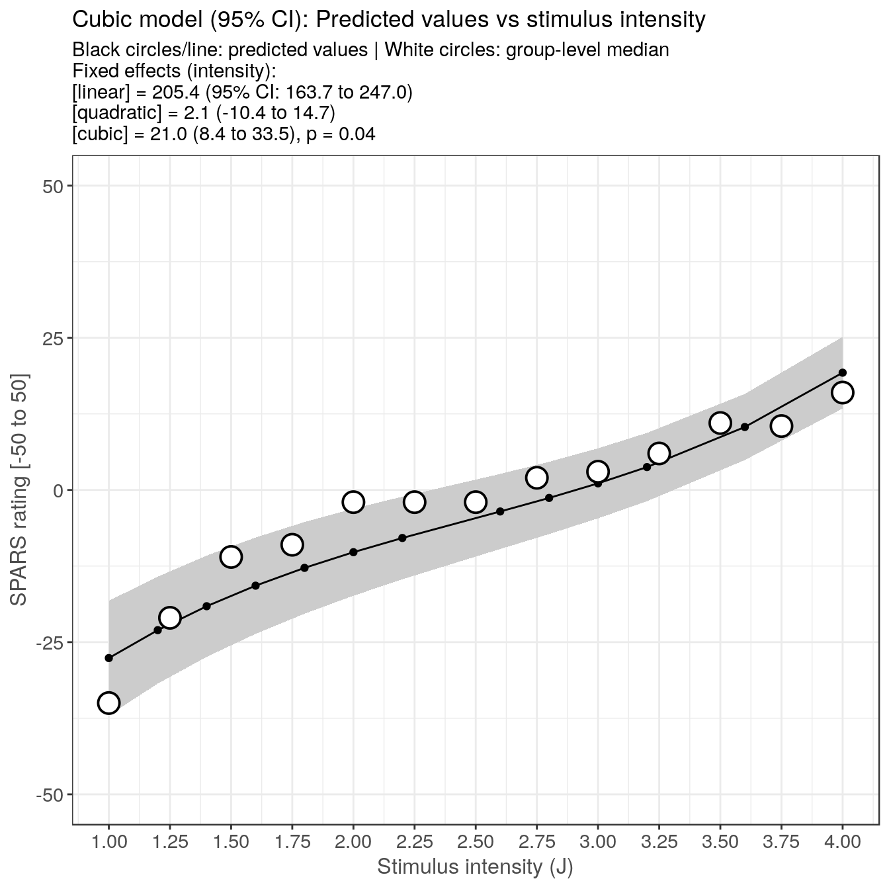
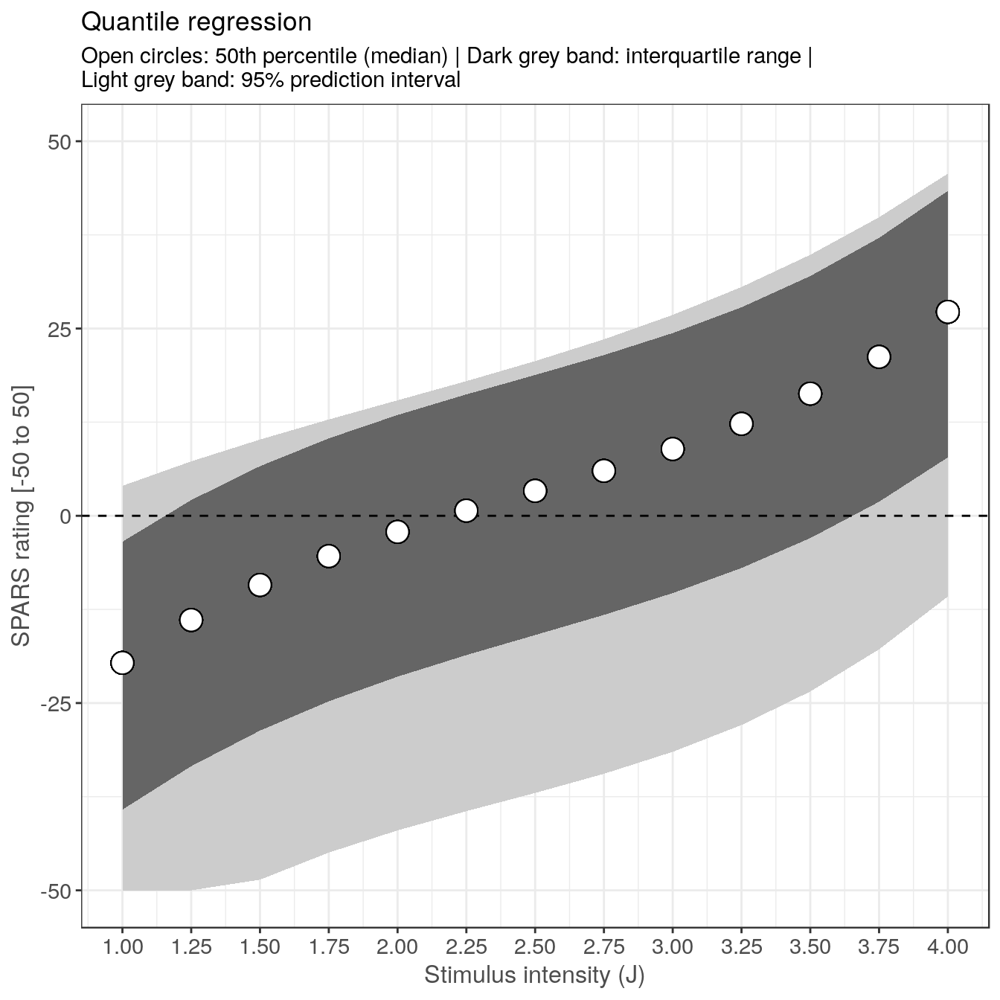
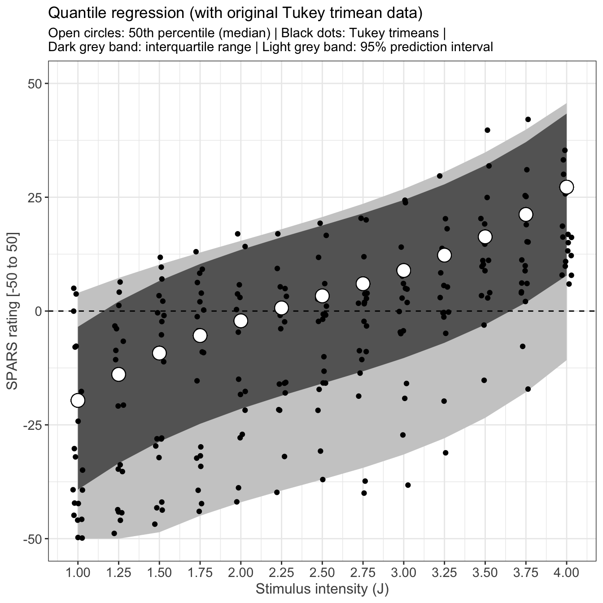

----

This script is part 2 of our analysis of the stimulus-response characteristics of the SPARS. This script models the relationship between stimulus intensity and SPARS rating using linear mixed models and quantile mixed model regression.

Descriptive plots of the data are provided in _"outputs/suppl\_05\_4A-stimulus-response-1.html"_, the diagnostics on the final linear mixed model are described in _"outputs/suppl\_07\_4A-stimulus-response-3.html"_, the stability of the model is described in _"outputs/suppl\_08\_4A-stimulus-response-4.html"_, the sensitivity of the scale to changes in stimulus intensity are described in _"outputs/suppl\_09\_4A-stimulus-reponse-5.html"_, and the variance in ratings at each stimulus intensity is described in _"outputs/suppl\_10\_4A-stimulus-reponse-6.html"_.

----

# Import and clean/transform data


```r
############################################################
#                                                          #
#                          Import                          #
#                                                          #
############################################################
data <- read_rds('./data-cleaned/SPARS_A.rds')

############################################################
#                                                          #
#                          Clean                           #
#                                                          #
############################################################
data %<>%
  # Select required columns
  select(PID, block, block_order, trial_number, intensity, intensity_char, rating) 

############################################################
#                                                          #
#                Calculate 'Tukey trimean'                 #
#                                                          #
############################################################
# Define tri.mean function
tri.mean <- function(x) {
  # Calculate quantiles
  q1 <- quantile(x, probs = 0.25, na.rm = TRUE)[[1]]
  q2 <- median(x, na.rm = TRUE)
  q3 <- quantile(x, probs = 0.75, na.rm = TRUE)[[1]]
  # Calculate trimean
  tm <- (q2 + ((q1 + q3) / 2)) / 2
  # Convert to integer
  tm <- as.integer(round(tm))
  return(tm)
}

############################################################
#                                                          #
#                    Generate core data                    #
#                                                          #
############################################################
# Calculate the participant average 
data_tm <- data %>% 
  group_by(PID, intensity) %>%
  summarise(tri_mean = tri.mean(rating)) %>%
  ungroup()

# Calculate the group average
data_group <- data_tm %>%
  group_by(intensity) %>%
  summarise(median = median(tri_mean)) %>%
  ungroup()
```

----

# Linear mixed model regression

To allow for a curvilinear relationship between stimulus intensity and rating, we modelled the data using polynomial regression, with 1^st^ (linear), 2^nd^ (quadratic), and 3^rd^ (cubic) order orthogonal polynomials. For each polynomial expression, we modelled the random effects as random intercept only, and as random intercept and slope. 

The random intercept only and random intercept and slope models were compared using the likelihood test, and the better model taken forward.

### 1st-order (linear) polynomial


```r
# Intercept only
lmm1 <- lmer(tri_mean ~ intensity + (1 | PID),
             data = data_tm,
             REML = TRUE)

# Intercept and slope
lmm1b <- lmer(tri_mean ~ intensity + (intensity | PID),
              data = data_tm,
              REML = TRUE)

# Better model?
anova(lmm1, lmm1b)
```

```
## Data: data_tm
## Models:
## lmm1: tri_mean ~ intensity + (1 | PID)
## lmm1b: tri_mean ~ intensity + (intensity | PID)
##       Df    AIC    BIC  logLik deviance  Chisq Chi Df Pr(>Chisq)    
## lmm1   4 1814.7 1828.7 -903.37   1806.7                             
## lmm1b  6 1733.6 1754.6 -860.79   1721.6 85.146      2  < 2.2e-16 ***
## ---
## Signif. codes:  0 '***' 0.001 '**' 0.01 '*' 0.05 '.' 0.1 ' ' 1
```

```r
# Anova of better model
Anova(lmm1b,
      type = 2,
      test.statistic = 'F')
```

```
## Analysis of Deviance Table (Type II Wald F tests with Kenward-Roger df)
## 
## Response: tri_mean
##                F Df Df.res    Pr(>F)    
## intensity 94.707  1 17.998 1.356e-08 ***
## ---
## Signif. codes:  0 '***' 0.001 '**' 0.01 '*' 0.05 '.' 0.1 ' ' 1
```

```r
# Print better model
tab_model(lmm1b,
          auto.label = FALSE,
          dv.labels = "Response", 
          string.pred = "Coefficients",
          pred.labels = c('(Intercept)', 'Intensity'),
          string.stat = 'Estimate',
          string.ci = '95% CI',
          string.p = 'p-value',
          show.icc = FALSE,
          show.r2 = FALSE)
```

<table style="border-collapse:collapse; border:none;">
<tr>
<th style="border-top: double; text-align:center; font-style:normal; font-weight:bold; padding:0.2cm;  text-align:left; ">&nbsp;</th>
<th colspan="3" style="border-top: double; text-align:center; font-style:normal; font-weight:bold; padding:0.2cm; ">Response</th>
</tr>
<tr>
<td style=" text-align:center; border-bottom:1px solid; font-style:italic; font-weight:normal;  text-align:left; ">Coefficients</td>
<td style=" text-align:center; border-bottom:1px solid; font-style:italic; font-weight:normal;  ">Estimates</td>
<td style=" text-align:center; border-bottom:1px solid; font-style:italic; font-weight:normal;  ">95% CI</td>
<td style=" text-align:center; border-bottom:1px solid; font-style:italic; font-weight:normal;  ">p-value</td>
</tr>
<tr>
<td style=" padding:0.2cm; text-align:left; vertical-align:top; text-align:left; ">(Intercept)</td>
<td style=" padding:0.2cm; text-align:left; vertical-align:top; text-align:center;  ">-39.76</td>
<td style=" padding:0.2cm; text-align:left; vertical-align:top; text-align:center;  ">-51.32&nbsp;&ndash;&nbsp;-28.21</td>
<td style=" padding:0.2cm; text-align:left; vertical-align:top; text-align:center;  "><strong>&lt;0.001</td>
</tr>
<tr>
<td style=" padding:0.2cm; text-align:left; vertical-align:top; text-align:left; ">Intensity</td>
<td style=" padding:0.2cm; text-align:left; vertical-align:top; text-align:center;  ">14.13</td>
<td style=" padding:0.2cm; text-align:left; vertical-align:top; text-align:center;  ">11.28&nbsp;&ndash;&nbsp;16.97</td>
<td style=" padding:0.2cm; text-align:left; vertical-align:top; text-align:center;  "><strong>&lt;0.001</td>
</tr>
<tr>
<td colspan="4" style="font-weight:bold; text-align:left; padding-top:.8em;">Random Effects</td>
</tr>

<tr>
<td style=" padding:0.2cm; text-align:left; vertical-align:top; text-align:left; padding-top:0.1cm; padding-bottom:0.1cm;">&sigma;<sup>2</sup></td>
<td style=" padding:0.2cm; text-align:left; vertical-align:top; padding-top:0.1cm; padding-bottom:0.1cm; text-align:left;" colspan="3">42.54</td>

<tr>
<td style=" padding:0.2cm; text-align:left; vertical-align:top; text-align:left; padding-top:0.1cm; padding-bottom:0.1cm;">&tau;<sub>00</sub> <sub>PID</sub></td>
<td style=" padding:0.2cm; text-align:left; vertical-align:top; padding-top:0.1cm; padding-bottom:0.1cm; text-align:left;" colspan="3">633.16</td>

<tr>
<td style=" padding:0.2cm; text-align:left; vertical-align:top; text-align:left; padding-top:0.1cm; padding-bottom:0.1cm;">&tau;<sub>11</sub> <sub>PID.intensity</sub></td>
<td style=" padding:0.2cm; text-align:left; vertical-align:top; padding-top:0.1cm; padding-bottom:0.1cm; text-align:left;" colspan="3">36.17</td>

<tr>
<td style=" padding:0.2cm; text-align:left; vertical-align:top; text-align:left; padding-top:0.1cm; padding-bottom:0.1cm;">&rho;<sub>01</sub> <sub>PID</sub></td>
<td style=" padding:0.2cm; text-align:left; vertical-align:top; padding-top:0.1cm; padding-bottom:0.1cm; text-align:left;" colspan="3">-0.89</td>
<tr>
<td style=" padding:0.2cm; text-align:left; vertical-align:top; text-align:left; padding-top:0.1cm; padding-bottom:0.1cm; border-top:1px solid;">Observations</td>
<td style=" padding:0.2cm; text-align:left; vertical-align:top; padding-top:0.1cm; padding-bottom:0.1cm; text-align:left; border-top:1px solid;" colspan="3">244</td>
</tr>

</table>

### 2nd-order (quadratic) polynomial


```r
# Intercept only
lmm2 <- lmer(tri_mean ~ poly(intensity, 2) + (1 | PID),
             data = data_tm,
             REML = TRUE)

# Intercept and slope
lmm2b <- lmer(tri_mean ~ poly(intensity, 2) + (intensity | PID),
              data = data_tm,
              REML = TRUE)

# Better model?
anova(lmm2, lmm2b)
```

```
## Data: data_tm
## Models:
## lmm2: tri_mean ~ poly(intensity, 2) + (1 | PID)
## lmm2b: tri_mean ~ poly(intensity, 2) + (intensity | PID)
##       Df    AIC    BIC  logLik deviance Chisq Chi Df Pr(>Chisq)    
## lmm2   5 1816.7 1834.2 -903.35   1806.7                            
## lmm2b  7 1735.5 1760.0 -860.74   1721.5 85.22      2  < 2.2e-16 ***
## ---
## Signif. codes:  0 '***' 0.001 '**' 0.01 '*' 0.05 '.' 0.1 ' ' 1
```

```r
# Anova for better model
Anova(lmm2b,
      type = 2,
      test.statistic = 'F')
```

```
## Analysis of Deviance Table (Type II Wald F tests with Kenward-Roger df)
## 
## Response: tri_mean
##                         F Df Df.res    Pr(>F)    
## poly(intensity, 2) 46.667  2 43.413 1.526e-11 ***
## ---
## Signif. codes:  0 '***' 0.001 '**' 0.01 '*' 0.05 '.' 0.1 ' ' 1
```

```r
# Print better model
tab_model(lmm2b,
          auto.label = FALSE,
          dv.labels = "Response", 
          string.pred = "Coefficients",
          pred.labels = c('(Intercept)', 
                          'Intensity (linear)',
                          'Intensity (quadratic)'),
          string.stat = 'Estimate',
          string.ci = '95% CI',
          string.p = 'p-value',
          show.icc = FALSE,
          show.r2 = FALSE)
```

<table style="border-collapse:collapse; border:none;">
<tr>
<th style="border-top: double; text-align:center; font-style:normal; font-weight:bold; padding:0.2cm;  text-align:left; ">&nbsp;</th>
<th colspan="3" style="border-top: double; text-align:center; font-style:normal; font-weight:bold; padding:0.2cm; ">Response</th>
</tr>
<tr>
<td style=" text-align:center; border-bottom:1px solid; font-style:italic; font-weight:normal;  text-align:left; ">Coefficients</td>
<td style=" text-align:center; border-bottom:1px solid; font-style:italic; font-weight:normal;  ">Estimates</td>
<td style=" text-align:center; border-bottom:1px solid; font-style:italic; font-weight:normal;  ">95% CI</td>
<td style=" text-align:center; border-bottom:1px solid; font-style:italic; font-weight:normal;  ">p-value</td>
</tr>
<tr>
<td style=" padding:0.2cm; text-align:left; vertical-align:top; text-align:left; ">(Intercept)</td>
<td style=" padding:0.2cm; text-align:left; vertical-align:top; text-align:center;  ">-4.67</td>
<td style=" padding:0.2cm; text-align:left; vertical-align:top; text-align:center;  ">-10.91&nbsp;&ndash;&nbsp;1.57</td>
<td style=" padding:0.2cm; text-align:left; vertical-align:top; text-align:center;  ">0.143</td>
</tr>
<tr>
<td style=" padding:0.2cm; text-align:left; vertical-align:top; text-align:left; ">Intensity (linear)</td>
<td style=" padding:0.2cm; text-align:left; vertical-align:top; text-align:center;  ">205.33</td>
<td style=" padding:0.2cm; text-align:left; vertical-align:top; text-align:center;  ">163.97&nbsp;&ndash;&nbsp;246.69</td>
<td style=" padding:0.2cm; text-align:left; vertical-align:top; text-align:center;  "><strong>&lt;0.001</td>
</tr>
<tr>
<td style=" padding:0.2cm; text-align:left; vertical-align:top; text-align:left; ">Intensity (quadratic)</td>
<td style=" padding:0.2cm; text-align:left; vertical-align:top; text-align:center;  ">2.06</td>
<td style=" padding:0.2cm; text-align:left; vertical-align:top; text-align:center;  ">-10.78&nbsp;&ndash;&nbsp;14.91</td>
<td style=" padding:0.2cm; text-align:left; vertical-align:top; text-align:center;  ">0.753</td>
</tr>
<tr>
<td colspan="4" style="font-weight:bold; text-align:left; padding-top:.8em;">Random Effects</td>
</tr>

<tr>
<td style=" padding:0.2cm; text-align:left; vertical-align:top; text-align:left; padding-top:0.1cm; padding-bottom:0.1cm;">&sigma;<sup>2</sup></td>
<td style=" padding:0.2cm; text-align:left; vertical-align:top; padding-top:0.1cm; padding-bottom:0.1cm; text-align:left;" colspan="3">42.73</td>

<tr>
<td style=" padding:0.2cm; text-align:left; vertical-align:top; text-align:left; padding-top:0.1cm; padding-bottom:0.1cm;">&tau;<sub>00</sub> <sub>PID</sub></td>
<td style=" padding:0.2cm; text-align:left; vertical-align:top; padding-top:0.1cm; padding-bottom:0.1cm; text-align:left;" colspan="3">633.22</td>

<tr>
<td style=" padding:0.2cm; text-align:left; vertical-align:top; text-align:left; padding-top:0.1cm; padding-bottom:0.1cm;">&tau;<sub>11</sub> <sub>PID.intensity</sub></td>
<td style=" padding:0.2cm; text-align:left; vertical-align:top; padding-top:0.1cm; padding-bottom:0.1cm; text-align:left;" colspan="3">36.17</td>

<tr>
<td style=" padding:0.2cm; text-align:left; vertical-align:top; text-align:left; padding-top:0.1cm; padding-bottom:0.1cm;">&rho;<sub>01</sub> <sub>PID</sub></td>
<td style=" padding:0.2cm; text-align:left; vertical-align:top; padding-top:0.1cm; padding-bottom:0.1cm; text-align:left;" colspan="3">-0.89</td>
<tr>
<td style=" padding:0.2cm; text-align:left; vertical-align:top; text-align:left; padding-top:0.1cm; padding-bottom:0.1cm; border-top:1px solid;">Observations</td>
<td style=" padding:0.2cm; text-align:left; vertical-align:top; padding-top:0.1cm; padding-bottom:0.1cm; text-align:left; border-top:1px solid;" colspan="3">244</td>
</tr>

</table>

### 3rd-order (cubic) polynomial


```r
# Intercept only
lmm3 <- lmer(tri_mean ~ poly(intensity, 3) + (1 | PID),
             data = data_tm,
             REML = TRUE)

# Intercept and slope
lmm3b <- lmer(tri_mean ~ poly(intensity, 3) + (intensity | PID),
              data = data_tm,
              REML = TRUE)

# Better model?
anova(lmm3, lmm3b)
```

```
## Data: data_tm
## Models:
## lmm3: tri_mean ~ poly(intensity, 3) + (1 | PID)
## lmm3b: tri_mean ~ poly(intensity, 3) + (intensity | PID)
##       Df    AIC    BIC  logLik deviance  Chisq Chi Df Pr(>Chisq)    
## lmm3   6 1813.8 1834.8 -900.90   1801.8                             
## lmm3b  8 1727.0 1754.9 -855.48   1711.0 90.841      2  < 2.2e-16 ***
## ---
## Signif. codes:  0 '***' 0.001 '**' 0.01 '*' 0.05 '.' 0.1 ' ' 1
```

```r
# Anova for better model
Anova(lmm3b,
      type = 2,
      test.statistic = 'F')
```

```
## Analysis of Deviance Table (Type II Wald F tests with Kenward-Roger df)
## 
## Response: tri_mean
##                         F Df Df.res    Pr(>F)    
## poly(intensity, 3) 34.148  3 71.491 8.318e-14 ***
## ---
## Signif. codes:  0 '***' 0.001 '**' 0.01 '*' 0.05 '.' 0.1 ' ' 1
```

```r
# Print better model
tab_model(lmm3b,
          auto.label = FALSE,
          dv.labels = "Response", 
          string.pred = "Coefficients",
          pred.labels = c('(Intercept)', 
                          'Intensity (linear)',
                          'Intensity (quadratic)',
                          'Intensity (cubic)'),
          string.stat = 'Estimate',
          string.ci = '95% CI',
          string.p = 'p-value',
          show.icc = FALSE,
          show.r2 = FALSE)
```

<table style="border-collapse:collapse; border:none;">
<tr>
<th style="border-top: double; text-align:center; font-style:normal; font-weight:bold; padding:0.2cm;  text-align:left; ">&nbsp;</th>
<th colspan="3" style="border-top: double; text-align:center; font-style:normal; font-weight:bold; padding:0.2cm; ">Response</th>
</tr>
<tr>
<td style=" text-align:center; border-bottom:1px solid; font-style:italic; font-weight:normal;  text-align:left; ">Coefficients</td>
<td style=" text-align:center; border-bottom:1px solid; font-style:italic; font-weight:normal;  ">Estimates</td>
<td style=" text-align:center; border-bottom:1px solid; font-style:italic; font-weight:normal;  ">95% CI</td>
<td style=" text-align:center; border-bottom:1px solid; font-style:italic; font-weight:normal;  ">p-value</td>
</tr>
<tr>
<td style=" padding:0.2cm; text-align:left; vertical-align:top; text-align:left; ">(Intercept)</td>
<td style=" padding:0.2cm; text-align:left; vertical-align:top; text-align:center;  ">-4.67</td>
<td style=" padding:0.2cm; text-align:left; vertical-align:top; text-align:center;  ">-10.89&nbsp;&ndash;&nbsp;1.56</td>
<td style=" padding:0.2cm; text-align:left; vertical-align:top; text-align:center;  ">0.142</td>
</tr>
<tr>
<td style=" padding:0.2cm; text-align:left; vertical-align:top; text-align:left; ">Intensity (linear)</td>
<td style=" padding:0.2cm; text-align:left; vertical-align:top; text-align:center;  ">205.35</td>
<td style=" padding:0.2cm; text-align:left; vertical-align:top; text-align:center;  ">163.69&nbsp;&ndash;&nbsp;247.01</td>
<td style=" padding:0.2cm; text-align:left; vertical-align:top; text-align:center;  "><strong>&lt;0.001</td>
</tr>
<tr>
<td style=" padding:0.2cm; text-align:left; vertical-align:top; text-align:left; ">Intensity (quadratic)</td>
<td style=" padding:0.2cm; text-align:left; vertical-align:top; text-align:center;  ">2.12</td>
<td style=" padding:0.2cm; text-align:left; vertical-align:top; text-align:center;  ">-10.42&nbsp;&ndash;&nbsp;14.67</td>
<td style=" padding:0.2cm; text-align:left; vertical-align:top; text-align:center;  ">0.740</td>
</tr>
<tr>
<td style=" padding:0.2cm; text-align:left; vertical-align:top; text-align:left; ">Intensity (cubic)</td>
<td style=" padding:0.2cm; text-align:left; vertical-align:top; text-align:center;  ">20.95</td>
<td style=" padding:0.2cm; text-align:left; vertical-align:top; text-align:center;  ">8.40&nbsp;&ndash;&nbsp;33.49</td>
<td style=" padding:0.2cm; text-align:left; vertical-align:top; text-align:center;  "><strong>0.001</strong></td>
</tr>
<tr>
<td colspan="4" style="font-weight:bold; text-align:left; padding-top:.8em;">Random Effects</td>
</tr>

<tr>
<td style=" padding:0.2cm; text-align:left; vertical-align:top; text-align:left; padding-top:0.1cm; padding-bottom:0.1cm;">&sigma;<sup>2</sup></td>
<td style=" padding:0.2cm; text-align:left; vertical-align:top; padding-top:0.1cm; padding-bottom:0.1cm; text-align:left;" colspan="3">40.77</td>

<tr>
<td style=" padding:0.2cm; text-align:left; vertical-align:top; text-align:left; padding-top:0.1cm; padding-bottom:0.1cm;">&tau;<sub>00</sub> <sub>PID</sub></td>
<td style=" padding:0.2cm; text-align:left; vertical-align:top; padding-top:0.1cm; padding-bottom:0.1cm; text-align:left;" colspan="3">639.31</td>

<tr>
<td style=" padding:0.2cm; text-align:left; vertical-align:top; text-align:left; padding-top:0.1cm; padding-bottom:0.1cm;">&tau;<sub>11</sub> <sub>PID.intensity</sub></td>
<td style=" padding:0.2cm; text-align:left; vertical-align:top; padding-top:0.1cm; padding-bottom:0.1cm; text-align:left;" colspan="3">36.93</td>

<tr>
<td style=" padding:0.2cm; text-align:left; vertical-align:top; text-align:left; padding-top:0.1cm; padding-bottom:0.1cm;">&rho;<sub>01</sub> <sub>PID</sub></td>
<td style=" padding:0.2cm; text-align:left; vertical-align:top; padding-top:0.1cm; padding-bottom:0.1cm; text-align:left;" colspan="3">-0.89</td>
<tr>
<td style=" padding:0.2cm; text-align:left; vertical-align:top; text-align:left; padding-top:0.1cm; padding-bottom:0.1cm; border-top:1px solid;">Observations</td>
<td style=" padding:0.2cm; text-align:left; vertical-align:top; padding-top:0.1cm; padding-bottom:0.1cm; text-align:left; border-top:1px solid;" colspan="3">244</td>
</tr>

</table>

### Compare models


```r
knitr::kable(broom::tidy(anova(lmm1b, lmm2b, lmm3b)),
             caption = 'Linear model vs quadratic model and cubic model')
```


Table: Linear model vs quadratic model and cubic model

term     df        AIC        BIC      logLik   deviance    statistic   Chi.Df     p.value
------  ---  ---------  ---------  ----------  ---------  -----------  -------  ----------
lmm1b     6   1733.586   1754.569   -860.7930   1721.586           NA       NA          NA
lmm2b     7   1735.487   1759.967   -860.7434   1721.487    0.0991866        1   0.7528079
lmm3b     8   1726.958   1754.936   -855.4791   1710.958   10.5285980        1   0.0011754

### PLot the model

```r
predicted <- ggeffect(model = lmm3b,
                      terms = 'intensity',
                      ci.lvl = 0.95) 

ggplot(data = predicted) +
    geom_ribbon(aes(x = x,
                    ymin = conf.low,
                    ymax = conf.high),
                fill = '#CCCCCC') + 
    geom_line(aes(x = x,
                  y = predicted)) +
    geom_point(aes(x = x,
                  y = predicted)) +
    geom_point(data = data_group,
               aes(x = intensity,
                   y = median),
               shape = 21,
               size = 5,
               stroke = 1,
               fill = '#FFFFFF') +
  labs(title = 'Cubic model (95% CI): Predicted values vs stimulus intensity',
       subtitle = 'Black circles/line: predicted values | White circles: group-level median \nFixed effects (intensity):\n[linear] = 205.4 (95% CI: 163.7 to 247.0)\n[quadratic] = 2.1 (-10.4 to 14.7)\n[cubic] = 21.0 (8.4 to 33.5), p = 0.04',
       x = 'Stimulus intensity (J)',
       y = 'SPARS rating [-50 to 50]') +
  scale_y_continuous(limits = c(-50, 50)) +
  scale_x_continuous(breaks = seq(from = 1, to = 4, by = 0.25))
```



The cubic model has the best fit. The resulting curvilinear response function is _steepest_ at the extremes and  _flattens out_ in the mid-ranges of stimulus intensity. We performed diagnostics on this model to confirm that the model was properly specified.

----

# Quantile mixed model regression


```r
# Quantile model with 2.5, 25, 50, 75, and 97.5% quantiles
qmm <- lqmm(fixed = tri_mean ~ poly(intensity, 3),
            random = ~ intensity,
            group = PID,
            data = data_tm,
            tau = c(0.025, 0.25, 0.5, 0.75, 0.975))

# Summary 
summary(qmm)
```

```
## Call: lqmm(fixed = tri_mean ~ poly(intensity, 3), random = ~intensity, 
##     group = PID, tau = c(0.025, 0.25, 0.5, 0.75, 0.975), data = data_tm)
## 
## tau = 0.025
## 
## Fixed effects:
##                         Value Std. Error lower bound upper bound  Pr(>|t|)
## (Intercept)         -36.37236   28.47494   -93.59490      20.850   0.20750
## poly(intensity, 3)1 204.70791   21.00843   162.48989     246.926 4.726e-13
## poly(intensity, 3)2  11.54948   20.66549   -29.97939      53.078   0.57879
## poly(intensity, 3)3  26.76290   13.56231    -0.49159      54.017   0.05411
##                        
## (Intercept)            
## poly(intensity, 3)1 ***
## poly(intensity, 3)2    
## poly(intensity, 3)3 .  
## ---
## Signif. codes:  0 '***' 0.001 '**' 0.01 '*' 0.05 '.' 0.1 ' ' 1
## 
## tau = 0.25
## 
## Fixed effects:
##                         Value Std. Error lower bound upper bound  Pr(>|t|)
## (Intercept)         -16.06242    6.98679   -30.10290      -2.022  0.025810
## poly(intensity, 3)1 205.06628   19.63261   165.61308     244.519 4.648e-14
## poly(intensity, 3)2   0.84314   11.57555   -22.41881      24.105  0.942232
## poly(intensity, 3)3  21.92427    8.16283     5.52045      38.328  0.009847
##                        
## (Intercept)         *  
## poly(intensity, 3)1 ***
## poly(intensity, 3)2    
## poly(intensity, 3)3 ** 
## ---
## Signif. codes:  0 '***' 0.001 '**' 0.01 '*' 0.05 '.' 0.1 ' ' 1
## 
## tau = 0.5
## 
## Fixed effects:
##                        Value Std. Error lower bound upper bound  Pr(>|t|)
## (Intercept)           3.2873     6.8684    -10.5154      17.090   0.63435
## poly(intensity, 3)1 204.0394    19.9537    163.9409     244.138 9.548e-14
## poly(intensity, 3)2   2.2389    11.0376    -19.9421      24.420   0.84010
## poly(intensity, 3)3  22.1176     8.2936      5.4510      38.784   0.01035
##                        
## (Intercept)            
## poly(intensity, 3)1 ***
## poly(intensity, 3)2    
## poly(intensity, 3)3 *  
## ---
## Signif. codes:  0 '***' 0.001 '**' 0.01 '*' 0.05 '.' 0.1 ' ' 1
## 
## tau = 0.75
## 
## Fixed effects:
##                        Value Std. Error lower bound upper bound  Pr(>|t|)
## (Intercept)          19.0215     8.0774      2.7894      35.254  0.022577
## poly(intensity, 3)1 203.2674    20.1555    162.7635     243.771 1.519e-13
## poly(intensity, 3)2   5.9631    10.6953    -15.5300      27.456  0.579696
## poly(intensity, 3)3  22.6834     8.4599      5.6827      39.684  0.009965
##                        
## (Intercept)         *  
## poly(intensity, 3)1 ***
## poly(intensity, 3)2    
## poly(intensity, 3)3 ** 
## ---
## Signif. codes:  0 '***' 0.001 '**' 0.01 '*' 0.05 '.' 0.1 ' ' 1
## 
## tau = 0.975
## 
## Fixed effects:
##                         Value Std. Error lower bound upper bound Pr(>|t|)
## (Intercept)          22.06042   10.49209     0.97576      43.145  0.04066
## poly(intensity, 3)1 188.98239   19.34271   150.11175     227.853 4.33e-13
## poly(intensity, 3)2  22.35978   14.46886    -6.71648      51.436  0.12869
## poly(intensity, 3)3  12.10052   10.62313    -9.24745      33.449  0.26021
##                        
## (Intercept)         *  
## poly(intensity, 3)1 ***
## poly(intensity, 3)2    
## poly(intensity, 3)3    
## ---
## Signif. codes:  0 '***' 0.001 '**' 0.01 '*' 0.05 '.' 0.1 ' ' 1
## 
## AIC:
## [1] 2304 (df = 7) 1892 (df = 7) 1858 (df = 7) 1913 (df = 7) 2212 (df = 7)
```

```r
# Get predicted values
## Level 0 (conditional, note difference to the lmer diagnostics)
quant_predict <- as.data.frame(predict(qmm, level = 0))
names(quant_predict) <- paste0('Q', c(2.5, 25, 50, 75, 97.5))

# Join with 'central_lmm'
data_lqmm <- data_tm %>%
  bind_cols(quant_predict)

# Trim prediction to upper and lower limits of the scale
data_lqmm %<>%
  mutate_if(is.numeric,
            funs(ifelse(. > 50,
                        yes = 50,
                        no = ifelse(. < -50,
                                    yes = -50,
                                    no = .))))

# Plot
ggplot(data = data_lqmm) +
  aes(x = intensity,
      y = Q50) +
  geom_ribbon(aes(ymin = `Q2.5`,
                  ymax = `Q97.5`),
              fill = '#CCCCCC') +
  geom_ribbon(aes(ymin = `Q25`,
                  ymax = `Q75`),
              fill = '#656565') +
  geom_hline(yintercept = 0,
             linetype = 2) +
  geom_point(size = 5,
             shape = 21,
             fill = '#FFFFFF',
             colour = '#000000') +
  labs(title = paste('Quantile regression'),
       subtitle = 'Open circles: 50th percentile (median) | Dark grey band: interquartile range |\nLight grey band: 95% prediction interval',
       x = 'Stimulus intensity (J)',
       y = 'SPARS rating [-50 to 50]') +
  scale_y_continuous(limits = c(-50, 50)) +
  scale_x_continuous(breaks = unique(data_lqmm$intensity)) 
```



```r
## With original data
ggplot(data = data_lqmm) +
  aes(x = intensity,
      y = Q50) +
  geom_ribbon(aes(ymin = `Q2.5`,
                  ymax = `Q97.5`),
              fill = '#CCCCCC') +
  geom_ribbon(aes(ymin = `Q25`,
                  ymax = `Q75`),
              fill = '#656565') +
  geom_point(data = data_tm,
             aes(y = tri_mean),
             position = position_jitter(width = 0.03)) +
  geom_hline(yintercept = 0,
             linetype = 2) +
  geom_point(size = 5,
             shape = 21,
             fill = '#FFFFFF',
             colour = '#000000') +
  labs(title = paste('Quantile regression (with original Tukey trimean data)'),
       subtitle = 'Open circles: 50th percentile (median) | Black dots: Tukey trimeans |\nDark grey band: interquartile range | Light grey band: 95% prediction interval',
       x = 'Stimulus intensity (J)',
       y = 'SPARS rating [-50 to 50]') +
  scale_y_continuous(limits = c(-50, 50)) +
  scale_x_continuous(breaks = unique(data_lqmm$intensity)) 
```



```r
# Publication plot
p <- ggplot(data = data_lqmm) +
    aes(x = intensity,
        y = Q50) +
    geom_ribbon(aes(ymin = `Q2.5`,
                    ymax = `Q97.5`),
                fill = '#CCCCCC') +
    geom_ribbon(aes(ymin = `Q25`,
                    ymax = `Q75`),
                fill = '#656565') +
    geom_segment(x = 0.8, xend = 4, 
                 y = 0, yend = 0, 
                 size = 0.6,
                 linetype = 2) +
    geom_point(data = data_tm,
               aes(y = tri_mean),
               position = position_jitter(width = 0.03)) +
    geom_point(size = 5,
               shape = 21,
               stroke = 1,
               fill = '#FFFFFF',
               colour = '#000000') +
    geom_segment(x = 0.8, xend = 0.8, 
                 y = -50.15, yend = 50.15, 
                 size = 1.2) +
    geom_segment(x = 0.995, xend = 4.006, 
                 y = -55, yend = -55, 
                 size = 1.2) +
    labs(x = 'Stimulus intensity (J)',
         y = 'SPARS rating (-50 to 50)') +
    scale_y_continuous(limits = c(-55, 50.25), 
                       expand = c(0, 0),
                       breaks = c(-50, -25, 0, 25, 50)) +
    scale_x_continuous(limits = c(0.8, 4.2), 
                       expand = c(0, 0),
                       breaks = seq(from = 1, to = 4, by = 0.5)) +
    theme_bw() +
    theme(panel.border = element_blank(),
          panel.grid = element_blank(),
          axis.text = element_text(size = 16,
                                   colour = '#000000'),
          axis.title = element_text(size = 16,
                                    colour = '#000000'))

ggsave(filename = 'figures/figure_5.pdf',
       plot = p,
       width = 6,
       height = 5)
```

There is good stability in the shape of the response characteristics across the quantiles. For all stimulus intensities, the distribution is left skewed (long tail towards lower ratings). 

----

# Session information

```r
sessionInfo()
```

```
## R version 3.5.1 (2018-07-02)
## Platform: x86_64-pc-linux-gnu (64-bit)
## Running under: Debian GNU/Linux 9 (stretch)
## 
## Matrix products: default
## BLAS: /usr/lib/openblas-base/libblas.so.3
## LAPACK: /usr/lib/libopenblasp-r0.2.19.so
## 
## locale:
##  [1] LC_CTYPE=en_US.UTF-8       LC_NUMERIC=C              
##  [3] LC_TIME=en_US.UTF-8        LC_COLLATE=en_US.UTF-8    
##  [5] LC_MONETARY=en_US.UTF-8    LC_MESSAGES=C             
##  [7] LC_PAPER=en_US.UTF-8       LC_NAME=C                 
##  [9] LC_ADDRESS=C               LC_TELEPHONE=C            
## [11] LC_MEASUREMENT=en_US.UTF-8 LC_IDENTIFICATION=C       
## 
## attached base packages:
## [1] stats     graphics  grDevices utils     datasets  methods   base     
## 
## other attached packages:
##  [1] bindrcpp_0.2.2  ggeffects_0.5.0 car_3.0-2       carData_3.0-1  
##  [5] sjPlot_2.6.0    HLMdiag_0.3.1   lqmm_1.5.4      lme4_1.1-18-1  
##  [9] Matrix_1.2-14   forcats_0.3.0   stringr_1.3.1   dplyr_0.7.6    
## [13] purrr_0.2.5     readr_1.1.1     tidyr_0.8.1     tibble_1.4.2   
## [17] ggplot2_3.0.0   tidyverse_1.2.1 magrittr_1.5   
## 
## loaded via a namespace (and not attached):
##  [1] TH.data_1.0-9      minqa_1.2.4        colorspace_1.3-2  
##  [4] modeltools_0.2-22  rio_0.5.10         ggridges_0.5.0    
##  [7] sjlabelled_1.0.13  rprojroot_1.3-2    estimability_1.3  
## [10] snakecase_0.9.2    rstudioapi_0.7     glmmTMB_0.2.2.0   
## [13] mvtnorm_1.0-8      lubridate_1.7.4    coin_1.2-2        
## [16] xml2_1.2.0         codetools_0.2-15   splines_3.5.1     
## [19] mnormt_1.5-5       knitr_1.20         sjmisc_2.7.4      
## [22] effects_4.0-3      bayesplot_1.6.0    jsonlite_1.5      
## [25] nloptr_1.0.4       pbkrtest_0.4-7     broom_0.5.0       
## [28] compiler_3.5.1     httr_1.3.1         sjstats_0.17.0    
## [31] emmeans_1.2.3      backports_1.1.2    assertthat_0.2.0  
## [34] lazyeval_0.2.1     survey_3.33-2      cli_1.0.0         
## [37] htmltools_0.3.6    tools_3.5.1        SparseGrid_0.8.2  
## [40] gtable_0.2.0       glue_1.3.0         reshape2_1.4.3    
## [43] Rcpp_0.12.18       cellranger_1.1.0   nlme_3.1-137      
## [46] psych_1.8.4        openxlsx_4.1.0     rvest_0.3.2       
## [49] stringdist_0.9.5.1 MASS_7.3-50        zoo_1.8-3         
## [52] scales_1.0.0       hms_0.4.2          parallel_3.5.1    
## [55] sandwich_2.5-0     pwr_1.2-2          TMB_1.7.14        
## [58] yaml_2.2.0         curl_3.2           stringi_1.2.4     
## [61] highr_0.7          zip_1.0.0          rlang_0.2.2       
## [64] pkgconfig_2.0.2    evaluate_0.11      lattice_0.20-35   
## [67] prediction_0.3.6   bindr_0.1.1        labeling_0.3      
## [70] tidyselect_0.2.4   plyr_1.8.4         R6_2.2.2          
## [73] multcomp_1.4-8     RLRsim_3.1-3       pillar_1.3.0      
## [76] haven_1.1.2        foreign_0.8-70     withr_2.1.2       
## [79] mgcv_1.8-24        abind_1.4-5        survival_2.42-3   
## [82] nnet_7.3-12        modelr_0.1.2       crayon_1.3.4      
## [85] rmarkdown_1.10     grid_3.5.1         readxl_1.1.0      
## [88] data.table_1.11.4  digest_0.6.16      xtable_1.8-3      
## [91] stats4_3.5.1       munsell_0.5.0
```
