----

This script is part 3 of our analysis of the stimulus-response characteristics of the SPARS. This script generates diagnostics on the final (best) linear mixed model of the relationship between stimulus intensity and SPARS rating.

Descriptive plots of the data are provided in _"outputs/suppl\_05\_4A-stimulus-response-1.html"_, modelling of the stimulus-response relationship is described in _"outputs/suppl\_06\_4A-stimulus-response-2.html"_, the stability of the model is described in _"outputs/suppl\_08\_4A-stimulus-response-4.html"_, the sensitivity of the scale to changes in stimulus intensity are described in _"outputs/suppl\_09\_4A-stimulus-reponse-5.html"_, and the variance in ratings at each stimulus intensity is described in _"outputs/suppl\_10\_4A-stimulus-reponse-6.html"_.

----

# Import and clean/transform data


```r
############################################################
#                                                          #
#                          Import                          #
#                                                          #
############################################################
data <- read_rds('./data-cleaned/SPARS_A.rds')

############################################################
#                                                          #
#                          Clean                           #
#                                                          #
############################################################
data %<>%
  # Select required columns
  select(PID, block, block_order, trial_number, intensity, intensity_char, rating) 

############################################################
#                                                          #
#                Calculate 'Tukey trimean'                 #
#                                                          #
############################################################
# Define tri.mean function
tri.mean <- function(x) {
  # Calculate quantiles
  q1 <- quantile(x, probs = 0.25, na.rm = TRUE)[[1]]
  q2 <- median(x, na.rm = TRUE)
  q3 <- quantile(x, probs = 0.75, na.rm = TRUE)[[1]]
  # Calculate trimean
  tm <- (q2 + ((q1 + q3) / 2)) / 2
  # Convert to integer
  tm <- as.integer(round(tm))
  return(tm)
}

############################################################
#                                                          #
#                    Generate core data                    #
#                                                          #
############################################################
# Calculate the participant average 
data_tm <- data %>% 
  group_by(PID, intensity) %>%
  summarise(tri_mean = tri.mean(rating)) %>%
  ungroup()
```

----

# Diagnostics 

The final (best) model was a cubic model. Diagnostics were run on this model only, and we examined level 1 residuals (conditional / fixed effects), and level 2 residuals (random effects) and influence points [^1].

[^1]: Loy A, Hofmann H. HLMdiag: A suite of diagnostics for hierarchical linear models in R. J. Stat. Softw. 2014;56:1–28. [Available](https://www.jstatsoft.org/article/view/v056i05/v56i05.pdf)

### Generate model


```r
# Intercept and slope
lmm3b <- lmer(tri_mean ~ poly(intensity, 3) + (intensity | PID),
              data = data_tm,
              REML = TRUE)
```

### Generate residuals 


```r
# Level 1 residuals
## Standardized
lmm_resid1 <- HLMresid(lmm3b,
                       level = 1,
                       type = 'LS',
                       standardize = TRUE)

# Semi-standardized residuals (used for assessing homoscedasticity)
lmm_ssresid1 <- HLMresid(lmm3b,
                         level = 1,
                         type = 'LS',
                         standardize = 'semi')

# Level 2 residuals
## Standardized
lmm_resid2 <- HLMresid(lmm3b,
                       level = 'PID',
                       type = 'EB') 
```

### Level 1 residuals: linearity

The relationship between predictor(s) and outcome for a linear model should be linear. This relationship can be observed by plotting the level 1 standardized residuals against the predictors. The scatter of residuals should show no pattern, and be centred around 0.


```r
# Standardized residuals vs intensity
ggplot(data = lmm_resid1) +
    aes(x = `poly(intensity, 3)`[, 1],
        y = std.resid) +
    geom_point() +
    geom_smooth(method = 'lm', 
                size = 1,
                colour = '#000000') +
    geom_hline(yintercept = 0,
               linetype = 2,
               colour = '#656565') +
    geom_hline(yintercept = -2,
               linetype = 2,
               colour = '#656565') +
    geom_hline(yintercept = 2,
               linetype = 2,
               colour = '#656565') +
    labs(title = 'Cubic model: Level 1 residuals vs intensity',
         subtitle = 'Assess linearity of the intensity term | Solid black line: linear regression line',
         caption = 'The regression line should be centered on 0\n~95% of points should be betwen -2 and +2',
         y = 'Standardized residuals',
         x = 'Stimulus intensity')
```

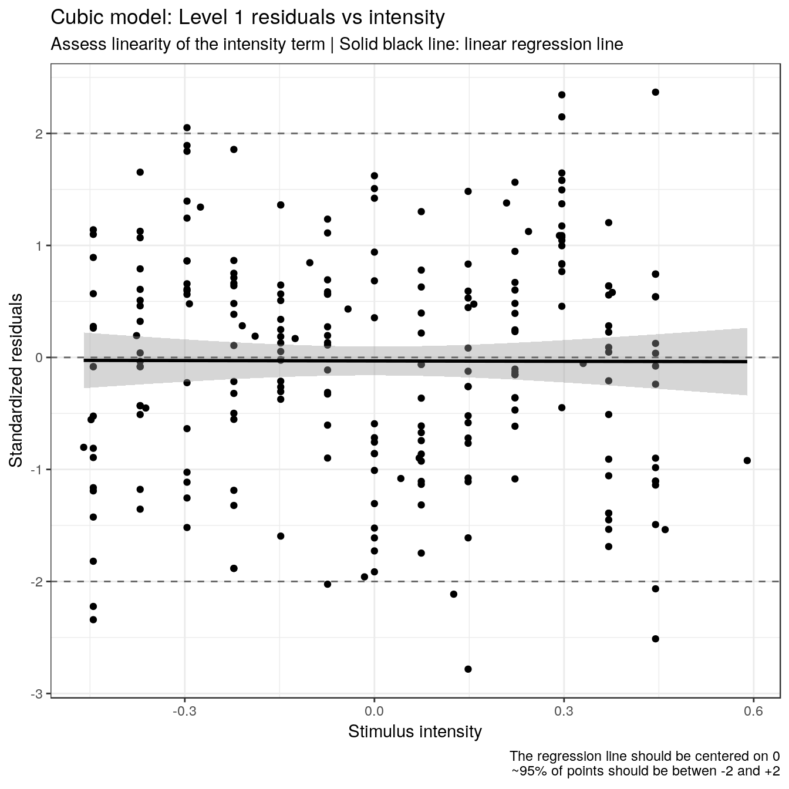

```r
# Standardized residuals vs intensity^2
ggplot(data = lmm_resid1) +
    aes(x = `poly(intensity, 3)`[, 2],
        y = std.resid) +
    geom_point() +
    geom_smooth(method = 'lm', 
                size = 1,
                colour = '#000000') +
    geom_hline(yintercept = 0,
               linetype = 2,
               colour = '#656565') +
    geom_hline(yintercept = -2,
               linetype = 2,
               colour = '#656565') +
    geom_hline(yintercept = 2,
               linetype = 2,
               colour = '#656565') +
    labs(title = expression(paste('Cubic model: Level 1 residuals vs ', intensity^2)),
         subtitle = expression(paste('Assess linearity of the ', intensity^2, ' term | Solid black line: linear regression line')),
         caption = 'The regression line should be centered on 0\n~95% of points should be betwen -2 and +2',
         y = 'Standardized residuals',
         x = expression(Stimulus~intensity^2)) 
```

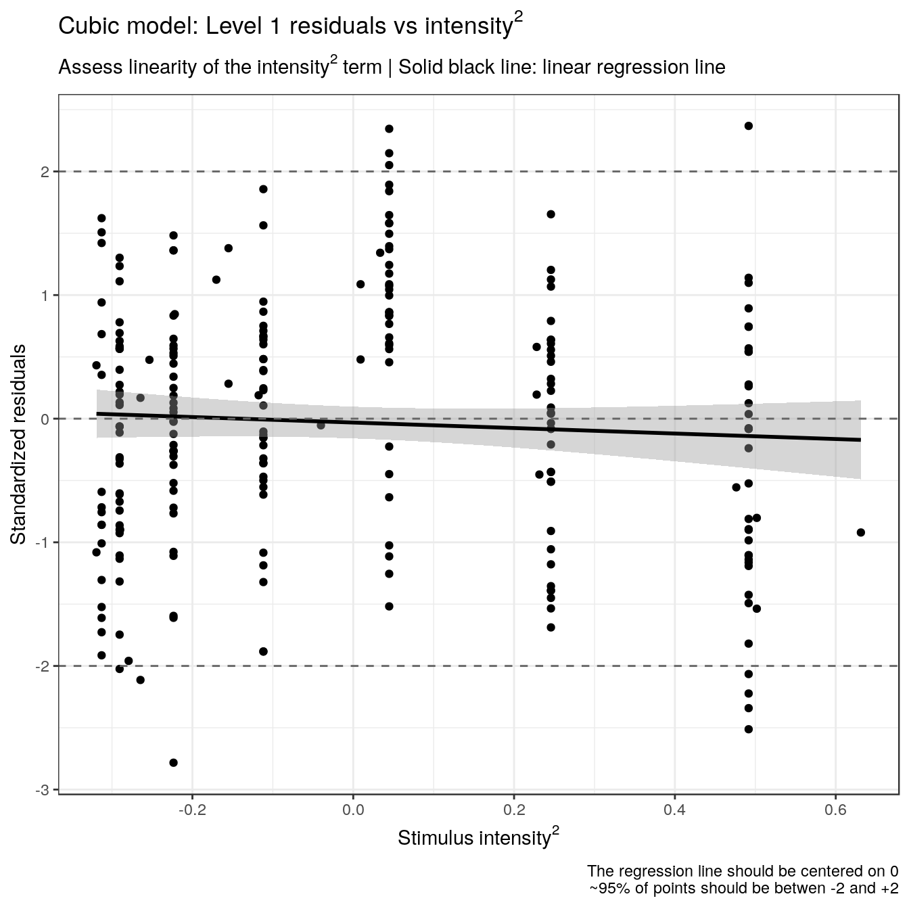

```r
# Standardized residuals vs intensity^3
ggplot(data = lmm_resid1) +
    aes(x = `poly(intensity, 3)`[, 3],
        y = std.resid) +
    geom_point() +
    geom_smooth(method = 'lm', 
                size = 1,
                colour = '#000000') +
    geom_hline(yintercept = 0,
               linetype = 2,
               colour = '#656565') +
    geom_hline(yintercept = -2,
               linetype = 2,
               colour = '#656565') +
    geom_hline(yintercept = 2,
               linetype = 2,
               colour = '#656565') +
    labs(title = expression(paste('Cubic model: Level 1 residuals vs ', intensity^3)),
         subtitle = expression(paste('Assess linearity of the ', intensity^3, ' term | Solid black line: linear regression line')),
         caption = 'The regression line should be centered on 0\n~95% of points should be betwen -2 and +2',
         y = 'Standardized residuals',
         x = expression(Stimulus~intensity^3)) 
```

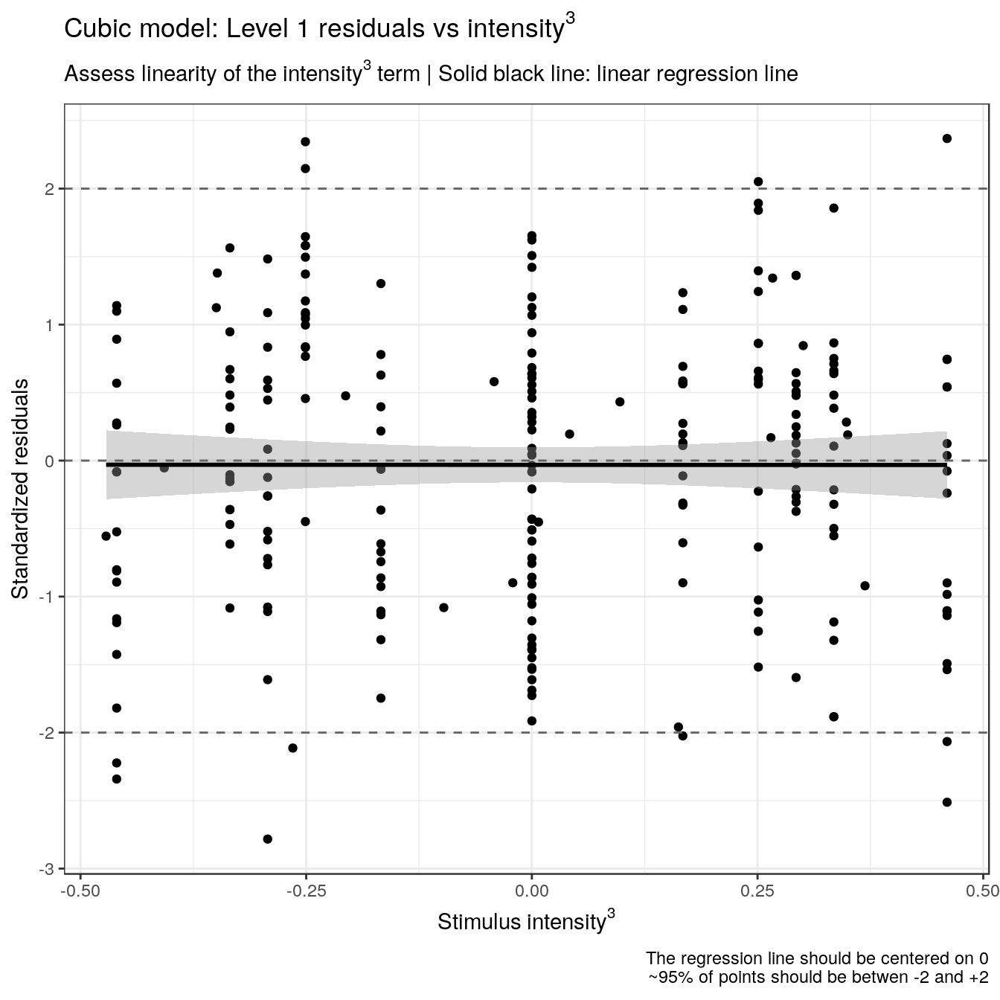

The regression curve for the quadratic term shows some signs of deviating from slope = 0, but otherwise the model specification (in terms of linearity) looks okay. Based on the overall picture, we accept that the condition of linearity for the cubic model.

### Level 1 residuals: homoscedasticity

The variance of residuals should be constant across the range of the predictor(s). This relationship can be observed by plotting the level 1 semi-standardized residuals against the predictors. Like the assessment of linearity, the residuals should be centred on 0, and show no pattern in the scatter of points.


```r
# Standardized residuals vs intensity
ggplot(data = lmm_ssresid1) +
    aes(x = `poly(intensity, 3)`[, 1],
        y = semi.std.resid) +
    geom_point() +
    geom_hline(yintercept = 0,
               linetype = 2) +
    labs(title = 'Cubic model: Level 1 residuals vs intensity',
         subtitle = 'Assess homoscedasticity for the intensity term',
         y = 'Semi-standardized residuals',
         x = 'Stimulus intensity')
```

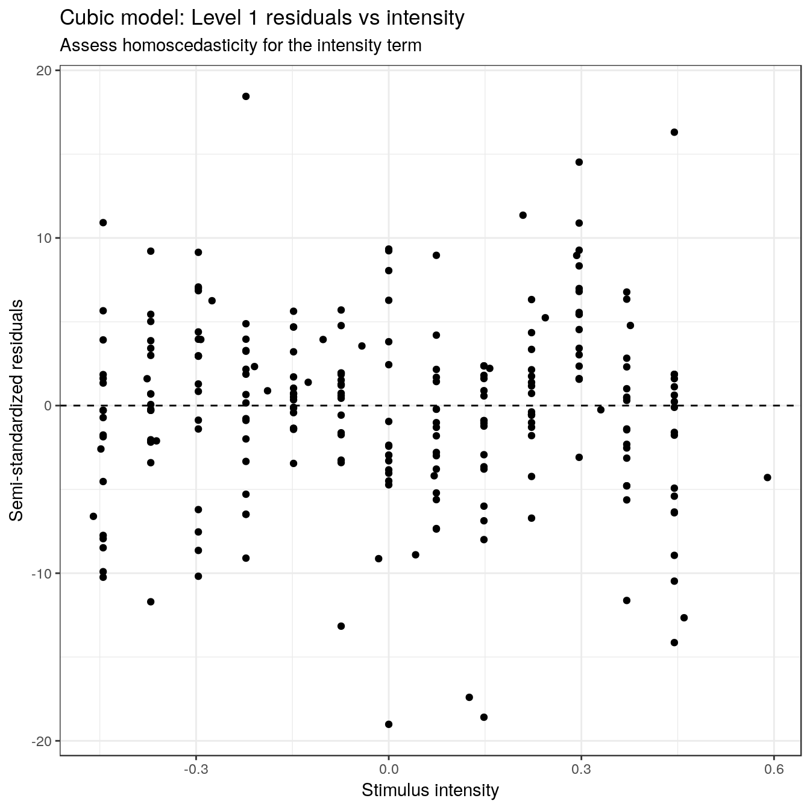

```r
# Standardized residuals vs intensity^2
ggplot(data = lmm_ssresid1) +
    aes(x = `poly(intensity, 3)`[, 2],
        y = semi.std.resid) +
    geom_point() +
    geom_hline(yintercept = 0,
               linetype = 2) +
    labs(title = expression(paste('Cubic model: Level 1 residuals vs ', intensity^2)),
         subtitle = expression(paste('Assess homoscedasticity for the ', intensity^2, ' term')),
         y = 'Semi-standardized residuals',
         x = expression(Stimulus~intensity^2)) 
```

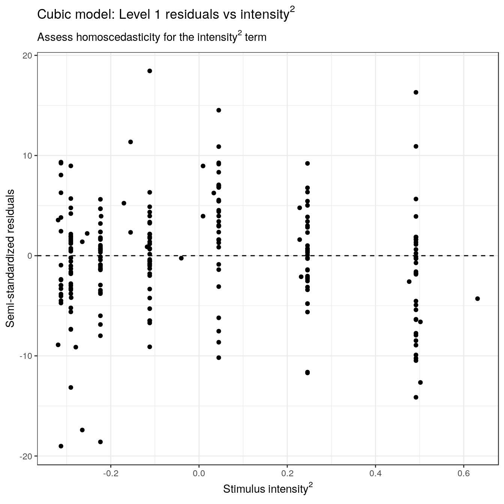

```r
# Standardized residuals vs intensity^3
ggplot(data = lmm_ssresid1) +
    aes(x = `poly(intensity, 3)`[, 3],
        y = semi.std.resid) +
    geom_point() +
    geom_hline(yintercept = 0,
               linetype = 2) +
    labs(title = expression(paste('Cubic model: Level 1 residuals vs ', intensity^3)),
         subtitle = expression(paste('Assess homoscedasticity for the ', intensity^3, ' term')),
         y = 'Semi-standardized residuals',
         x = expression(Stimulus~intensity^3)) 
```

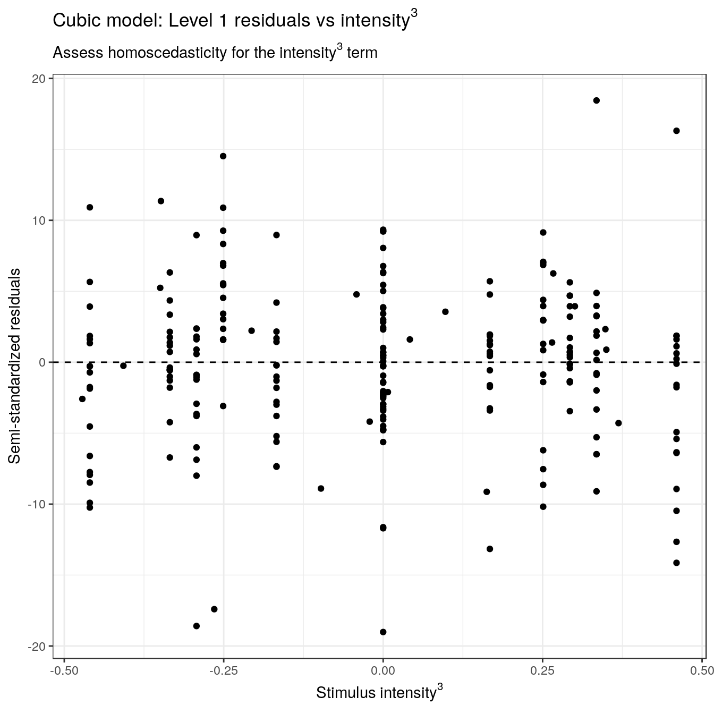

There is no obvious pattern to the scatter of residuals across any of the fixed effect terms. So we accept that the residuals are homoscedastic in the cubic model.

### Level 1 residuals: residual distribution

Residuals should be normally distributed. There are various methods of examining the distribution, and we have chosen the QQ-plot method, which plots the quantiles of the standardized residuals against a theoretical (Gaussian) quantile distribution. Points should line on the line of identity of the two sets of quantiles follow the same distribution. 


```r
# Standardized residuals vs intensity
ggplot_qqnorm(x = lmm_resid1$std.resid, 
              line = "rlm") +
    labs(title = 'Cubic model: QQ-plot of level 1 residuals',
         subtitle = 'Assessing whether residuals follow a normal distribution',
         x = 'Theoretical quantiles',
         y = 'Standardized residuals')
```

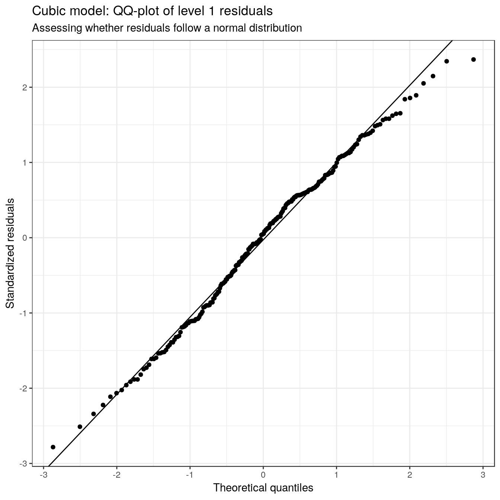

There is minor deviation at the extremes, but on the whole, we are satisfied that the cubic model fits the assumption of normally distributed residuals. 

### Level 2 residuals: residual distribution

Level 2 residuals can be used to identify predictors that should be included in the model, but since we are only assessing the effect of stimulus strength on SPARS rating, we have only assessed whether the level 2 residuals (intercept and slope) meet the assumption of being normally distributed (assessed using QQ-plots).


```r
# Generate QQplots 
qq1 <- ggplot_qqnorm(x = lmm_resid2$`(Intercept)`, 
              line = "rlm") +
    labs(title = 'Cubic model: QQ-plot of level 2 residuals (Intercept)',
         subtitle = 'Assessing whether residuals follow a normal distribution',
         x = 'Theoretical quantiles',
         y = 'Residuals') 

qq2 <- ggplot_qqnorm(x = lmm_resid2$intensity, 
              line = "rlm") +
    labs(title = 'Cubic model: QQ-plot of level 2 residuals (slope: intensity)',
         subtitle = 'Assessing whether residuals follow a normal distribution',
         x = 'Theoretical quantiles',
         y = 'Residuals') 

# Plot
qq1 + qq2
```

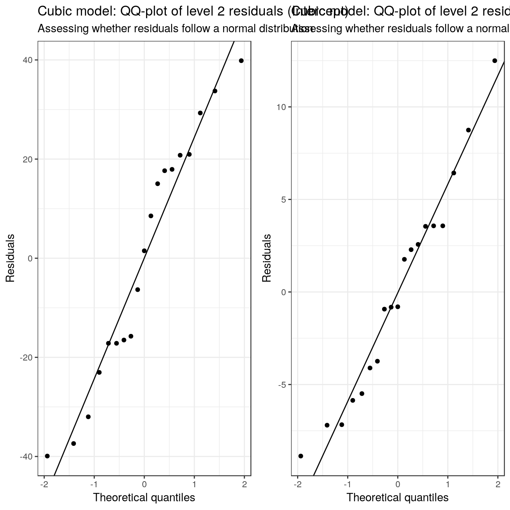

Although the data are sparse, we are satisfied that the level 2 residuals for the intercept and the slope of the cubic model fit the assumption of being normally distributed.

### influence points

We assessed three aspects of influence (data that significantly model coefficients):

- The variance component (random effects) was assessed using the relative variance change metric, which calculates the impact of deleting observational units of the variance of the residuals, random intercept, random slope, and covariance of the random slope and random intercept.

- Leverage was used to assess fitted values. The assessment involves assessing the rate of change in the predicted response with respect to the observed response.

- Cook's Distance was used to assess the influence of fixed effects. The metric measures the distance between the fixed effects estimates obtained from the full model to that obtained from the reduced data (observations removed). 

In all cases, we treated the individual (indicated using PID) as the unit of observation, and we used internal scaling to set the diagnostic cut-offs for each metric. The cut-offs were determined as: $3^{rd}~Quartile + (3 \cdot IQR)$.


```r
# Prepare relative variance change (RCV)
influence_rvc <- rvc(lmm3b, 
                     group = 'PID')

# Prepare Cook's distance
influence_cooks <- cooks.distance(lmm3b, 
                                  group = 'PID')

# Prepare leverage 
## (Assessed at the level of PID, and not the individual observation)
influence_leverage <- leverage(lmm3b,
                               level = 'PID')
```

### Random effects

Estimation of the variance component was undertaken by calculating relative variance change (RCV). RVC is close to zero when deletion of observational units from the model does not have a large influence on the variance component.
 

```r
# Plot
dotplot_diag(x = influence_rvc[ , 1], 
             cutoff = 'internal',
             name = 'rvc') + 
    labs(title = 'Relative variance change for the residual variance',
         subtitle = 'Cutoffs determined by measures of internal scaling',
         y = 'Relative variance change',
         x = 'Participant ID') 
```

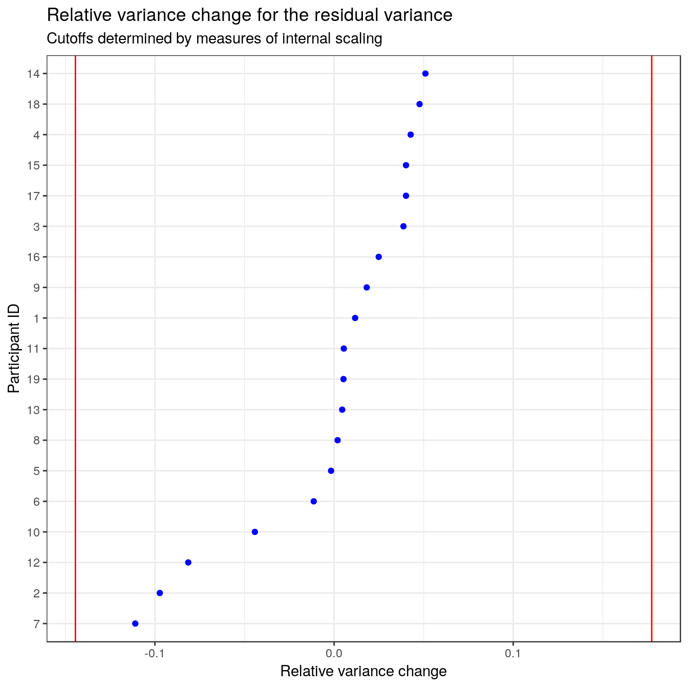

```r
dotplot_diag(x = influence_rvc[ , 2], 
             cutoff = 'internal',
             name = 'rvc') + 
    labs(title = 'Relative variance change for the random intercept variance',
         subtitle = 'Cutoffs determined by measures of internal scaling',
         y = 'Relative variance change',
         x = 'Participant ID')
```

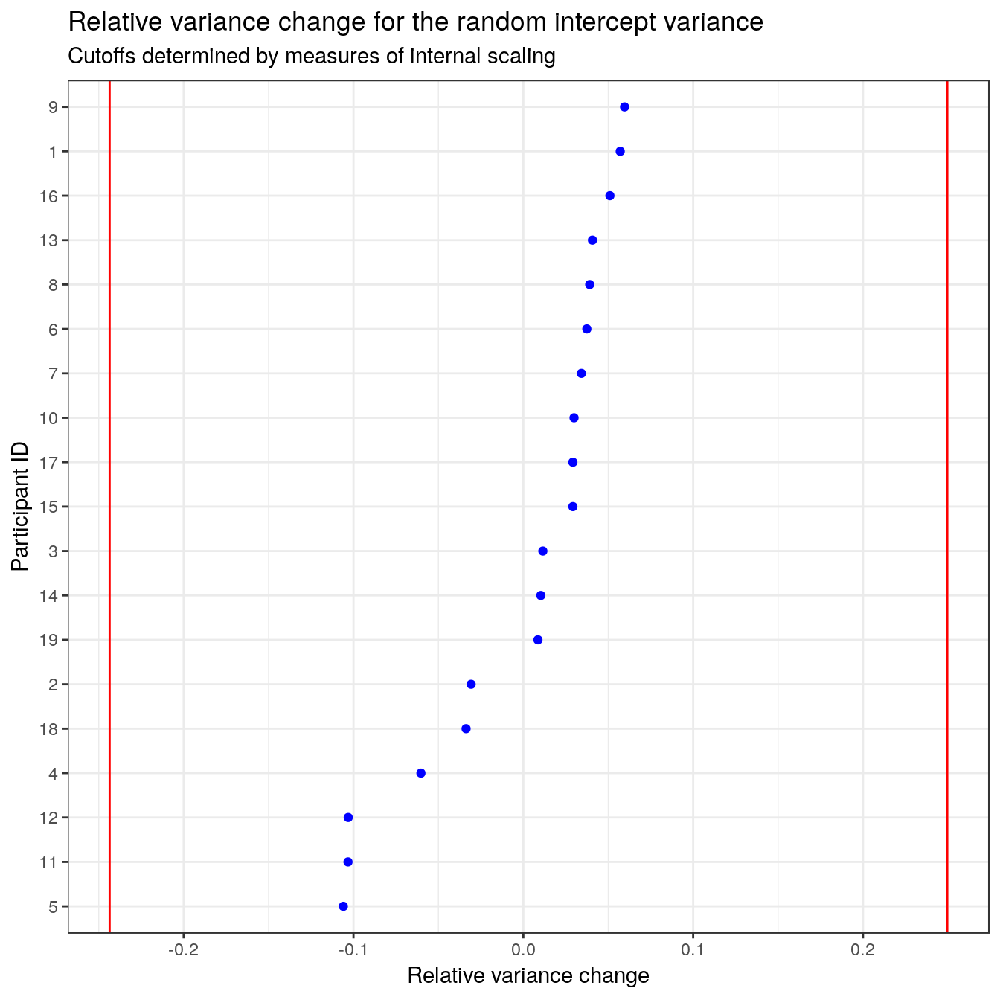

```r
dotplot_diag(x = influence_rvc[ , 3], 
             cutoff = 'internal',
             name = 'rvc') + 
    labs(title = 'Relative variance change for the random slope variance',
         subtitle = 'Cutoffs determined by measures of internal scaling',
         y = 'Relative variance change',
         x = 'Participant ID')
```

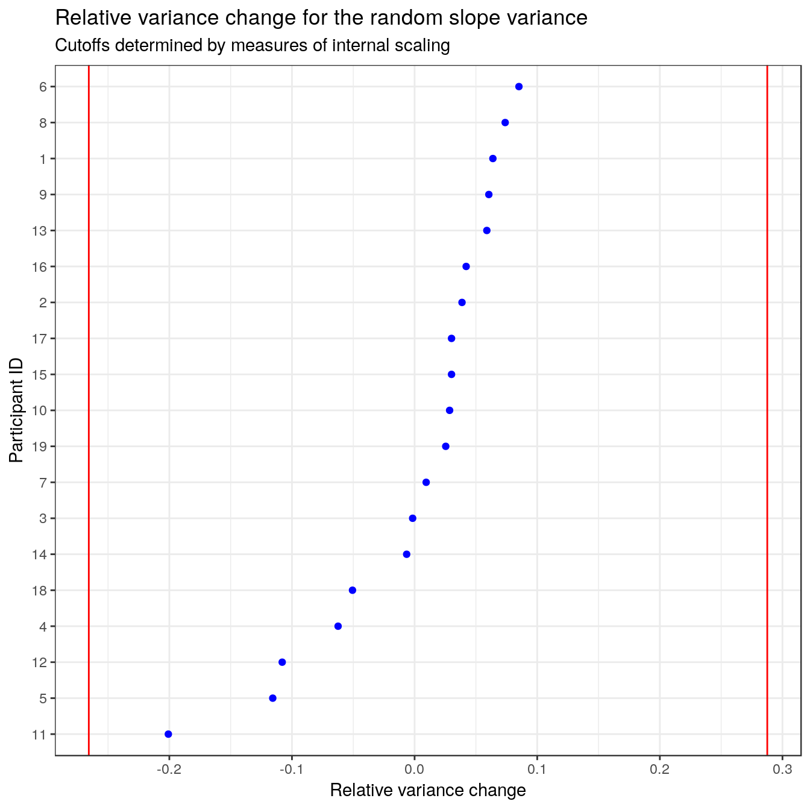

```r
dotplot_diag(x = influence_rvc[ , 4], 
             cutoff = 'internal',
             name = 'rvc') + 
    labs(title = 'Relative variance change for the random slope and intercept covariance',
         subtitle = 'Cutoffs determined by measures of internal scaling',
         y = 'Relative variance change',
         x = 'Participant ID')
```

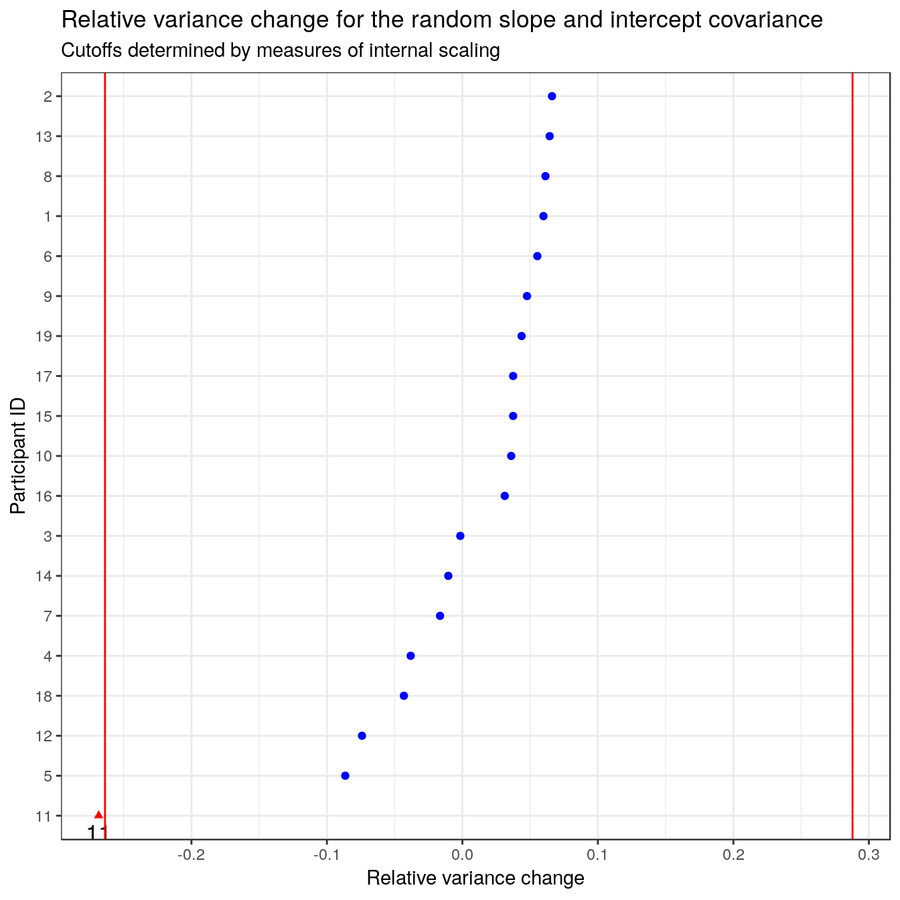

One value (PID11) is below the cut-off for the relative variance change for random slope and intercept covariance. The extent of the deviation is minor, and was ignored.

### Fitted values

Assessing whether observations are unusual with regard to the fitted values
and explanatory variables using leverage. We assessed leverage at two levels: i) fixed effects, and ii) unconfounded (by fixed effects) random effects.


```r
dotplot_diag(x = influence_leverage[, 2], 
             cutoff = "internal",
             name = "leverage") + 
    labs(title = 'Leverage: fixed effects',
         subtitle = 'Cutoffs determined by measures of internal scaling',
         y = 'Leverage',
         x = 'Participant ID')
```

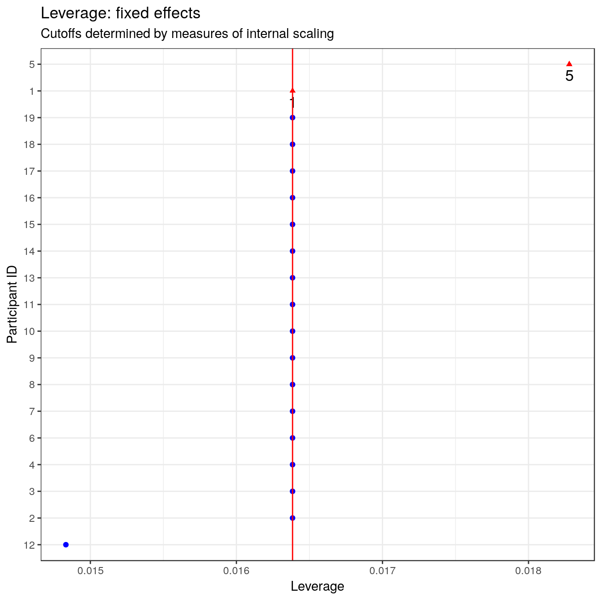

```r
dotplot_diag(x = influence_leverage[, 4], 
             cutoff = "internal",
             name = "leverage") + 
    labs(title = 'Leverage: unconfounded random effects',
         subtitle = 'Cutoffs determined by measures of internal scaling',
         y = 'Leverage',
         x = 'Participant ID')
```

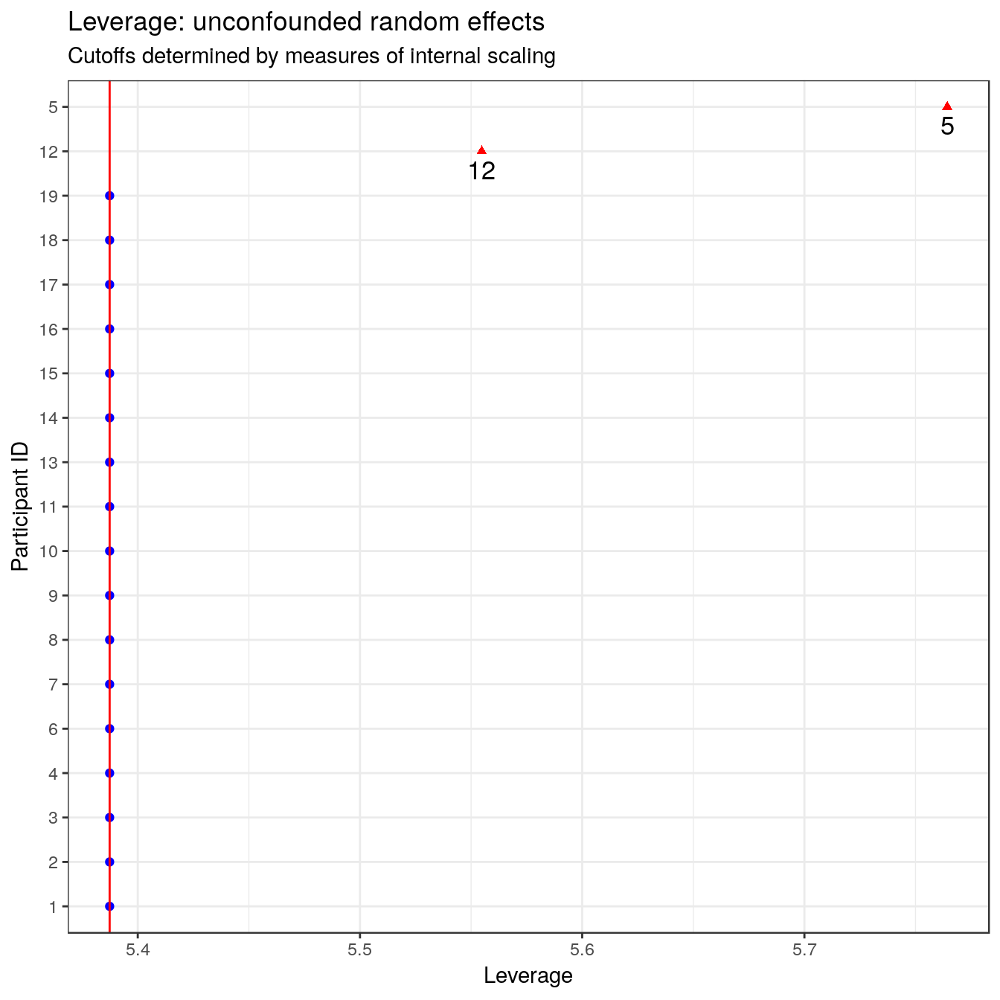

Participants 5 and 12 were identified as having high leverage. Their data is highlighted in the plot below. Data look okay. 


```r
data_tm %>%
    mutate(faux_colour = case_when(
        PID == 'ID05' ~ 'high leverage ID05',
        PID == 'ID12' ~ 'high leverage ID12',
        TRUE ~ 'low leverage'
    )) %>%
    ggplot(data = .) +
    aes(x = intensity,
        y = tri_mean,
        colour = faux_colour) +
    geom_point(position = position_jitter(width = 0.05)) +
    geom_smooth(aes(colour = faux_colour), 
                method = 'loess',
                se = FALSE, 
                size = 0.6) +
    scale_colour_manual(name = 'Leverage points',
                        values = c('#000000', '#656565', '#CCCCCC')) +
    labs(title = 'Inspection of high-leverage participants',
        x = 'Stimulus intensity (J)',
        y = 'SPARS rating [-50 to 50]') +
    scale_y_continuous(limits = c(-50, 50)) +
    scale_x_continuous(breaks = seq(from = 1, to = 4, by = 0.5))
```


#### Fixed effects

Influence points were assessed by calculating Cook's Distance metrics.


```r
# Plot data
dotplot_diag(x = influence_cooks, 
             cutoff = "internal",
             name = "cooks.distance") + 
    labs(title = 'Influence: Cooks Distance',
         subtitle = 'Cutoffs determined by measures of internal scaling',
         y = 'Cooks Distance',
         x = 'Participant ID') 
```

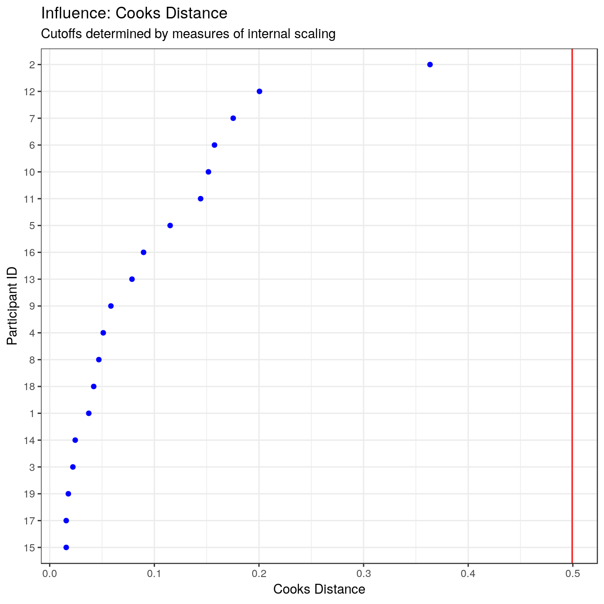

Based on There are no influential fixed effects.

### Summary

The cubic model is well-specified.

----

# Session information

```r
sessionInfo()
```

```
## R version 3.5.1 (2018-07-02)
## Platform: x86_64-apple-darwin15.6.0 (64-bit)
## Running under: macOS  10.14
## 
## Matrix products: default
## BLAS: /Library/Frameworks/R.framework/Versions/3.5/Resources/lib/libRblas.0.dylib
## LAPACK: /Library/Frameworks/R.framework/Versions/3.5/Resources/lib/libRlapack.dylib
## 
## locale:
## [1] en_GB.UTF-8/en_GB.UTF-8/en_GB.UTF-8/C/en_GB.UTF-8/en_GB.UTF-8
## 
## attached base packages:
## [1] stats     graphics  grDevices utils     datasets  methods   base     
## 
## other attached packages:
##  [1] bindrcpp_0.2.2  patchwork_0.0.1 HLMdiag_0.3.1   lme4_1.1-18-1  
##  [5] Matrix_1.2-14   forcats_0.3.0   stringr_1.3.1   dplyr_0.7.6    
##  [9] purrr_0.2.5     readr_1.1.1     tidyr_0.8.1     tibble_1.4.2   
## [13] ggplot2_3.0.0   tidyverse_1.2.1 magrittr_1.5   
## 
## loaded via a namespace (and not attached):
##  [1] tidyselect_0.2.4 reshape2_1.4.3   splines_3.5.1    haven_1.1.2     
##  [5] lattice_0.20-35  colorspace_1.3-2 htmltools_0.3.6  mgcv_1.8-24     
##  [9] yaml_2.2.0       rlang_0.2.2      nloptr_1.2.1     pillar_1.3.0    
## [13] glue_1.3.0       withr_2.1.2      modelr_0.1.2     readxl_1.1.0    
## [17] bindr_0.1.1      plyr_1.8.4       munsell_0.5.0    gtable_0.2.0    
## [21] cellranger_1.1.0 rvest_0.3.2      evaluate_0.11    labeling_0.3    
## [25] knitr_1.20       RLRsim_3.1-3     broom_0.5.0      Rcpp_0.12.19    
## [29] scales_1.0.0     backports_1.1.2  jsonlite_1.5     hms_0.4.2       
## [33] digest_0.6.17    stringi_1.2.4    grid_3.5.1       rprojroot_1.3-2 
## [37] cli_1.0.1        tools_3.5.1      lazyeval_0.2.1   crayon_1.3.4    
## [41] pkgconfig_2.0.2  MASS_7.3-50      xml2_1.2.0       lubridate_1.7.4 
## [45] assertthat_0.2.0 minqa_1.2.4      rmarkdown_1.10   httr_1.3.1      
## [49] rstudioapi_0.8   R6_2.2.2         nlme_3.1-137     compiler_3.5.1
```
