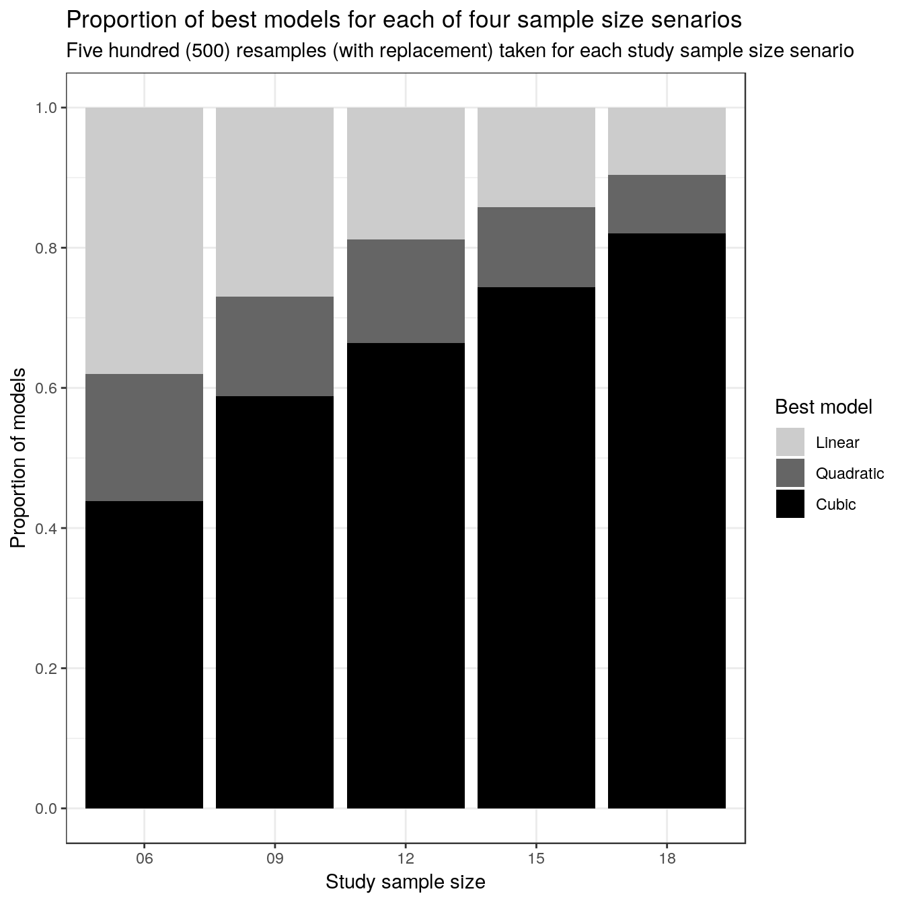

----

This script is part 4 of our analysis of the stimulus-response characteristics of the SPARS. In this analysis we examine the _'stability'_ of the stimulus-response relationship of the SPARS. It is a descriptive analysis (see plots). We assessed stability by examining the stimulus-response relationship of SPARS under five study sample size scenarios (n: 6, 9, 12, 15, 18). Under each sample size scenario, we generated 500 random samples (with replacement), and fit linear mixed models to each of the 500 samples with the predictor (stimulus intensity) modelled as a 1^st^ (linear), 2^nd^ (quadratic), and 3^rd^ (cubic)-order orthogonal polynomial. The likelihood test was then used to decide which of the three models had the best fit for each sample, and the proportion of best models fitting each of the polynomial forms was plotted for each study sample size scenario.   

Descriptive plots of the data are provided in _"outputs/suppl\_05\_4A-stimulus-response-1.html"_, modelling of the stimulus-response relationship is described in _"outputs/suppl\_06\_4A-stimulus-response-2.html"_, the diagnostics on the final linear mixed model are described in _"outputs/suppl\_07\_4A-stimulus-response-3.html"_, the sensitivity of the scale to changes in stimulus intensity are described in _"outputs/suppl\_09\_4A-stimulus-reponse-5.html"_, and the variance in ratings at each stimulus intensity is described in _"outputs/suppl\_10\_4A-stimulus-reponse-6.html"_.

----

# Import and clean/transfrom data


```r
# Import
data <- read_rds('./data-cleaned/SPARS_A.rds')

# Inspect
glimpse(data)
```

```
## Observations: 1,927
## Variables: 19
## $ PID               <chr> "ID01", "ID01", "ID01", "ID01", "ID01", "ID0...
## $ block             <chr> "A", "A", "A", "A", "A", "A", "A", "A", "A",...
## $ block_order       <dbl> 1, 1, 1, 1, 1, 1, 1, 1, 1, 1, 1, 1, 1, 1, 1,...
## $ trial_number      <dbl> 1, 2, 3, 4, 5, 6, 7, 8, 9, 10, 11, 12, 13, 1...
## $ intensity         <dbl> 3.75, 1.50, 3.25, 1.50, 3.00, 2.75, 1.00, 2....
## $ intensity_char    <chr> "3.75", "1.50", "3.25", "1.50", "3.00", "2.7...
## $ rating            <dbl> -10, -40, -10, -25, -20, -25, -40, 2, -40, -...
## $ rating_positive   <dbl> 40, 10, 40, 25, 30, 25, 10, 52, 10, 40, 54, ...
## $ EDA               <dbl> 18315.239, 13904.177, 11543.449, 20542.834, ...
## $ age               <dbl> 21, 21, 21, 21, 21, 21, 21, 21, 21, 21, 21, ...
## $ sex               <dbl> 2, 2, 2, 2, 2, 2, 2, 2, 2, 2, 2, 2, 2, 2, 2,...
## $ panas_positive    <dbl> 36, 36, 36, 36, 36, 36, 36, 36, 36, 36, 36, ...
## $ panas_negative    <dbl> 10, 10, 10, 10, 10, 10, 10, 10, 10, 10, 10, ...
## $ dass42_depression <dbl> 0, 0, 0, 0, 0, 0, 0, 0, 0, 0, 0, 0, 0, 0, 0,...
## $ dass42_anxiety    <dbl> 1, 1, 1, 1, 1, 1, 1, 1, 1, 1, 1, 1, 1, 1, 1,...
## $ dass42_stress     <dbl> 0, 0, 0, 0, 0, 0, 0, 0, 0, 0, 0, 0, 0, 0, 0,...
## $ pcs_magnification <dbl> 6, 6, 6, 6, 6, 6, 6, 6, 6, 6, 6, 6, 6, 6, 6,...
## $ pcs_rumination    <dbl> 11, 11, 11, 11, 11, 11, 11, 11, 11, 11, 11, ...
## $ pcs_helplessness  <dbl> 10, 10, 10, 10, 10, 10, 10, 10, 10, 10, 10, ...
```

```r
############################################################
#                                                          #
#              Define Tukey trimean function               #
#                                                          #
############################################################
tri.mean <- function(x) {
  # Calculate quantiles
  q1 <- quantile(x, probs = 0.25, na.rm = TRUE)[[1]]
  q2 <- median(x, na.rm = TRUE)
  q3 <- quantile(x, probs = 0.75, na.rm = TRUE)[[1]]
  # Calculate trimean
  tm <- (q2 + ((q1 + q3) / 2)) / 2
  # Convert to integer
  tm <- as.integer(round(tm))
  return(tm)
}

############################################################
#                                                          #
#             Define random sampling function              #
#                                                          #
############################################################
sampler <- function(x = data_ref, 
                    y = data_nest, 
                    size = 6, 
                    by = 'PID') {
    foo <- sample_n(x, 
                    size = size, 
                    replace = TRUE) %>%
        inner_join(x = ., 
                   y = y, 
                   by = by) %>%
        arrange(PID)
    return(foo)
}

############################################################
#                                                          #
#                    Generate core data                    #
#                                                          #
############################################################
# Calculate trimeans
data_tm <- data %>%
    # Select columns
    select(PID, intensity, rating) %>%
    # Calculate tri.mean
    group_by(PID, intensity) %>% 
    summarise(tri_mean = tri.mean(rating))

# Generated nested table of data_tm
data_nest <- data_tm %>% 
    group_by(PID) %>% 
    nest()

# Generate sampling reference
data_ref <- select(data_nest, PID)
```

----

# Sampling

### Senario 1 (n = 6)


```r
# Set random seed
set.seed(1234)

# Generate data
n06 <- map(1:500, ~ sampler(size = 6))

# Unnest data and clean-up
n06 %<>% map2(.x = .,
             .y = sprintf('%03i', 1:500),
             # Unnest each list item
             ~ unnest(.x) %>%
                 # Add a column with the sample label to each list item
                 mutate(sample = .y) %>%
                 # Select required column in each list item
                 select(sample, PID, intensity, tri_mean) %>%
                 # Re-nest each list item dataframe under the sample label
                 group_by(sample) %>%
                 nest())

# Convert to a single dataframe
n06 %<>% map_df(~ data.frame(.x))

# Add linear, quadratic and cubic model
n06 %<>% mutate(L.model = map(.x = data,
                              ~ lmer(tri_mean ~ poly(intensity, 1) + (intensity | PID),
                                     data = .x,
                                     REML = FALSE)),
               Q.model = map(.x = data,
                             ~ lmer(tri_mean ~ poly(intensity, 2) + (intensity | PID),
                                    data = .x,
                                    REML = FALSE)),
               C.model = map(.x = data,
                             ~ lmer(tri_mean ~ poly(intensity, 3) + (intensity | PID),
                                    data = .x,
                                    REML = FALSE)))

# Compare models using likelihood test
n06 %<>% mutate(compare = pmap(.l = list(L.model, Q.model, C.model),
                              ~ anova(..1, ..2, ..3) %>%
                                  mutate(Model = c('Linear', 'Quadratic', 'Cubic')) %>%
                                  select(Model, everything())))

# Extract the name of the best model
n06 %<>% mutate(best_model = map(.x = compare,
                                ~ filter(.x, 
                                         `Pr(>Chisq)` == min(`Pr(>Chisq)`, 
                                                             na.rm = TRUE)) %>%
                                    mutate(Model = case_when(
                                        `Pr(>Chisq)` < 0.05 ~ Model,
                                        TRUE ~ 'Linear'
                                        )) %>%
                                    .$Model))

# Extract data
n06_best <- n06 %>%
    select(sample, best_model) %>% 
    unnest() %>% 
    mutate(n_sample = '06')
```

### Senario 2 (n = 9)


```r
# Set random seed
set.seed(1234)

# Generate data
n09 <- map(1:500, ~ sampler(size = 9))

# Unnest data and clean-up
n09 %<>% map2(.x = .,
             .y = sprintf('%03i', 1:500),
             # Unnest each list item
             ~ unnest(.x) %>%
                 # Add a column with the sample label to each list item
                 mutate(sample = .y) %>%
                 # Select required column in each list item
                 select(sample, PID, intensity, tri_mean) %>%
                 # Re-nest each list item dataframe under the sample label
                 group_by(sample) %>%
                 nest())

# Convert to a single dataframe
n09 %<>% map_df(~ data.frame(.x))

# Add linear, quadratic and cubic model
n09 %<>% mutate(L.model = map(.x = data,
                              ~ lmer(tri_mean ~ poly(intensity, 1) + (intensity | PID),
                                     data = .x,
                                     REML = FALSE)),
               Q.model = map(.x = data,
                             ~ lmer(tri_mean ~ poly(intensity, 2) + (intensity | PID),
                                    data = .x,
                                    REML = FALSE)),
               C.model = map(.x = data,
                             ~ lmer(tri_mean ~ poly(intensity, 3) + (intensity | PID),
                                    data = .x,
                                    REML = FALSE)))

# Compare models using likelihood test
n09 %<>% mutate(compare = pmap(.l = list(L.model, Q.model, C.model),
                              ~ anova(..1, ..2, ..3) %>%
                                  mutate(Model = c('Linear', 'Quadratic', 'Cubic')) %>%
                                  select(Model, everything())))

# Extract the name of the best model
n09 %<>% mutate(best_model = map(.x = compare,
                                ~ filter(.x, 
                                         `Pr(>Chisq)` == min(`Pr(>Chisq)`, 
                                                             na.rm = TRUE)) %>%
                                    mutate(Model = case_when(
                                        `Pr(>Chisq)` < 0.05 ~ Model,
                                        TRUE ~ 'Linear'
                                        )) %>%
                                    .$Model))

# Extract data
n09_best <- n09 %>%
    select(sample, best_model) %>% 
    unnest() %>% 
    mutate(n_sample = '09')
```

### Senario 3 (n = 12)


```r
# Set random seed
set.seed(1234)

# Generate data
n12 <- map(1:500, ~ sampler(size = 12))

# Unnest data and clean-up
n12 %<>% map2(.x = .,
             .y = sprintf('%03i', 1:500),
             # Unnest each list item
             ~ unnest(.x) %>%
                 # Add a column with the sample label to each list item
                 mutate(sample = .y) %>%
                 # Select required column in each list item
                 select(sample, PID, intensity, tri_mean) %>%
                 # Re-nest each list item dataframe under the sample label
                 group_by(sample) %>%
                 nest())

# Convert to a single dataframe
n12 %<>% map_df(~ data.frame(.x))

# Add linear, quadratic and cubic model
n12 %<>% mutate(L.model = map(.x = data,
                              ~ lmer(tri_mean ~ poly(intensity, 1) + (intensity | PID),
                                     data = .x,
                                     REML = FALSE)),
               Q.model = map(.x = data,
                             ~ lmer(tri_mean ~ poly(intensity, 2) + (intensity | PID),
                                    data = .x,
                                    REML = FALSE)),
               C.model = map(.x = data,
                             ~ lmer(tri_mean ~ poly(intensity, 3) + (intensity | PID),
                                    data = .x,
                                    REML = FALSE)))

# Compare models using likelihood test
n12 %<>% mutate(compare = pmap(.l = list(L.model, Q.model, C.model),
                              ~ anova(..1, ..2, ..3) %>%
                                  mutate(Model = c('Linear', 'Quadratic', 'Cubic')) %>%
                                  select(Model, everything())))

# Extract the name of the best model
n12 %<>% mutate(best_model = map(.x = compare,
                                ~ filter(.x, 
                                         `Pr(>Chisq)` == min(`Pr(>Chisq)`, 
                                                             na.rm = TRUE)) %>%
                                    mutate(Model = case_when(
                                        `Pr(>Chisq)` < 0.05 ~ Model,
                                        TRUE ~ 'Linear'
                                        )) %>%
                                    .$Model))

# Extract data
n12_best <- n12 %>%
    select(sample, best_model) %>% 
    unnest() %>% 
    mutate(n_sample = '12')
```

### Senario 4 (n = 15)


```r
# Set random seed
set.seed(1234)

# Generate data
n15 <- map(1:500, ~ sampler(size = 15))

# Unnest data and clean-up
n15 %<>% map2(.x = .,
             .y = sprintf('%03i', 1:500),
             # Unnest each list item
             ~ unnest(.x) %>%
                 # Add a column with the sample label to each list item
                 mutate(sample = .y) %>%
                 # Select required column in each list item
                 select(sample, PID, intensity, tri_mean) %>%
                 # Re-nest each list item dataframe under the sample label
                 group_by(sample) %>%
                 nest())

# Convert to a single dataframe
n15 %<>% map_df(~ data.frame(.x))

# Add linear, quadratic and cubic model
n15 %<>% mutate(L.model = map(.x = data,
                              ~ lmer(tri_mean ~ poly(intensity, 1) + (intensity | PID),
                                     data = .x,
                                     REML = FALSE)),
               Q.model = map(.x = data,
                             ~ lmer(tri_mean ~ poly(intensity, 2) + (intensity | PID),
                                    data = .x,
                                    REML = FALSE)),
               C.model = map(.x = data,
                             ~ lmer(tri_mean ~ poly(intensity, 3) + (intensity | PID),
                                    data = .x,
                                    REML = FALSE)))

# Compare models using likelihood test
n15 %<>% mutate(compare = pmap(.l = list(L.model, Q.model, C.model),
                              ~ anova(..1, ..2, ..3) %>%
                                  mutate(Model = c('Linear', 'Quadratic', 'Cubic')) %>%
                                  select(Model, everything())))

# Extract the name of the best model
n15 %<>% mutate(best_model = map(.x = compare,
                                ~ filter(.x, 
                                         `Pr(>Chisq)` == min(`Pr(>Chisq)`, 
                                                             na.rm = TRUE)) %>%
                                    mutate(Model = case_when(
                                        `Pr(>Chisq)` < 0.05 ~ Model,
                                        TRUE ~ 'Linear'
                                        )) %>%
                                    .$Model))

# Extract data
n15_best <- n15 %>%
    select(sample, best_model) %>% 
    unnest() %>% 
    mutate(n_sample = '15')
```

### Senario 5 (n = 18)


```r
# Set random seed
set.seed(1234)

# Generate data
n18 <- map(1:500, ~ sampler(size = 18))

# Unnest data and clean-up
n18 %<>% map2(.x = .,
              .y = sprintf('%03i', 1:500),
              # Unnest each list item
              ~ unnest(.x) %>%
                  # Add a column with the sample label to each list item
                  mutate(sample = .y) %>%
                  # Select required column in each list item
                  select(sample, PID, intensity, tri_mean) %>%
                  # Re-nest each list item dataframe under the sample label
                  group_by(sample) %>%
                  nest())

# Convert to a single dataframe
n18 %<>% map_df(~ data.frame(.x))

# Add linear, quadratic and cubic model
n18 %<>% mutate(L.model = map(.x = data,
                              ~ lmer(tri_mean ~ poly(intensity, 1) + (intensity | PID),
                                     data = .x,
                                     REML = FALSE)),
               Q.model = map(.x = data,
                             ~ lmer(tri_mean ~ poly(intensity, 2) + (intensity | PID),
                                    data = .x,
                                    REML = FALSE)),
               C.model = map(.x = data,
                             ~ lmer(tri_mean ~ poly(intensity, 3) + (intensity | PID),
                                    data = .x,
                                    REML = FALSE)))

# Compare models using likelihood test
n18 %<>% mutate(compare = pmap(.l = list(L.model, Q.model, C.model),
                               ~ anova(..1, ..2, ..3) %>%
                                   mutate(Model = c('Linear', 'Quadratic', 'Cubic')) %>%
                                   select(Model, everything())))

# Extract the name of the best model
n18 %<>% mutate(best_model = map(.x = compare,
                                 ~ filter(.x, 
                                          `Pr(>Chisq)` == min(`Pr(>Chisq)`, 
                                                              na.rm = TRUE)) %>%
                                     mutate(Model = case_when(
                                         `Pr(>Chisq)` < 0.05 ~ Model,
                                         TRUE ~ 'Linear'
                                         )) %>%
                                     .$Model))

# Extract data
n18_best <- n18 %>%
    select(sample, best_model) %>% 
    unnest() %>% 
    mutate(n_sample = '18')
```

----

# Summary of best model


```r
# Join datasets
model_combined <- bind_rows(n06_best, n09_best, 
                            n12_best, n15_best, 
                            n18_best) %>% 
    mutate(n_sample = fct_relevel(n_sample, 
                                  '06', '09', 
                                  '12', '15', 
                                  '18'),
           best_model = fct_relevel(best_model,
                                    'Linear', 'Quadratic', 'Cubic'))

# Plot
pal <- colorRampPalette(colors = c('#88caef', '#0072B2'))(3)

ggplot(data = model_combined) +
    aes(n_sample,
        fill = best_model) +
    geom_bar(position = position_fill()) +
    labs(title = 'Proportion of best models for each of four sample size senarios',
         subtitle = 'Five hundred (500) resamples (with replacement) taken for each study sample size senario',
         x = 'Study sample size',
         y = 'Proportion of models') +
    scale_fill_manual(name = 'Best model',
                      values = pal) +
    scale_y_continuous(breaks = seq(from = 0, to = 1, by = 0.2))
```



```r
## Publication plot
p <- model_combined %>%
    ggplot(data = .) +
    aes(n_sample,
        fill = best_model) +
    geom_bar(position = position_fill()) +
    geom_segment(x = 0.4, xend = 0.4, 
                 y = -0.0014, yend = 1.001, 
                 size = 1.2) +
    geom_segment(x = 0.998, xend = 5.0025, 
                 y = -0.05, yend = -0.05, 
                 size = 0.6) +
    labs(x = 'Sample size',
         y = 'Proportion of models') +
    scale_fill_manual(name = 'Best model',
                      values = pal) +
    scale_y_continuous(limits = c(-0.002, 1.002),
                       breaks = seq(from = 0, to = 1, by = 0.2)) +
    scale_x_discrete(labels = c(6, 9, 12, 15, 18)) +
    theme_bw() +
    theme(panel.border = element_blank(),
          panel.grid = element_blank(),
          legend.title = element_blank(),
          legend.text = element_text(size = 14),
          axis.text = element_text(size = 16,
                                   colour = '#000000'),
          axis.title = element_text(size = 16))

ggsave(filename = 'figures/figure_7.pdf',
       plot = p,
       width = 7,
       height = 5)
```

Across all sample sizes, the cubic model is the best fit model the majority of the time. However the proportion of times when the cubic model is the best fit model is dependent on sample size, such that for n = 6, the cubic model was the best model in only about 40% of cases, but at when n = 18, the cubic model was the best model in about 80% of cases. The next most commonly best fit model across all samples sizes was a linear (1^st^-order) model. 

----

# Session information

```r
sessionInfo()
```

```
## R version 3.5.0 (2018-04-23)
## Platform: x86_64-apple-darwin15.6.0 (64-bit)
## Running under: macOS High Sierra 10.13.5
## 
## Matrix products: default
## BLAS: /Library/Frameworks/R.framework/Versions/3.5/Resources/lib/libRblas.0.dylib
## LAPACK: /Library/Frameworks/R.framework/Versions/3.5/Resources/lib/libRlapack.dylib
## 
## locale:
## [1] en_GB.UTF-8/en_GB.UTF-8/en_GB.UTF-8/C/en_GB.UTF-8/en_GB.UTF-8
## 
## attached base packages:
## [1] stats     graphics  grDevices utils     datasets  methods   base     
## 
## other attached packages:
##  [1] bindrcpp_0.2.2     patchwork_0.0.1    lme4_1.1-17       
##  [4] Matrix_1.2-14      forcats_0.3.0      stringr_1.3.1     
##  [7] dplyr_0.7.5        purrr_0.2.5        readr_1.1.1       
## [10] tidyr_0.8.1        tibble_1.4.2       ggplot2_2.2.1.9000
## [13] tidyverse_1.2.1    magrittr_1.5      
## 
## loaded via a namespace (and not attached):
##  [1] tidyselect_0.2.4  reshape2_1.4.3    splines_3.5.0    
##  [4] haven_1.1.1       lattice_0.20-35   colorspace_1.3-2 
##  [7] htmltools_0.3.6   yaml_2.1.19       rlang_0.2.1      
## [10] nloptr_1.0.4      pillar_1.2.3      foreign_0.8-70   
## [13] glue_1.2.0        withr_2.1.2       modelr_0.1.2     
## [16] readxl_1.1.0      bindr_0.1.1       plyr_1.8.4       
## [19] munsell_0.4.3     gtable_0.2.0      cellranger_1.1.0 
## [22] rvest_0.3.2       psych_1.8.4       evaluate_0.10.1  
## [25] knitr_1.20        parallel_3.5.0    broom_0.4.4      
## [28] Rcpp_0.12.17      scales_0.5.0.9000 backports_1.1.2  
## [31] jsonlite_1.5      mnormt_1.5-5      hms_0.4.2        
## [34] digest_0.6.15     stringi_1.2.2     grid_3.5.0       
## [37] rprojroot_1.3-2   cli_1.0.0         tools_3.5.0      
## [40] lazyeval_0.2.1    crayon_1.3.4      pkgconfig_2.0.1  
## [43] MASS_7.3-50       xml2_1.2.0        lubridate_1.7.4  
## [46] minqa_1.2.4       assertthat_0.2.0  rmarkdown_1.9    
## [49] httr_1.3.1        rstudioapi_0.7    R6_2.2.2         
## [52] nlme_3.1-137      compiler_3.5.0
```
