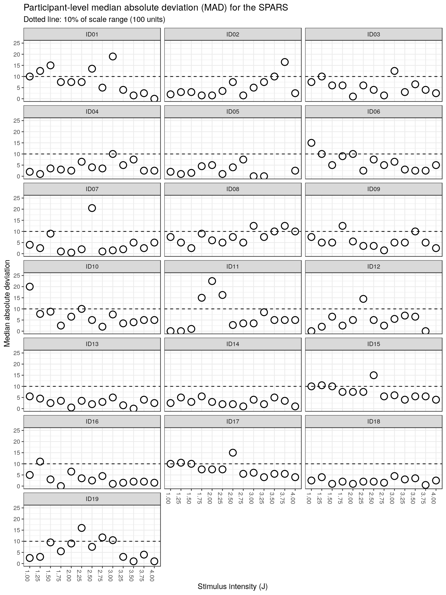
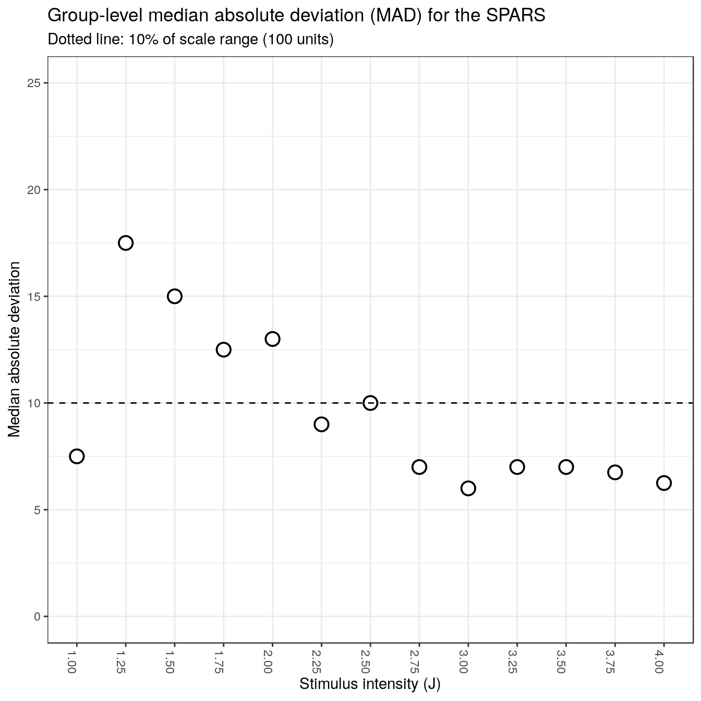

----

This script is part 6 of our analysis of the stimulus-response characteristics of the SPARS. In these analyses we assessed intra-individual and inter-individual variability in scoring on the SPARS at each pain intensity. 

We used the _median absolute deviation_ (MAD), which is a robust measure of dispersion, to assess variance. To calculate intra-individual variance for each stimulus intensity, we calculated the MAD using the ratings from repeated stimuli at each stimulus intensity. We also used the MAD for calculating inter-individual variance for each scale and at each intensity, using the median ratings by individuals at each intensity as the input.

**Median absolute deviation**  

$$MAD = median(|X_i - median(X)|)$$ 

Descriptive plots of the data are provided in _"outputs/suppl\_05\_4A-stimulus-response-1.html"_, modelling of the stimulus-response relationship is described in _"outputs/suppl\_06\_4A-stimulus-response-2.html"_, the diagnostics on the final linear mixed model are described in _"outputs/suppl\_07\_4A-stimulus-response-3.html"_, the stability of the model is described in _"outputs/suppl\_08\_4A-stimulus-response-4.html"_, the sensitivity of the scale to changes in stimulus intensity are described in _"outputs/suppl\_09\_4A-stimulus-reponse-5.html"_.

----

# Import and clean/transform data


```r
############################################################
#                                                          #
#                          Import                          #
#                                                          #
############################################################
data <- read_rds('./data-cleaned/SPARS_A.rds')

############################################################
#                                                          #
#                          Clean                           #
#                                                          #
############################################################
data %<>%
  # Select required columns
  select(PID, intensity, rating) 
```

----

# Intra-individual variation (participant-level)


```r
# Calculate MAD
data_varianceP <- data %>%
    group_by(PID, intensity) %>%
    summarise(MAD = mad(x = rating,
                        constant = 1, 
                        na.rm = TRUE)) %>%
    ungroup()

# Plot
ggplot(data = data_varianceP) +
    aes(y = MAD,
        x = sprintf('%.02f', intensity)) +
    geom_point(shape = 21,
               size = 4,
               fill = '#E69F00') +
    geom_hline(yintercept = 10,
               linetype = 2) +
    labs(title = 'Participant-level median absolute deviation (MAD) for the SPARS',
         subtitle = 'Dotted line: 10% of scale range (100 units)',
         y = 'Median absolute deviation',
         x = 'Stimulus intensity (J)') +
    scale_y_continuous(limits = c(0, 25)) +
    facet_wrap(~ PID, ncol = 3) +
    theme(axis.text.x = element_text(angle = -90))
```



There is no clear pattern in intra-individual variance in intensity rating within the scale. Variance can be high on a case-by-case basis, but most MAD value are < 10% of the scale range (100 units, -50 to 50). 

----

# Inter-individual variation (group-level)


```r
# Process data for plotting
data_varianceG <- data %>% 
    # Calculate median rating at each stimulus intensity for each scale per PID
    group_by(PID, intensity) %>%
    summarise(median = median(rating, 
                              na.rm = TRUE)) %>%
    # Calculate group MAD
    group_by(intensity) %>%
    summarise(MAD = mad(median,
                        constant = 1,
                        na.rm = TRUE)) %>%
    ungroup()
    

# Plot
ggplot(data = data_varianceG) +
    aes(y = MAD,
        x = sprintf('%.02f', intensity)) +
    geom_point(shape = 21,
               size = 4,
               fill = '#E69F00') +
    geom_hline(yintercept = 10,
               linetype = 2) +
    labs(title = 'Group-level median absolute deviation (MAD) for the SPARS',
         subtitle = 'Dotted line: 10% of scale range (100 units)',
         y = 'Median absolute deviation',
         x = 'Stimulus intensity (J)') +
    scale_y_continuous(limits = c(0, 25)) +
    theme(axis.text.x = element_text(angle = -90))
```



Other than an 'odd' value at 1J, there is a trend for high inter-individual MAD values at low stimulus intensities, and for this variance to decrease as stimulus intensity increases. 

----

# Session information

```r
sessionInfo()
```

```
## R version 3.5.0 (2018-04-23)
## Platform: x86_64-apple-darwin15.6.0 (64-bit)
## Running under: macOS High Sierra 10.13.5
## 
## Matrix products: default
## BLAS: /Library/Frameworks/R.framework/Versions/3.5/Resources/lib/libRblas.0.dylib
## LAPACK: /Library/Frameworks/R.framework/Versions/3.5/Resources/lib/libRlapack.dylib
## 
## locale:
## [1] en_GB.UTF-8/en_GB.UTF-8/en_GB.UTF-8/C/en_GB.UTF-8/en_GB.UTF-8
## 
## attached base packages:
## [1] stats     graphics  grDevices utils     datasets  methods   base     
## 
## other attached packages:
##  [1] bindrcpp_0.2.2     forcats_0.3.0      stringr_1.3.1     
##  [4] dplyr_0.7.5        purrr_0.2.5        readr_1.1.1       
##  [7] tidyr_0.8.1        tibble_1.4.2       ggplot2_2.2.1.9000
## [10] tidyverse_1.2.1    magrittr_1.5      
## 
## loaded via a namespace (and not attached):
##  [1] Rcpp_0.12.17      cellranger_1.1.0  pillar_1.2.3     
##  [4] compiler_3.5.0    plyr_1.8.4        bindr_0.1.1      
##  [7] tools_3.5.0       digest_0.6.15     lubridate_1.7.4  
## [10] jsonlite_1.5      evaluate_0.10.1   nlme_3.1-137     
## [13] gtable_0.2.0      lattice_0.20-35   pkgconfig_2.0.1  
## [16] rlang_0.2.1       psych_1.8.4       cli_1.0.0        
## [19] rstudioapi_0.7    yaml_2.1.19       parallel_3.5.0   
## [22] haven_1.1.1       withr_2.1.2       xml2_1.2.0       
## [25] httr_1.3.1        knitr_1.20        hms_0.4.2        
## [28] rprojroot_1.3-2   grid_3.5.0        tidyselect_0.2.4 
## [31] glue_1.2.0        R6_2.2.2          readxl_1.1.0     
## [34] foreign_0.8-70    rmarkdown_1.9     modelr_0.1.2     
## [37] reshape2_1.4.3    backports_1.1.2   scales_0.5.0.9000
## [40] htmltools_0.3.6   rvest_0.3.2       assertthat_0.2.0 
## [43] mnormt_1.5-5      colorspace_1.3-2  labeling_0.3     
## [46] stringi_1.2.2     lazyeval_0.2.1    munsell_0.4.3    
## [49] broom_0.4.4       crayon_1.3.4
```
