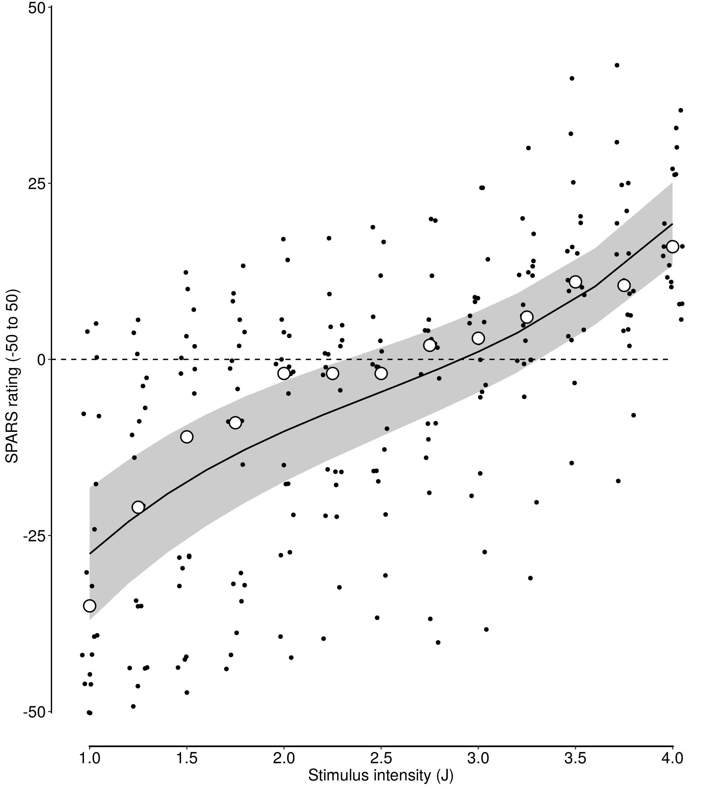

    

----

In this script, we combined **Figure 4** from (_suppl\_05\_4A-stimulus-response-1.Rmd_) and **Figure 5** from (_suppl\_06\_4A-stimulus-response-2.Rmd_) into a single figure, **Figure 4**, which shows the individual participants' Tukey trimeans by stimulus intensity (black dots), the group means by intensity (white circles), the (best fit) cubic model (black line) and its 95% CI (grey band). 

All figures downstream of Figure 5 have been re-labelled accordingly. 

----

# Import and inspect data


```r
# Import
data <- read_rds('./data-cleaned/SPARS_A.rds')

# Inspect
glimpse(data)
```

```
## Observations: 1,927
## Variables: 19
## $ PID               <chr> "ID01", "ID01", "ID01", "ID01", "ID01", "ID0...
## $ block             <chr> "C", "C", "C", "C", "C", "C", "C", "C", "C",...
## $ block_order       <dbl> 1, 1, 1, 1, 1, 1, 1, 1, 1, 1, 1, 1, 1, 1, 1,...
## $ trial_number      <dbl> 1, 2, 3, 4, 5, 6, 7, 8, 9, 10, 11, 12, 13, 1...
## $ intensity         <dbl> 3.75, 1.50, 3.25, 1.50, 3.00, 2.75, 1.00, 2....
## $ intensity_char    <chr> "3.75", "1.50", "3.25", "1.50", "3.00", "2.7...
## $ rating            <dbl> -10, -40, -10, -25, -20, -25, -40, 2, -40, -...
## $ rating_positive   <dbl> 40, 10, 40, 25, 30, 25, 10, 52, 10, 40, 54, ...
## $ EDA               <dbl> 18315.239, 13904.177, 11543.449, 20542.834, ...
## $ age               <dbl> 21, 21, 21, 21, 21, 21, 21, 21, 21, 21, 21, ...
## $ sex               <dbl> 2, 2, 2, 2, 2, 2, 2, 2, 2, 2, 2, 2, 2, 2, 2,...
## $ panas_positive    <dbl> 36, 36, 36, 36, 36, 36, 36, 36, 36, 36, 36, ...
## $ panas_negative    <dbl> 10, 10, 10, 10, 10, 10, 10, 10, 10, 10, 10, ...
## $ dass42_depression <dbl> 0, 0, 0, 0, 0, 0, 0, 0, 0, 0, 0, 0, 0, 0, 0,...
## $ dass42_anxiety    <dbl> 1, 1, 1, 1, 1, 1, 1, 1, 1, 1, 1, 1, 1, 1, 1,...
## $ dass42_stress     <dbl> 0, 0, 0, 0, 0, 0, 0, 0, 0, 0, 0, 0, 0, 0, 0,...
## $ pcs_magnification <dbl> 6, 6, 6, 6, 6, 6, 6, 6, 6, 6, 6, 6, 6, 6, 6,...
## $ pcs_rumination    <dbl> 11, 11, 11, 11, 11, 11, 11, 11, 11, 11, 11, ...
## $ pcs_helplessness  <dbl> 10, 10, 10, 10, 10, 10, 10, 10, 10, 10, 10, ...
```

----

# Clean and transform data

We performed a basic clean-up of the data, and then calculated _Tukey trimean_ at each stimulus intensity for each participant (participant average), and finally the _median_ of the trimeans at each stimulus intensity across participants (group average).


```r
############################################################
#                                                          #
#                          Clean                           #
#                                                          #
############################################################
data %<>%
# Select required columns
select(PID, block, block_order, trial_number, intensity, intensity_char, rating)

############################################################
#                                                          #
#                Calculate 'Tukey trimean'                 #
#                                                          #
############################################################
# Define tri.mean function
tri.mean <- function(x) {
# Calculate quantiles
q1 <- quantile(x, probs = 0.25, na.rm = TRUE)[[1]]
q2 <- median(x, na.rm = TRUE)
q3 <- quantile(x, probs = 0.75, na.rm = TRUE)[[1]]
# Calculate trimean
tm <- (q2 + ((q1 + q3) / 2)) / 2
# Convert to integer
tm <- as.integer(round(tm))
return(tm)
}

############################################################
#                                                          #
#                    Generate core data                    #
#                                                          #
############################################################
# Calculate the participant average
data_tm <- data %>%
group_by(PID, intensity) %>%
summarise(tri_mean = tri.mean(rating)) %>%
ungroup()

# Calculate the group average
data_group <- data_tm %>%
group_by(intensity) %>%
summarise(median = median(tri_mean)) %>%
ungroup()
```

----

# Regression model

Generate the 3rd-order (cubic) polynomial regression model (random slope and intercept), and get predicted values for plotting.


```r
# Generate model
lmm3b <- lmer(tri_mean ~ poly(intensity, 3) + (intensity | PID),
              data = data_tm)

# Generate predicted values
predicted <- ggeffect(model = lmm3b,
                      terms = 'intensity',
                      ci.lvl = 0.95) 
```

---

# Plot for publication


```r
p <- ggplot() +
    geom_ribbon(data = predicted,
                aes(x = x,
                    ymin = conf.low,
                    ymax = conf.high),
                fill = '#CCCCCC') +
    geom_point(data = data_tm,
               aes(x = intensity,
                   y = tri_mean),
               position = position_jitter(width = 0.05)) +
    geom_line(data = predicted,
              aes(x = x,
                  y = predicted),
              size = 0.8) +
    geom_point(data = data_group,
               aes(x = intensity,
                   y = median),
               shape = 21,
               size = 5,
               stroke = 1,
               fill = '#FFFFFF') +
    geom_segment(aes(x = 0.8, xend = 0.8,
                 y = -50.25, yend = 50.25),
                 size = 1.2) +
    geom_segment(aes(x = 0.995, xend = 4.006,
                 y = -55, yend = -55),
                 size = 1.2) +
    geom_segment(aes(x = 0.8, xend = 4,
                 y = 0, yend = 0),
                 size = 0.6,
                 linetype = 2) +
    labs(x = 'Stimulus intensity (J)',
         y = 'SPARS rating (-50 to 50)') +
    scale_y_continuous(limits = c(-55, 50.25),
                       expand = c(0, 0),
                       breaks = c(-50, -25, 0, 25, 50)) +
    scale_x_continuous(limits = c(0.8, 4.2),
                       expand = c(0, 0),
                       breaks = seq(from = 1, to = 4, by = 0.5)) +
    theme_bw() +
    theme(panel.border = element_blank(),
          panel.grid = element_blank(),
          axis.text = element_text(size = 16,
                                   colour = '#000000'),
          axis.title = element_text(size = 16,
                                   colour = '#000000'))

# Print plot
print(p)
```



```r
# Save plot
ggsave(filename = 'figures/figure_4.pdf',
       plot = p,
       width = 6,
       height = 5)
```

----

# Session information

    
    ```r
    sessionInfo()
    ```
    
    ```
    ## R version 3.5.1 (2018-07-02)
    ## Platform: x86_64-apple-darwin15.6.0 (64-bit)
    ## Running under: macOS  10.14
    ## 
    ## Matrix products: default
    ## BLAS: /Library/Frameworks/R.framework/Versions/3.5/Resources/lib/libRblas.0.dylib
    ## LAPACK: /Library/Frameworks/R.framework/Versions/3.5/Resources/lib/libRlapack.dylib
    ## 
    ## locale:
    ## [1] en_GB.UTF-8/en_GB.UTF-8/en_GB.UTF-8/C/en_GB.UTF-8/en_GB.UTF-8
    ## 
    ## attached base packages:
    ## [1] stats     graphics  grDevices utils     datasets  methods   base     
    ## 
    ## other attached packages:
    ##  [1] bindrcpp_0.2.2  ggeffects_0.5.0 lmerTest_3.0-1  lme4_1.1-18-1  
    ##  [5] Matrix_1.2-14   forcats_0.3.0   stringr_1.3.1   dplyr_0.7.6    
    ##  [9] purrr_0.2.5     readr_1.1.1     tidyr_0.8.1     tibble_1.4.2   
    ## [13] ggplot2_3.0.0   tidyverse_1.2.1 magrittr_1.5   
    ## 
    ## loaded via a namespace (and not attached):
    ##  [1] nlme_3.1-137       lubridate_1.7.4    httr_1.3.1        
    ##  [4] rprojroot_1.3-2    numDeriv_2016.8-1  TMB_1.7.14        
    ##  [7] tools_3.5.1        backports_1.1.2    R6_2.2.2          
    ## [10] sjlabelled_1.0.14  lazyeval_0.2.1     colorspace_1.3-2  
    ## [13] nnet_7.3-12        withr_2.1.2        tidyselect_0.2.4  
    ## [16] emmeans_1.2.4      compiler_3.5.1     cli_1.0.1         
    ## [19] rvest_0.3.2        xml2_1.2.0         sandwich_2.5-0    
    ## [22] effects_4.0-3      scales_1.0.0       mvtnorm_1.0-8     
    ## [25] ggridges_0.5.1     digest_0.6.17      minqa_1.2.4       
    ## [28] rmarkdown_1.10     stringdist_0.9.5.1 pkgconfig_2.0.2   
    ## [31] htmltools_0.3.6    pwr_1.2-2          rlang_0.2.2       
    ## [34] readxl_1.1.0       rstudioapi_0.8     bindr_0.1.1       
    ## [37] zoo_1.8-4          jsonlite_1.5       modeltools_0.2-22 
    ## [40] bayesplot_1.6.0    Rcpp_0.12.19       munsell_0.5.0     
    ## [43] prediction_0.3.6   stringi_1.2.4      multcomp_1.4-8    
    ## [46] yaml_2.2.0         snakecase_0.9.2    carData_3.0-2     
    ## [49] MASS_7.3-50        plyr_1.8.4         grid_3.5.1        
    ## [52] parallel_3.5.1     sjmisc_2.7.5       crayon_1.3.4      
    ## [55] lattice_0.20-35    haven_1.1.2        splines_3.5.1     
    ## [58] sjstats_0.17.1     hms_0.4.2          knitr_1.20        
    ## [61] pillar_1.3.0       estimability_1.3   codetools_0.2-15  
    ## [64] stats4_3.5.1       glue_1.3.0         evaluate_0.11     
    ## [67] data.table_1.11.8  modelr_0.1.2       nloptr_1.2.1      
    ## [70] cellranger_1.1.0   gtable_0.2.0       assertthat_0.2.0  
    ## [73] coin_1.2-2         xtable_1.8-3       broom_0.5.0       
    ## [76] survey_3.33-2      coda_0.19-1        survival_2.42-6   
    ## [79] glmmTMB_0.2.2.0    TH.data_1.0-9
    ```
