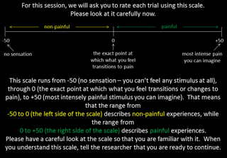
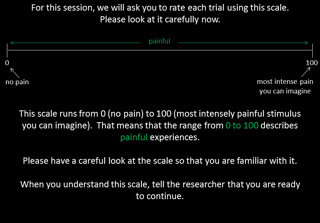
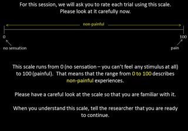

```{r setup, include = FALSE}
# knitr setup
knitr::opts_chunk$set(fig.align = 'center')
```

----

This document displays the information given to participants before each block of Experiment 2. 

----

# Rating scale

## Sensation and Pain Rating Scale (SPARS)




## Numerical Pain Rating Scale (NRS)




## Numerical Sensation Rating Scale (SRS)



----

# Session information

```{r session_info}
sessionInfo()
```
